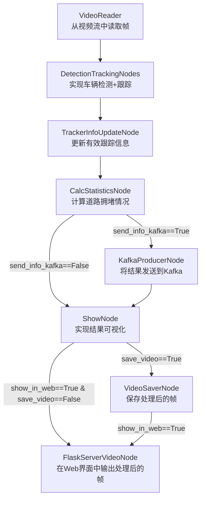

# 环形交叉路口交通分析器
**生产版本：支持多摄像头、InfluxDB时序数据库和Grafana仪表盘**

本程序用于分析环形交叉路口区域的交通流量。算法能够确定相邻道路的拥堵情况并显示交互式统计数据。

关于项目及其架构的详细教程 - [__视频链接__](https://vk.com/video-145052891_456247910)

## 安装和启动：

克隆仓库：

```
git clone https://github.com/Koldim2001/TrafficAnalyzer.git
```

之后，需要在项目主目录下创建一个环境变量文件，这些变量将被注入到Grafana和Influx的容器中。请创建 `.env` 文件并填入以下类似内容（包含服务的登录名和密码）：

```
INFLUXDB_ADMIN_USER=admin
INFLUXDB_ADMIN_PASSWORD=admin
GRAFANA_ADMIN_USER=admin
GRAFANA_ADMIN_PASSWORD=admin
KAFKA_USERNAME=traffic
KAFKA_PASSWORD=traffic-secret
```

接下来，使用以下命令启动项目：

```
docker compose -p traffic_analyzer up -d --build
```

启动后，要访问Grafana仪表盘，请点击此[链接](http://localhost:3111/d/edycr94pt2mm8b/dashboard-trafficanalyzer-1-camera-influx?orgId=1&refresh=5s)。输入用户名 `admin` 和密码 `admin`。
每个摄像头都有自己独立的仪表盘，可以通过按钮切换：


在Docker Compose中，每个新摄像头都作为 traffic_analyzer_camera_{n} 后端服务的一个额外实例添加，只需通过服务的环境变量指定不同的 `src` 和配置即可。

## 如何在本地通过Python运行（无需额外微服务）：

```
# 安装依赖库：
python -m pip install --upgrade pip
pip install "numpy<2"
pip install cython_bbox==0.1.5 lap==0.4.0
pip install torch==2.3.1 torchvision==0.18.1 --index-url https://download.pytorch.org/whl/cu121
pip install -r requirements.txt

# 运行代码：
python main_optimized.py pipeline.send_info_kafka=False
```
程序运行结果可通过此[链接](http://127.0.0.1:8100/)查看。

---

## 项目架构：

该项目是一个实时视频分析系统，可处理RTSP流或MP4文件。主服务 **traffic_analyzer_camera_{n}** 处理视频帧，提取分析数据（例如，环岛上的车辆数量、相邻道路的拥堵情况）并将其发送到消息代理 **Kafka**。每个摄像头的实时统计数据被写入其专属的Kafka主题 *statistics_{n}*。数据通过 **Telegraf** 自动从Kafka写入时间序列数据库 **InfluxDB**。InfluxDB因其高性能和对海量数据的支持，非常适合存储流数据。

数据可视化通过 **Grafana** 实现，它连接到InfluxDB并将分析结果以交互式仪表盘的形式展示。这使得用户可以实时跟踪关键指标、绘制图表并分析趋势。

#### 主要组件：
1.  **traffic_analyzer_camera_{n}**: 按编号n处理视频流，将数据发送到Kafka。
2.  **Kafka**: 数据的临时存储和传输。
3.  **Telegraf**: 将数据从Kafka转移到InfluxDB。
4.  **InfluxDB**: 存储分析数据。
5.  **Grafana**: 将InfluxDB中的数据可视化到交互式仪表盘。
6.  **Nginx**: 充当反向代理，将所有处理后的视频Flask流统一聚合到一个端口的不同端点下。这样可以方便地管理视频流的访问，并为所有摄像头提供统一的入口点。


## 主视频流处理服务的代码实现：

每个视频帧（FrameElement对象）会顺序通过多个处理节点（Node），该对象的属性会逐步添加越来越多的信息。



---

## 使用程序：

启动前，必须在 __configs/app_config.yaml__ 文件中指定所有所需的参数。然后即可运行代码。

要使用特定视频启动项目，需要在Docker Compose中通过环境变量指定其路径。也可以指定rtsp流的URL来代替文件路径。同样地，可以通过容器的环境变量指定包含相邻道路多边形坐标的json文件路径。

#### <ins>运行MP4文件的选项：<ins>

**main.py** - 项目的主要代码，在循环中实现帧通过所有节点的处理。

**main_optimized.py** - 使用multiprocessing优化后的main.py版本。由于所有资源密集型操作分布在独立且并行工作的进程之间，因此可以实现更高的处理速度（超过35帧/秒）。

#### <ins>附加运行选项（仅适用于实时RTSP流）：<ins>

**main_stream_optimized.py** — 用于处理实时流媒体的版本，它确保只处理最新的帧而不使用缓冲区。这是通过在一个单独的进程中处理帧，而主进程总是只获取最新的可用帧进行处理来实现的。

**main_stream_optimized_v2.py** — main_stream_optimized.py的改进版本。主要区别在于，当某个进程终止或崩溃时，另一个进程也会自动终止。通过 `process.is_alive()` 方法监控进程状态，从而实现了更可靠的进程生命周期管理。

**generate_lanes车道标定** python d:\ai\TrafficAnalyzer\generate_lanes.py d:\ai\TrafficAnalyzer\test_videos\inter2.mp4 d:\ai\TrafficAnalyzer\configs\inter2_lanes.json
---

## 代码工作示例：

__显示统计信息的算法工作示例__：每辆车以其来自的道路对应的颜色显示 + 显示可见车辆数量的值 + 显示输入流强度值（每分钟从各入口道路驶入的车辆数）。<br/>当在配置中选择 show_node.show_info_statistics=True 时，显示方式如下：


通过在配置中选择 show_node.show_info_statistics=False 可以禁用统计信息窗口的显示。<br/>
要像第一个示例中那样观察处理FPS，需要在配置中指定 show_node.draw_fps_info=True。

---

__显示车辆跟踪结果的演示模式示例__（每个ID以其独特的颜色显示）<br/>
当在配置中选择 show_node.show_track_id_different_colors=True 时，显示方式如下：


---

## 现有代码版本：

项目中特意包含了多个分支，实现了大规模计算机视觉项目开发的不同阶段。

例如，在 [**main**](https://github.com/Koldim2001/TrafficAnalyzer/tree/main) 分支中，Docker Compose可以启动辅助服务（用于可视化的Grafana和PostgreSQL数据库）。但是，实现后端的主代码需要使用计算机上已有的Python在本地运行。此代码版本的教程 - [YouTube](https://www.youtube.com/watch?v=u9EtqHz4Vqc)

项目的进一步发展在于实现包含所有服务（包括后端本身）的完整Docker Compose。此版本可在 [**prod_docker_version**](https://github.com/Koldim2001/TrafficAnalyzer/tree/prod_docker_version) 分支中找到。此分支的代码非常容易启动，除了Docker之外，计算机上不需要任何其他东西。项目只需一条命令即可启动：`docker compose -p traffic_analyzer up -d --build`。此代码版本的教程 - [YouTube](https://www.youtube.com/watch?v=jU6Y2GRh2Zs)

项目发展的下一阶段是出现了 [**multicamera**](https://github.com/Koldim2001/TrafficAnalyzer/tree/multicamera) 分支。它实现了与prod_docker_version分支相同的功能，但现在可以方便地将项目扩展到大量摄像头。为此，只需在docker-compose文件中添加新的后端容器，并指定新视频资源的路径即可。同时，所有处理（包括网络推理本身）都将在后端容器内部本机执行。每个新摄像头都会自动启动一个新的YOLO网络实例，用于执行车辆检测。此代码版本的教程 - [YouTube](https://www.youtube.com/watch?v=jU6Y2GRh2Zs)

另一个进一步发展的选项是出现了 [**feature/triton**](https://github.com/Koldim2001/TrafficAnalyzer/tree/feature/triton) 分支。这本质上是相同的multicamera分支，但现在所有后端容器不再内部执行网络推理，而是通过gRPC向一个名为Triton Inference Server的附加服务发送请求。这样可以在不显著增加负载的情况下扩展项目（尽管由于现在需要向服务发送请求并接收响应，FPS值会稍低）。但是现在只有一个容器与显卡交互，后端实例不需要GPU即可工作。

另一个进一步发展的选项是出现了 [**feature/influx**](https://github.com/Koldim2001/TrafficAnalyzer/tree/feature/influx) 分支。
**这正是您当前所在的分支。**
这本质上是相同的multicamera分支，但现在数据库已从PostgreSQL更改为时间序列数据库InfluxDB。该数据库更适用于处理从后端发送的流数据。同时，使用Telegraf服务进行写入InfluxDB，该服务读取消息代理Kafka的主题（后端将数据发送到该主题）并自动将数据保存到InfluxDB。此代码版本的教程 - [YouTube]()

Git项目的分支结构如下：

```
main
└── prod_docker_version
    └── multicamera
        ├── feature/triton
        └── feature/influx