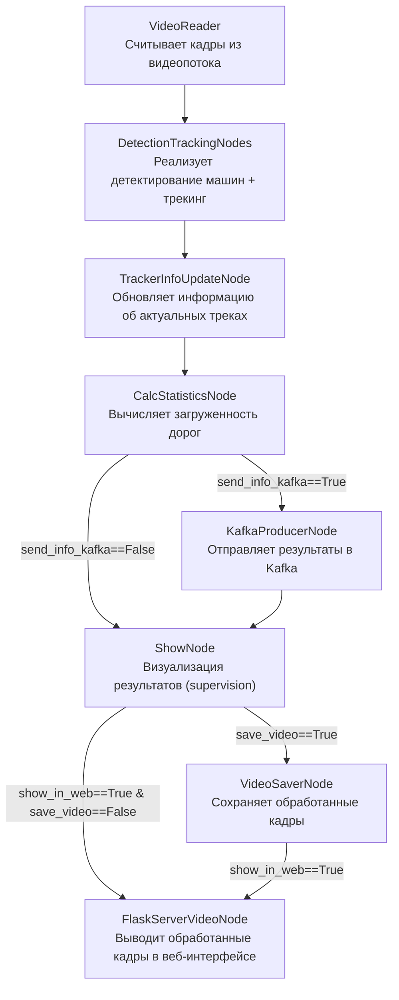

# 环形交叉路口交通分析器
**带有多摄像头、Influx时序数据库和Grafana仪表盘的生产版本**

本程序用于对环形交叉路口区域的交通流量进行分析。算法能够确定相邻道路的拥堵情况并显示交互式统计数据。

有关项目及其架构的详细教程 - [__视频链接__](https://vk.com/video-145052891_456247910)

## 快速启动：视频流检测器

### 本地启动（无需 Kafka / Docker）

```bash
python main_optimized.py pipeline.send_info_kafka=False
```

启动后访问：
- MJPEG 视频流：http://127.0.0.1:8100/video
- Flask 主页：http://127.0.0.1:8100/

### inter_xqh 视频 + SRT 遥测 + Kafka（推荐）

```bash
VIDEO_SRC="test_videos/inter_xqh/DJI_20260403142902_0001_V小清河北路与水屯路路口.mp4" \
ROADS_JSON="configs/inter_xqh_lanes.json" \
TOPIC_NAME="statistics_1" \
CAMERA_ID=1 \
KAFKA_BOOTSTRAP="localhost:9092" \
python main_optimized.py \
  pipeline.send_info_kafka=True \
  telemetry.enabled=true \
  telemetry.source=srt \
  +telemetry.file_path=test_videos/inter_xqh/telemetry.srt
```

后台运行加 `nohup ... > /tmp/detector_xqh.log 2>&1 &`。

### 自定义视频源

```bash
VIDEO_SRC=test_videos/inter1.mp4 python main_optimized.py pipeline.send_info_kafka=False
```

### 启用 Kafka 数据推送（完整管道）

```bash
python main_optimized.py
```

### 关键环境变量

| 变量 | 默认值 | 说明 |
|------|--------|------|
| `VIDEO_SRC` | `test_videos/test_video.mp4` | 视频文件路径、RTSP URL 或摄像头索引 |
| `ROADS_JSON` | `configs/entry_exit_lanes.json` | 道路多边形坐标 JSON 文件 |
| `TOPIC_NAME` | `statistics_1` | Kafka 主题名 |
| `CAMERA_ID` | `1` | 摄像头 ID |
| `KAFKA_BOOTSTRAP` | `kafka:29092` | Kafka 地址（本地运行改为 `localhost:9092`）|

### 停止检测器

```bash
pkill -f main_optimized.py
```

---

## 安装和启动：

克隆仓库：

```
git clone https://github.com/Koldim2001/TrafficAnalyzer.git
```
После этого необходимо в главной директории  проекта создать файл с переменными окружения, которые будут прокинуты в контейнеры Grafana и Influx. Для этого создайте файл `.env` и укажите подобный текст с паролями и логинами к сервисам:
```
INFLUXDB_ADMIN_USER=admin
INFLUXDB_ADMIN_PASSWORD=admin
GRAFANA_ADMIN_USER=admin
GRAFANA_ADMIN_PASSWORD=admin
KAFKA_USERNAME=traffic
KAFKA_PASSWORD=traffic-secret
```
Далее запустите проект с помощью этой команды:
```
docker compose -p traffic_analyzer up -d --build
```

Для того, чтобы попасть на дашборд в Grafana надо после запуска компоуза перейти по этой [ссылке](http://localhost:3111/d/edycr94pt2mm8b/dashboard-trafficanalyzer-1-camera-influx?orgId=1&refresh=5s). Введите логин `admin` и пароль `admin`.
У каждой камеры свой дашборд между которыми можно переходит по кнопке:


Каждая новая камера добавляется в компоузе как +1 инстанс бекенда traffic_analyzer_camera_{n}, в котором надо указать лишь разные scr и конфигурации через переменные окружения сервиса.

## Как запустить локально в Python без дополнительных микросервисов:
```
# ставим библиотеки:
python -m pip install --upgrade pip
pip install "numpy<2"
pip install cython_bbox==0.1.5 lap==0.4.0 
pip install torch==2.3.1 torchvision==0.18.1 --index-url https://download.pytorch.org/whl/cu121
pip install -r requirements.txt

# запускаем код:
python main_optimized.py pipeline.send_info_kafka=False
```
Результат работы программы можно увидеть, перейдя по [ссылке](http://127.0.0.1:8100/)

---
## Архитектура проекта:

Проект представляет собой систему для анализа видео в реальном времени, работающую с RTSP-стримами или MP4-файлами. Основной сервис **traffic_analyzer_camera_{n}** обрабатывает кадры, извлекает аналитические данные (например, число машин на круговом участке, загруженность примыкающих дорог) и отправляет их в брокер сообщений **Kafka**. Для каждой камеры записись realtime статистики ведется в свой топик *statistics_{n}*. Данные из Kafka автоматически записываются в базу временных рядов **InfluxDB** с помощью **Telegraf**. InfluxDB оптимальна для хранения потоковых данных благодаря высокой производительности и поддержке больших объемов информации.

Для визуализации данных используется **Grafana**, которая подключается к InfluxDB и отображает аналитику в виде интерактивных дашбордов. Это позволяет отслеживать ключевые метрики в реальном времени, строить графики и анализировать тренды.

#### Основные компоненты:
1. **traffic_analyzer_camera_{n}**: обрабатывает видеопоток по номеру n, отправляет данные в Kafka.
2. **Kafka**: временное хранение и передача данных.
3. **Telegraf**: перенос данных из Kafka в InfluxDB.
4. **InfluxDB**: хранение аналитических данных.
5. **Grafana**: визуализация данных из InfluxDB в интерактивных дашбордах.
6. **Nginx**: выступает в роли реверс-прокси для объединения всех результирующих Flask-стримов обработанного видео на одном порту с разными эндпоинтами. Это позволяет удобно управлять доступом к видеостримам и обеспечивает единую точку входа для всех камер.


## Рассмотрим, как реализован код главного сервиса по обработке видеопотока:

Каждый кадр (объект FrameElement) последовательно проходит через ноды, и в атрибуты этого объекта постепенно добавляется все больше и больше информации.


---

## Работа с программой:
Перед запуском необходимо в файле __configs/app_config.yaml__ указать все желаемые параметры. Далее можно запускать код.

Чтобы запустить проект с определенным видео, необходимо указать путь к нему в докер компоузе переменной окружения. Можно вместо пути к файлу указать ссыку на rtsp поток. Там же в переменных окружения контейнера можно указать путь до json файла с указанными координатами полигонов прилегающих дорог. 

#### <ins>Варианты запуска для mp4 файлов:<ins>

**main.py** - основной код проекта, реализующий в цикле прогон кадров через все ноды.

**main_optimized.py** - Оптимизированный код main.py с помошью multiprocessing. Позволяет достичь более высокой скорости обработки (свыше 35 кадров в секунду), поскольку все ресурсоемкие операции распределены между независимыми процессами, работающими параллельно. Включает проверки здоровья процессов (`is_alive()` + таймаут очереди) для надёжного завершения.

#### <ins>Устаревшие варианты запуска (удалены, функционал интегрирован в main_optimized.py):<ins>

Ранее существовали `main_stream_optimized.py` и `main_stream_optimized_v2.py` — версии для RTSP-потоков с отбрасыванием старых кадров. Их функционал (проверки `is_alive()`, таймауты очереди) интегрирован в `main_optimized.py`.

---
## Примеры работы кода:

__Пример работы алгоритма c выводом статистики__: каждая машина отображается цветом, соответствующим дороге, с которой она прибыла к круговому движению + выводится значение числа видимых машин + значения интенсивности входного потока (число машин в минуту с каждой входящей дороги). <br/>Отображается таким образом при выборе в конфигурации show_node.show_info_statistics=True 


Отключить отображение окна со статистикой можно при выборе в конфигурации show_node.show_info_statistics=False <br/>
Чтобы наблюдать fps обработки как в первом представленном примере, необходимо в конфиге указать show_node.draw_fps_info=True.  

---
__Пример режима демонстрации результатов трекинга машин__ (каждый id своим уникальным цветом отображается) <br/>
Отображается таким образом при выборе в конфигурации show_node.show_track_id_different_colors=True 


---

## Существующие версии кода:

В проекте специально предусмотрено множество веток, реализующих разные уровни разработки масштабного Computer Vision проекта.

Например, в ветке [**main**](https://github.com/Koldim2001/TrafficAnalyzer/tree/main) Docker Compose позволяет поднять сторонние сервисы (Grafana для визуализации и базу данных PostgreSQL). Однако основной код, реализующий бекенд, необходимо запускать локально с помощью имеющегося на компьютере Python. Туториал по этой версии кода - [YouTube](https://www.youtube.com/watch?v=u9EtqHz4Vqc)

Дальнейшее развитие проекта заключается в реализации полного Docker Compose из всех имеющихся сервисов, включая сам бекенд. Такая версия доступна в ветке [**prod_docker_version**](https://github.com/Koldim2001/TrafficAnalyzer/tree/prod_docker_version). Код из этой ветки очень просто запустить, и не требуется ничего иметь на компьютере, кроме Docker. Проект запускается единственной командой: `docker compose -p traffic_analyzer up -d --build`. Туториал по этой версии кода - [YouTube](https://www.youtube.com/watch?v=jU6Y2GRh2Zs)

Следующим этапом развития проекта стало появление ветки [**multicamera**](https://github.com/Koldim2001/TrafficAnalyzer/tree/multicamera). В ней реализовано всё то же, что и в ветке prod_docker_version, но теперь есть удобная возможность масштабировать проект на большое число камер. Для этого потребуется лишь в файле docker-compose добавить новые контейнеры бекенда с указанием пути до нового видео ресурса. При этом вся обработка будет выполняться нативно внутри контейнеров бекенда, включая инференс самой сети. Под каждую новую камеру автоматически поднимается новый инстанс сети YOLO, реализующий детекцию транспорта. Туториал по этой версии кода - [YouTube](https://www.youtube.com/watch?v=jU6Y2GRh2Zs)

Еще одним дальнейшим вариантом развития стало появление ветки [**feature/triton**](https://github.com/Koldim2001/TrafficAnalyzer/tree/feature/triton). По сути это та же ветка multicamera, но теперь все контейнеры бекенда не реализуют инференс сети внутри, а лишь отправляют запросы по gRPC на дополнительный сервис под названием Triton Inference Server. Благодаря этому можно масштабировать проект без значительного увеличения нагрузки (хотя значения FPS будет чуть ниже из-за того, что теперь для инференса надо отправлять запрос на сервис и получать ответы с него). Однако теперь лишь один контейнер взаимодействует с видеокартой, и инстансы бекенда не требуют GPU для работы.

Еще одним дальнейшим вариантом развития стало появление ветки [**feature/influx**](https://github.com/Koldim2001/TrafficAnalyzer/tree/feature/influx).
**Это как раз та ветка, в которой вы сейчас находитесь.** 
По сути это та же ветка multicamera, но теперь база данных изменена с PostgreSQL на базу данных врмененных рядов InfluxDB. Данная база данных лучше подходит для работы с потоковыми данными, которые записываются с бекенда. При этом запись в InfluxDB осуществляется с помощью сервиса Telegraf, который читает топик брокера сообщений Kafka, в который отправляет бекенд, и производит автоматическое сохранение данных в Influx. Туториал по этой версии кода - [YouTube]()

Структура ветвления Git проекта представлена ниже:

```
main
└── prod_docker_version
    └── multicamera
        ├── feature/triton
        └── feature/influx