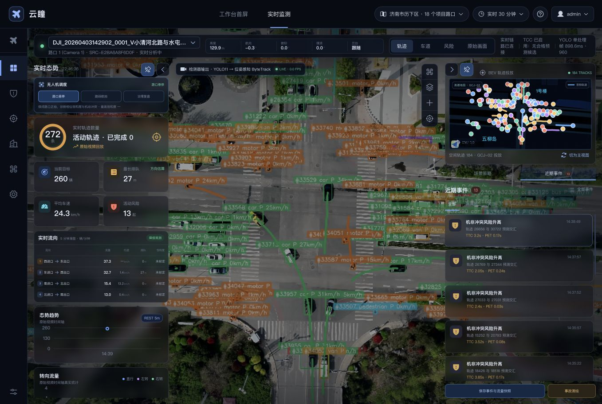
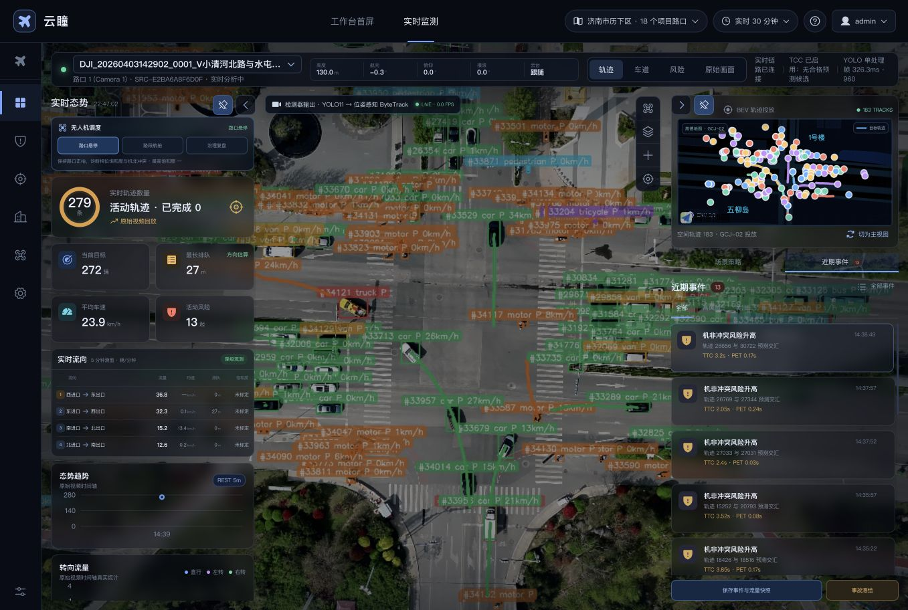
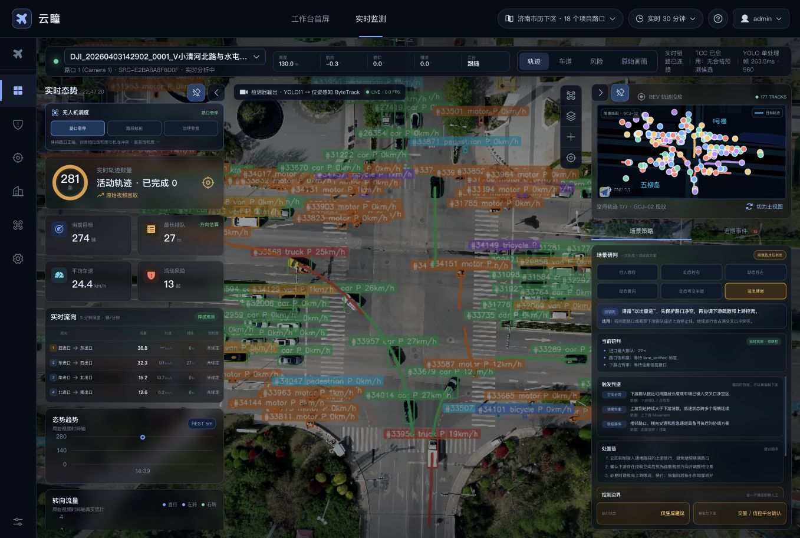

# xqh 路口实时监控页面业务评审报告

> 日期：2026-08-24  
> 页面：`/monitoring?intersection_id=INT_camera_1&source_profile_id=SRC-E2BA6A8F6D0F`  
> 对象：路口 1（Camera 1）/ xqh 客户演示验收机  
> 评审方式：当前页面实测、DOM 语义检查、可见状态与交互检查  
> 环境边界：当前使用视频回放进行开发测试；用户已确认真实上线对接实时无人机视频，因此回放文案与墙上时间差不计为产品缺陷  
> 结论边界：本报告是业务、产品和可用性评审，不等同于算法精度、生产部署或信号控制验收

## 1. 总体结论

xqh 页面已经从“算法结果展示”进入“可辅助人工研判”的阶段：能够同时展示检测视频、活动轨迹、方向流量、速度、降级排队、GCJ-02 轨迹、TCC 候选事件以及场景策略；对 `lane_verified` 缺失、地图覆盖不可用和路网匹配降级也有明确披露。排除开发测试使用回放的环境差异后，当前页面已具备进入实时无人机业务试点的界面基础。

当前仍不适合被定义为交警值守席的正式决策台，更不具备自动信号联控条件。主要阻断不是回放问题，也不是缺少更多指标，而是以下四类业务能力尚未闭环：

1. 13 起风险以事件结论呈现，但缺少证据复核、事件聚类、真假标注和处置责任链。
2. 路网能力明确降级，但部分排队、方向和策略状态仍容易被理解为车道级正式结论。
3. 推理耗时和处理帧率波动明显，真实上线前仍需建立端到端延迟、积压和数据新鲜度门禁。
4. 事件、策略、审批、外部执行和治理复测尚未形成完整业务闭环。

建议将当前产品定位表述为：

> **基于实时无人机视频的交通态势分析与风险候选研判台。开发阶段通过可控回放验证链路；上线后可用于人工辅助研判。策略仅生成建议，须经视频复核、交警审批及外部信控平台确认。**

## 2. 评审范围与用户目标

目标用户包括交警值守人员、交通治理分析人员、信控优化人员和算法运维人员。页面应首先帮助用户回答五个问题：

1. 当前无人机视频、遥测和检测数据是否属于同一任务，并且足够新？
2. 现在最需要处理的异常是什么？
3. 指标和事件的证据是否足以支撑业务判断？
4. 建议会影响哪些方向和交通参与者，有什么控制边界？
5. 谁负责复核、审批、下发和效果验证？

本次检查覆盖三个关键步骤：

| 步骤 | 页面状态 | 健康度 | 结论 |
|---|---|---|---|
| 1 | xqh 总览与实时态势 | 中上 | 数据丰富、降级可见；上线前需补实时源健康和数据新鲜度门禁 |
| 2 | 选择一条机非冲突事件 | 较差 | 事件可选，但没有形成可复核的证据详情 |
| 3 | 查看六类场景策略 | 中 | 规则和控制边界较成熟，但可执行证据覆盖不足 |

## 3. 当前页面证据

### 3.1 总览

当前实测可见：

> 当前为开发测试回放。以下回放标识和源时间仅用于说明证据采集状态，不作为产品缺陷；生产评审重点转为实时无人机视频的连接质量、源时间、端到端延迟和数据过期保护。

- 视频源为“客户演示验收机”，页面同时显示“实时分析中”“LIVE”和“原始视频回放”。
- 页面墙上时间约为 `22:46`，视频图表时间约为 `14:39`，事件时间集中在 `14:30–14:38`。
- 活动轨迹约 `272–281` 条，当前目标约 `260–274` 辆，平均车速约 `23.4–24.4 km/h`。
- 最长排队在实测期间显示 `27–57m`，并标记为 AutoLane 物理方向降级估算。
- 活动风险和近期事件均显示 `13` 起；BEV 展示约 `177–187` 条 GCJ-02 空间轨迹。
- 页面明确提示缺少 `lane_verified`，Lane ID、Link ID、匹配质量和饱和度不可用。
- 单处理帧耗时实测在约 `136.8–898.6ms` 间波动，页面处理速率出现 `0.0–1.1 FPS`。

### 3.2 事件选择

事件列表提供轨迹对、TTC、PET 和发生时间，这是重要的证据索引。但点击事件后主要表现为卡片选中，中央视频和 BEV 没有明确进入“冲突证据聚焦”状态，也没有展示：

- 两个参与者的类别和运动方向；
- 预测路径、冲突点、共同冲突区和关键帧；
- 事件前后视频片段；
- 数据质量、TCC 合格门禁和证据覆盖；
- 人工判真、驳回、合并、备注和责任人；
- 后续治理任务或现场处置入口。

列表中同一轨迹对 `17553 / 17735` 在相邻秒出现两条记录，说明当前更接近“逐次算法触发”，尚未聚合为业务事件过程。直接以 13 起事件呈现，容易制造告警数量膨胀。

### 3.3 场景策略

六类策略均已包含适用条件、组合判据、处置链、控制边界、退出和复盘指标，并统一声明“仅生成建议、交警/信控平台确认”。这是当前页面业务设计中最成熟的部分。

问题在于策略仍以并列按钮呈现，用户需要逐个点击才能判断哪项可用；页面没有按证据完整度、紧迫程度和设施可执行性排序，也没有把事件证据直接带入策略研判。

## 4. 已确认的优势

1. **数据来源可追溯。** 路口、Source Profile、视频源类型和检测链均可见。
2. **能力门禁没有完全混在一起。** 目标跟踪、遥测、视觉变换、地图覆盖和路网匹配分别展示状态，符合“能跟踪不等于能做车道级业务”的原则。
3. **降级排队有显式标签。** 页面没有把 AutoLane 方向估算直接包装成 `lane_verified` 正式车道结果。
4. **风险事件具备基础索引。** 事件卡片提供轨迹对、TTC、PET 和时间，支持下一步构建证据复核。
5. **策略权责边界正确。** 动态黄闪、动态可变车道等高风险场景都要求设施、预案和交管审批，前端不直接控灯。
6. **六类策略不是单指标触发。** 规则已考虑慢行安全、下游承接、横向交通、应急通道和退出条件。

## 5. 重点问题与改进意见

### P0-01：建立上线实时源健康和数据新鲜度门禁

**环境说明**：开发态使用回放验证检测与页面链路，回放文案和测试时间差不作为产品问题。真实上线对接实时无人机视频后，核心问题转为：页面能否证明视频仍来自当前任务、数据是否足够新、检测是否跟得上源流。

顶部“TCC 已启用：无合格预测候选”描述的是当前处理时刻，右侧“近期事件 13”描述的是统计窗口，仍需明确两者的时间范围。“实时链路已连接”只证明数据通道连接，不能证明无人机源流持续、检测无积压、指标仍在有效时限内。

**业务风险**：无人机断流、处理积压或消息停更后，页面仍可能保持“已连接/LIVE”，值守人员会把过期指标当作当前态势。

**改进**：顶部建立唯一权威状态条，固定展示：

- 无人机任务、设备、视频源和 Pipeline 绑定关系；
- 视频采集时间、平台接收时间、最新处理时间和三者差值；
- 当前统计窗口和事件检索窗口；
- Pipeline 状态、最新消息时间、端到端延迟和积压状态。

真实流中断或超过点位时效门槛时，页面统一进入“延迟/过期/断流”状态，停止形成新的控制建议；开发回放可继续保留为独立测试模式。

### P0-02：把“风险触发”升级为可复核事件证据

**问题**：13 起事件只有摘要，点击后缺少显著的证据聚焦和人工研判界面。

**改进**：事件点击后进入证据模式：

1. 隐去无关轨迹，只保留两个参与者和共同冲突区；
2. 同屏显示原始画面、检测画面和 BEV；
3. 展示预测路径、冲突点、TTC/PET 变化曲线和关键帧；
4. 明确 `path_intersection`、质量门禁、世界坐标和证据覆盖；
5. 提供“有效风险 / 误报 / 证据不足 / 重复事件”人工结论；
6. 保存复核人、复核时间、备注和关联治理任务。

### P0-03：对连续触发进行事件聚类和去重

**问题**：同一轨迹对在相邻秒形成多条告警，算法触发次数与业务事件数混用。

**改进**：按“轨迹对 + 冲突区 + 时间间隔”聚合为一次事件过程，展示：

- 过程持续时间；
- 最小 TTC、最小 PET、最高风险等级；
- 首次/峰值/退出关键帧；
- 原始触发次数；
- 人工复核状态。

右侧主数字应区分“候选触发 13 条”和“聚合事件 N 起”，默认以聚合事件数作为业务口径。

### P0-04：增加实时性门禁，而不仅展示推理耗时

**问题**：实测出现 `0.0–1.1 FPS`，单帧耗时最高接近 `900ms`，但页面仍保持 LIVE 状态。

**业务风险**：画面仍在播放不代表指标足够新，延迟数据可能导致错误调度。

**改进**：增加“实时可用性”状态：正常、延迟、积压、停止。至少显示源时间差、处理队列长度、统计数据年龄和事件年龄；超过点位门槛后所有卡片自动标记“延迟数据”，暂停形成新的控制建议。

### P1-01：建立跨指标一致性检查

**问题**：方向表中可见“有流量、速度接近 0、排队仍为 0m”或“速度缺失、排队显示 0m”的组合。0 可能被误解为没有排队，而不是当前方向无法形成可靠排队观测。

**改进**：

- 未覆盖或不可计算时显示“未评估”，不用 0；
- 当低速、持续到达和零排队冲突时，显示“指标不一致，需复核”；
- 每行增加样本数、覆盖率、置信度和最近更新时间；
- 将流量单位写清为窗口总量或折算率，避免“5 分钟滑窗”和“辆/分钟”混淆。

### P1-02：把路网降级传播到所有相关业务结论

**问题**：页面已正确披露无 `lane_verified`，但“溢流拥堵”仍显示“实时观测 · 待联控”，容易高估当前证据完整度。

**改进**：策略状态改为证据覆盖表达，例如：

> 疑似溢流风险 · 证据 1/3：已有方向排队估算；缺少车道标定、下游占有率和走廊信控状态，不形成联控建议。

排队卡继续保留方向估算，但不得生成车道级饱和度、蓄车长度占用率或正式溢流结论。

### P1-03：形成“事件—策略—治理任务—复盘”闭环

**问题**：事件列表与场景策略相互独立；底部只有保存快照和事故测绘。“事故测绘”也不适合所有近冲突事件。

**改进**：按事件类型提供差异化动作：

- 近冲突：视频复核、标注冲突区、生成安全治理建议；
- 排队/溢流：生成信控研判单、关联上下游路口；
- 事故：进入事故测绘；
- 数据异常：进入设备或标定工单。

统一状态链建议为：`候选发现 → 人工复核 → 形成建议 → 审批/驳回 → 外部执行 → 二次飞行复测 → 归档`。

### P1-04：策略按“可用性”排序，不按固定按钮平铺

**问题**：六类策略均可选择，但多数当前证据不足；用户需要阅读大量规则后才知道不能执行。

**改进**：每个场景先显示状态和证据覆盖：

| 场景 | xqh 当前业务判断 | 建议状态 |
|---|---|---|
| 行人感应 | 缺少行人请求、过街宽度和信号相位 | 证据不足 |
| 动态控右 | 已有机非风险候选，但缺少视频复核、慢行需求和右转蓄车能力 | 候选复核中 |
| 动态控左 | 缺少左转 Lane、Movement、相位方案和出口承接 | 证据不足 |
| 动态黄闪 | 当前为日间回放，且缺少批准时段、环境和设备就绪 | 当前不适用 |
| 动态可变车道 | 未确认可变标志、车道灯和清空检测设施 | 设施不支持/待确认 |
| 溢流拥堵 | 有方向级排队估算，缺少车道标定、下游占有率和联控接口 | 疑似风险，禁止联控 |

### P1-05：降低视频叠加噪声，增加研判焦点模式

**问题**：大量目标标签、速度和轨迹线覆盖路口，交叉口冲突区、停车线和行人过街区域不易识别。

**改进**：默认只显示边框与短尾迹；选中事件后突出相关目标、预测路径和冲突区，其余目标降至低透明度。提供“业务简洁 / 全量轨迹 / 原始画面”三种清晰模式。

### P2-01：重构值守信息层级

值守人员第一层只看异常、可信度、时间和待办；算法链、YOLO 耗时、ByteTrack 和关联终止原因放入“数据质量/工程诊断”抽屉。左侧趋势图在只有一个时间点时应显示“样本不足”，避免生成看似完整的趋势。

### P2-02：提高控制室可读性和操作目标尺寸

当前 1357×912 视口下，策略区域可见文本的计算字号最低约 `6px`、中位约 `7px`，并存在大量高度 `16–35px` 的按钮。侧栏透明背景叠加视频后，阅读负担进一步增加。

建议：

- 核心状态文字不低于 14px，次级说明不低于 12px；
- 高频操作目标扩大并增加间距；
- 增强卡片背景遮罩和状态对比度；
- 状态变化同时使用文字、图标和颜色；
- 后续补做键盘顺序、焦点可见性、200% 缩放、读屏播报和动态更新通知测试。

## 6. 六类场景的业务评审

### 6.1 行人感应

逻辑完整，已覆盖请求、服务缺口、冲突相位和安全清空。当前页面不能触发是正确的。后续需接入行人/非机动车分级需求、过街宽度、行人相位、按钮请求和特殊人群时段。

### 6.2 动态控右

与 xqh 当前 13 条机非风险候选最相关，但风险候选不能直接等于控右依据。必须先聚合事件、完成原视频复核，再结合慢行到达率、右转车道蓄车能力和信号灯组状态形成建议。

### 6.3 动态控左

规则正确强调对向直行、慢行安全和下游承接。当前缺少车道级地图和信控周期，不能给出绿信比调整量；页面应直接显示“无法计算建议幅度”。

### 6.4 动态黄闪

属于最高风险场景，当前规则中的夜间批准、视距、天气、施工、活动保障和设备回退门禁是必要的。对当前 14:39 的日间回放应直接判定“不适用”，而不是仅显示证据未齐。

### 6.5 动态可变车道

必须先确认现场存在可变导向标志、车道灯、清空检测和对应信号相位。设施未登记时应隐藏策略或标记“设施不支持”，避免形成不具备落地条件的建议。

### 6.6 溢流拥堵

当前只有方向级最大排队估算，尚缺可用路段长度、停车线/冲突区、下游占有率、上下游 Movement 和联控预案。现阶段只能提示“疑似排队风险”，不能进入“待联控”业务状态。

## 7. 建议改造后的页面结构

1. **顶部权威状态条**：来源模式、源时间、数据年龄、Pipeline、质量等级、端到端延迟。
2. **左侧业务态势**：异常优先，显示流量、速度、排队及跨指标一致性；每项带来源和置信度。
3. **中央证据视图**：默认简洁视频；事件选中后切换为双目标、冲突区和关键帧聚焦。
4. **右上空间视图**：BEV 增加车型/风险图例，并支持定位选中事件。
5. **右下决策工作区**：`待复核事件 → 场景证据 → 候选建议 → 审批与复盘`，不再把事件和策略完全割裂。
6. **工程诊断抽屉**：YOLO、FPS、队列、坐标和地图门禁供算法运维查看。

## 8. 分阶段实施建议

### P0：先消除误判风险

- 建立实时无人机源、Pipeline、数据年龄和端到端延迟门禁；
- 候选触发聚类为业务事件；
- 增加事件证据详情和人工复核；
- 增加端到端延迟及数据过期门禁；
- 缺失观测使用“未评估”，不使用 0。

### P1：形成交通治理闭环

- 事件与策略证据联动；
- 场景按可用性和证据完整度排序；
- 增加上下游、信控周期、设施和预案接口；
- 建立认领、审批、下发、复测和归档状态链；
- 增加事件聚焦和三画面对照证据。

### P2：提升控制室使用效率

- 分离业务态势与工程诊断；
- 优化字号、对比度、点击目标和信息密度；
- 为趋势、方向表和 BEV 增加图例、覆盖率与异常解释；
- 完成键盘、缩放、读屏和动态状态可访问性测试。

## 9. 建议验收标准

| 验收项 | 建议门槛 |
|---|---|
| 实时源健康 | 每张卡可追溯无人机源时间、平台接收时间、处理时间和统计窗口；断流、积压或过期时自动降级并停止形成新建议 |
| 风险口径 | 明确区分算法触发数、聚合事件数、已复核有效数和待复核数 |
| 事件证据 | 选中事件可定位两条轨迹、冲突区、关键帧、视频片段及质量门禁 |
| 降级传播 | 无 `lane_verified` 时不输出正式车道饱和度、蓄车占用率或联控结论 |
| 实时性 | 页面展示端到端延迟和数据年龄；过期时停止形成新控制建议 |
| 策略可执行性 | 六类场景均显示证据覆盖、设施支持、适用性、审批状态和退出条件 |
| 处置闭环 | 每起已复核事件都有责任人、状态、时间戳、治理动作和复测结果 |
| 可读性 | 核心状态、次级说明和高频操作达到控制室可辨识要求，并通过缩放/键盘专项测试 |

## 10. 评审边界

- 本次没有点击“保存事件与流量快照”和“事故测绘”，因此未验证写入成功、跳转、权限和错误恢复。
- 未接入信号机、行人检测、气象、设施状态和走廊控制接口，不能验证真实联控可执行性。
- 截图可以确认信息密度、字号和对比风险，但不能证明完整的 WCAG 合规性。
- 页面事件仍属于系统候选证据；在没有人工原视频复核和外部真值前，不对事件准确率作生产结论。

## 11. 整改实施与验收记录（2026-08-24）

### 11.1 验收范围调整

根据用户确认，视频回放仅用于开发测试，真实上线将对接实时无人机视频。因此本轮不把回放播放能力、回放源时间与墙上时间差、回放结束状态作为上线问题或验收项。开发回放只用于验证数据口径、事件证据和页面降级传播。

本轮验收分为两层：

1. **页面整改验收**：验证业务口径、门禁、事件聚合、证据复核、场景研判和可读性，已完成。
2. **生产联调验收**：必须在真实无人机在线流、遥测、Pipeline、信控及外部治理接口到位后执行，本轮不具备条件，不得用开发回放代替。

### 11.2 整改结果矩阵

| 编号 | 整改结果 | 页面验收结论 | 仍需外部联调 |
|---|---|---|---|
| P0-01 实时源健康 | 新增健康、延迟、过期、中断、停止和开发回放状态；只有健康实时源可进入建议候选 | 通过 | 真实无人机断流、抖动、恢复和设备切换 |
| P0-02 触发聚合 | 先按事件 ID 去重，再按同源、同 Pipeline、同参与轨迹对和 60 秒窗口聚合 | 通过；xqh 13 次触发显示为 12 起事件 | 生产窗口阈值需按点位标定 |
| P0-03 事件证据与复核 | 事件详情读取权威台账，展示原始帧和检测帧；技术确认/驳回使用 revision 并限制管理员；历史 Replay V2 事实保持只读 | 通过；写契约由自动化验证，浏览器未执行真实写入 | 正式人员、班组和业务复核授权体系 |
| P0-04 缺失值真实性 | 无可靠排队、方向流量、饱和度和时间时统一显示“等待数据/未标定/—”，不再回填 0 或当前时间 | 通过 | 真实源统计窗口完整性 |
| P0-05 延迟门禁 | 区分源消息时间、Console 接收时间、处理耗时和端到端延迟；过期或延迟时停止形成建议 | 通过（状态机和 UI 自动化） | 真实网络、Kafka 积压和 Pipeline 压测 |
| P1-01 跨指标一致性 | 车辆、速度、方向、排队、道路能力按各自事实可用性展示，缺少可比窗口时不强行做数值一致性结论 | 页面范围通过 | 信号周期、Movement 窗口和断面口径对齐 |
| P1-02 道路降级传播 | 无 `lane_verified` 时阻断正式车道饱和度、蓄车占用和联控建议 | 通过 | 点位正式渠化与地图版本冻结 |
| P1-03 治理闭环 | 页面接入事件台账、技术复核和基于原始帧的本地证据复核任务；“事故测绘”入口改为“事件治理台账” | 页面内部闭环通过 | 责任认领、警务审批、外部信控执行、二次飞行复测和归档仍需外部系统 |
| P1-04 场景可用性排序 | 六场景按证据完备度排序并显示候选复核、部分满足、等待、阻断或开发测试状态 | 通过 | 行人、信号、气象、设施和走廊接口 |
| P1-05 事件聚焦 | 选中事件后切换风险模式，突出两条参与轨迹并降低其他轨迹透明度 | 自动化通过 | xqh 当前无在线 Pipeline，待实时轨迹现场确认 |
| P2-01 信息分层 | 业务态势保留异常、可信度和待办；WS、丢帧、Pipeline、YOLO 和飞行质量下沉工程诊断 | 通过 | 值班岗位实地可用性测试 |
| P2-02 控制室可读性 | 1357×912 下扩大右栏、六场景按钮、核心字号和复核操作目标，面板无横向溢出 | 目标视口通过 | 200% 缩放、键盘顺序、读屏和多屏专项 |

### 11.3 xqh 浏览器验收事实

- 当前 SourceProfile 明确显示“开发回放”和“开发测试回放不参与生产实时性验收”，策略门禁已阻断，当前不形成在线策略候选。
- 页面当前显示 `277 辆`、平均车速 `17.9 km/h`；排队、方向流量和饱和度缺少可信事实时均保持等待/未标定状态。
- `13` 次算法触发聚合为 `12` 起风险事件，其中 `0` 起已复核、`12` 起待复核；同一轨迹对的两次相邻触发合并为一个事件过程。
- 事件名称保持“待复核机非冲突候选”，可查看原始画面和检测器 TCC 画面；历史事实技术确认/驳回按钮禁用并明确“只读”。
- 六个业务场景全部显示“开发测试”，当前研判明确“不形成在线建议”；页面底部继续声明只生成建议，由交警/信控平台确认。
- 浏览器控制台无 `warning` 或 `error`；事件证据、风险统计、四个复核/证据入口和六场景在目标视口可见。

### 11.4 自动化与构建

- 定向回归：`3` 个文件、`82/82` 通过，覆盖实时源状态、触发聚合、事件证据与技术复核、本地证据复核任务、事件轨迹聚焦和六场景排序。
- Console2 全量回归：`24` 个文件、`251/251` 通过。
- Console2 production build：通过，Vite 完成 `5304` 个模块转换。
- 真实浏览器验收：xqh 页面、事件证据工作区和六场景工作区通过；未点击会产生真实写入的复核、任务或快照操作。

### 11.5 最终结论

**实时监控页面整改在当前产品边界内通过验收。** 页面已能如实区分开发回放与生产实时源，未复核 TCC 只作为候选，缺失车道/方向/排队事实不会冒充正式结论，策略在数据或外部接口不足时自动阻断。

**生产上线验收尚未执行。** 上线前仍必须以真实无人机在线流完成断流恢复、端到端时延、消息积压、轨迹聚焦、实时证据生成和多源切换测试；并由交警/信控平台补齐审批、下发、回执和复测接口。上述门禁不属于视频回放问题，也不能因本轮页面验收通过而豁免。
