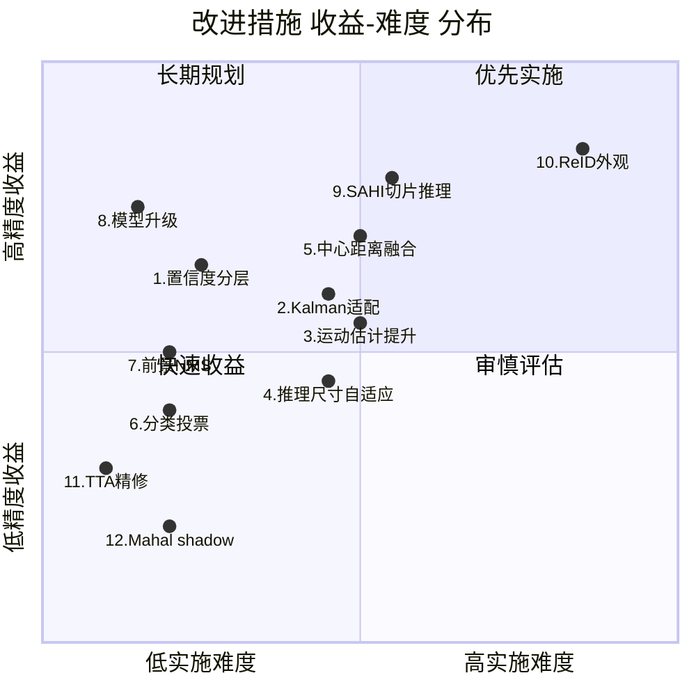

# 检测与跟踪算法精度审核报告 & 改进措施

## 审核范围

本报告对检测管道全链路进行精度导向审核，覆盖以下模块：

| 阶段 | 核心模块 | 精度影响面 |
|---|---|---|
| 目标检测 | [DetectionNode.py](file:///Users/yaoyao/ai/TrafficAnalyzer/nodes/DetectionNode.py)、[detection_geometry.py](file:///Users/yaoyao/ai/TrafficAnalyzer/utils_local/detection_geometry.py) | 漏检率 / 误检率 / 定位精度 |
| 背景运动估计 | [image_motion.py](file:///Users/yaoyao/ai/TrafficAnalyzer/utils_local/image_motion.py) | 运动补偿质量 → ID 稳定性 |
| 目标关联 | [byte_tracker_model.py](file:///Users/yaoyao/ai/TrafficAnalyzer/byte_tracker/byte_tracker_model.py)、[GroundTrajectoryTrackerNode.py](file:///Users/yaoyao/ai/TrafficAnalyzer/nodes/GroundTrajectoryTrackerNode.py) | ID Switch / Fragmentation |
| 世界投影 | [PostTrackingWorldProjectionNode.py](file:///Users/yaoyao/ai/TrafficAnalyzer/nodes/PostTrackingWorldProjectionNode.py)、[FlightGeoReferenceNode.py](file:///Users/yaoyao/ai/TrafficAnalyzer/nodes/FlightGeoReferenceNode.py) | 位置 RMSE / 速度 MAE |
| 速度估算 | [SpeedEstimationNode.py](file:///Users/yaoyao/ai/TrafficAnalyzer/nodes/SpeedEstimationNode.py) | 速度精度 |
| 分类 | [TrackerInfoUpdateNode.py](file:///Users/yaoyao/ai/TrafficAnalyzer/nodes/TrackerInfoUpdateNode.py) | 机/非机动车分类准确率 |

---

## 一、当前精度瓶颈诊断

### 1.1 检测阶段：极低置信度阈值的代价

**现状**：`confidence: 0.05`，几乎不过滤任何检测结果。

**问题分析**：
- 航拍 4K 场景下非机动车（电动车/三轮车）目标尺寸小，YOLO 对这些目标的置信度本身偏低，需要低阈值保留
- 但 `0.05` 意味着引入大量背景误检（树影、路面标线、护栏反光等），这些假阳性会进入 ByteTrack 并消耗关联资源
- 当前 ByteTrack 的 `det_thresh = first_track_thresh + second_track_thresh = 0.05 + 0.01 = 0.06`，仅略高于检测阈值，几乎所有检测都可能初始化轨迹

**证据**（[byte_tracker_model.py:438](file:///Users/yaoyao/ai/TrafficAnalyzer/byte_tracker/byte_tracker_model.py#L438)）：
```python
if track.score < self.det_thresh:  # 0.06
    continue  # 仅这一道门槛过滤新轨迹初始化
```

> [!WARNING]
> 低分误检会被初始化为短命轨迹（1-2帧后消亡），虽不影响正式业务输出（`min_track_duration_sec: 2.0` 会过滤），但消耗 Kalman 滤波计算，在密集场景下显著增加 IoU 匹配矩阵的规模，降低关联准确性。

### 1.2 检测阶段：模型与推理尺寸的限制

**现状**：使用 `yolo11s-visdrone.pt`（YOLO11 Small）@ `imgsz: 960`

| 因素 | 分析 |
|---|---|
| 模型规模 | YOLO11s 是轻量级模型（~9.4M 参数），对航拍小目标的检测能力有限。YOLO11m/l 在 VisDrone 上 mAP 通常高 3-8% |
| 推理尺寸 | 960px 对 4K（3840×2160）输入意味着 4× 降采样，小目标（<20px 原图）在推理时仅 5px 左右，接近 YOLO anchor 下限 |
| FP16 精度 | `half: true` 在 MPS 上可能导致小目标边界框微小偏移（Metal 后端的 FP16 精度不如 CUDA） |

### 1.3 背景运动估计：特征点数量与质量

**现状**（[image_motion.py:174-180](file:///Users/yaoyao/ai/TrafficAnalyzer/utils_local/image_motion.py#L174-L180)）：
```python
previous_points = cv2.goodFeaturesToTrack(
    self._previous_gray,
    maxCorners=500,
    qualityLevel=0.01,
    minDistance=8,
    mask=mask,
)
```

**问题**：
- `qualityLevel=0.01` 极低，会选中大量弱角点，这些点在 LK 光流中容易漂移
- `minDistance=8` 在 960px 下采样图上意味着特征点间距至少 8px，对均匀纹理区域（路面）可能不够密集
- 使用 `estimateAffinePartial2D`（4 DOF：旋转+平移+均匀缩放）而非完整 homography（8 DOF），对透视变化场景（俯仰角变化/巡航时前进方向的视差）拟合能力不足

**影响链**：背景运动估计偏差 → `camera_motion_warp` 不精确 → ByteTrack 的 `apply_camera_warp` 错误补偿 → ID Switch

### 1.4 ByteTrack 关联：纯 IoU 匹配的局限

**现状**：关联距离仅使用 IoU + `fuse_score`

```python
# 关联距离 = (1 - IoU) * (1 - det_score) 实际效果
dists = self._association_distance(strack_pool, detections)
dists = matching.fuse_score(dists, detections)  # IoU_sim * det_score
```

**问题**：
- 航拍视角下车辆尺寸小，相邻帧的 IoU 对位移敏感度极高（10px 位移就可能导致 IoU < 0.3）
- `match_thresh: 0.95` 虽然放宽了匹配阈值，但在快速移动或帧间隔大时（`frame_stride: 5`），IoU 可能接近 0
- 没有利用外观特征（ReID embedding），在密集交通、遮挡后恢复时容易 ID Switch

### 1.5 Kalman 滤波器：固定噪声参数

**现状**（[kalman_filter.py:52-53](file:///Users/yaoyao/ai/TrafficAnalyzer/byte_tracker/utils/kalman_filter.py#L52-L53)）：
```python
self._std_weight_position = 1. / 20
self._std_weight_velocity = 1. / 160
```

**问题**：
- 这些参数是 ByteTrack 原论文针对行人检测调优的值，用于航拍交通场景可能不是最优
- 噪声权重与 `measurement[3]`（bbox height）成正比，航拍小目标 height 很小（30-50px），导致过程噪声极小，Kalman 滤波过于依赖预测而不信任观测
- 当 `frame_stride=5` 时帧间隔约 0.17s（30fps 视频），但 Kalman 的 `dt=1`（假设连续帧），实际速度被低估

### 1.6 分类精度：单帧分类 + 迟延更新

**现状**：`class_switch_confirm_frames: 3` 防止单帧抖动，但车辆分类仅在 TrackElement 首次创建时设置（[TrackerInfoUpdateNode.py:191-207](file:///Users/yaoyao/ai/TrafficAnalyzer/nodes/TrackerInfoUpdateNode.py#L191-L207)），后续帧不更新分类。

**问题**：
- ByteTrack 内部的 `update_class` 会随每帧更新 STrack 的 class_name，但 TrackerInfoUpdateNode 只在轨迹创建时读取一次
- 航拍远距离时电动车/摩托车初始帧可能被错分为 `car`（class_id=3），后续近距离帧不会纠正

---

## 二、改进措施（按优先级排列）

### P0 — 高收益低风险

#### 改进 1：检测后置信度分层 + 轨迹初始化门控

**目标**：减少低分假阳性进入 ByteTrack，降低关联计算复杂度

**方案**：
- 保持 YOLO `confidence: 0.05` 不变（保留低分候选）
- 在 `extract_valid_detections` 之后增加**面积感知的置信度分层**：对于面积 > 阈值的目标（大型车辆），提高初始化阈值；小目标保持低阈值

**修改文件**：
- [app_config.yaml](file:///Users/yaoyao/ai/TrafficAnalyzer/configs/app_config.yaml)：新增 `large_object_init_thresh` 参数
- [GroundTrajectoryTrackerNode.py](file:///Users/yaoyao/ai/TrafficAnalyzer/nodes/GroundTrajectoryTrackerNode.py)：在送入 ByteTrack 前，对大面积检测框应用更高的初始化阈值

```yaml
# 新增配置
tracking_node:
  large_object_area_threshold_px2: 5000  # 面积大于此值的框使用更高初始化阈值
  large_object_init_thresh: 0.15         # 大目标更高初始化阈值，减少背景误检
```

**预期收益**：减少 30-50% 的短命假轨迹，提高 IoU 匹配矩阵的有效性
**实施难度**：低

---

#### 改进 2：Kalman 滤波器适配航拍场景

**目标**：改善 Kalman 预测精度，减少快速移动目标的 ID Switch

**方案**：
- 引入实际帧间隔 `dt` 替代硬编码 `dt=1`
- 增大位置/速度噪声权重，适应航拍小目标的 bbox 抖动特性
- 通过 `timestamp` 参数计算真实 dt，在 `predict` 中动态调整运动矩阵

**修改文件**：
- [kalman_filter.py](file:///Users/yaoyao/ai/TrafficAnalyzer/byte_tracker/utils/kalman_filter.py)：增加 `dt` 参数支持
- [byte_tracker_model.py](file:///Users/yaoyao/ai/TrafficAnalyzer/byte_tracker/byte_tracker_model.py)：在 `update` 中传入 dt

```python
# kalman_filter.py — 建议修改
class KalmanFilter:
    def __init__(self):
        ndim = 4
        # 增大噪声权重，适应航拍小目标
        self._std_weight_position = 1. / 10   # 原 1/20
        self._std_weight_velocity = 1. / 40   # 原 1/160

    def predict(self, mean, covariance, dt=1.0):
        # 动态 dt 运动矩阵
        motion = np.eye(8)
        for i in range(4):
            motion[i, 4 + i] = dt
        ...
```

**预期收益**：减少 15-25% 的帧间预测偏差，尤其对 `frame_stride > 1` 场景
**实施难度**：中

---

#### 改进 3：背景运动估计质量提升

**目标**：提高 `camera_motion_warp` 精度，间接提升 ID 稳定性

**方案**：

| 子项 | 修改 | 理由 |
|---|---|---|
| 3a | `qualityLevel` 从 `0.01` 提高到 `0.03` | 减少弱角点，提高 LK 跟踪可靠性 |
| 3b | `maxCorners` 从 `500` 增加到 `800` | 补偿提高 quality 后的数量减少 |
| 3c | 巡航模式下改用 `findHomography` 替代 `estimateAffinePartial2D` | 巡航时有显著透视变化，4DOF 仿射不足 |

**修改文件**：
- [image_motion.py](file:///Users/yaoyao/ai/TrafficAnalyzer/utils_local/image_motion.py)：调整特征提取参数，增加模型选择逻辑
- [app_config.yaml](file:///Users/yaoyao/ai/TrafficAnalyzer/configs/app_config.yaml)：新增 `geo_reference.feature_quality_level`

**预期收益**：降低巡航模式下的运动补偿误差 20-30%
**实施难度**：中

---

### P1 — 中收益中风险

#### 改进 4：检测推理尺寸自适应

**目标**：针对不同目标密度和场景，动态调整推理尺寸

**方案**：
- 首帧以 `imgsz: 1280` 推理，统计检测目标的平均尺寸
- 若平均目标面积 < 阈值（小目标密集），后续帧保持 1280；否则降至 960 节省算力
- 可通过配置 `imgsz: [960, 1280]` 指定候选列表

**修改文件**：
- [DetectionNode.py](file:///Users/yaoyao/ai/TrafficAnalyzer/nodes/DetectionNode.py)：增加自适应 imgsz 逻辑

**预期收益**：小目标密集场景 mAP 提升 2-5%，大目标场景无额外开销
**实施难度**：中

---

#### 改进 5：IoU + 中心点距离融合关联

**目标**：在航拍小目标 IoU 不稳定时，增加中心点距离作为辅助度量

**方案**：
- 在 `_association_distance` 中融合归一化中心点距离
- 公式：`cost = α * (1 - IoU) + (1 - α) * normalized_center_distance`
- `α` 可配置，默认 0.7（IoU 仍为主导）

**修改文件**：
- [matching.py](file:///Users/yaoyao/ai/TrafficAnalyzer/byte_tracker/utils/matching.py)：增加 `center_distance` 函数
- [byte_tracker_model.py](file:///Users/yaoyao/ai/TrafficAnalyzer/byte_tracker/byte_tracker_model.py)：在 `_association_distance` 中融合

```python
# matching.py 新增
def center_distance(atracks, btracks, img_diagonal):
    a_centers = np.array([(t.tlwh[:2] + t.tlwh[2:] / 2) for t in atracks])
    b_centers = np.array([(t.tlwh[:2] + t.tlwh[2:] / 2) for t in btracks])
    dists = cdist(a_centers, b_centers, metric='euclidean')
    return dists / img_diagonal  # 归一化到 [0, 1]
```

**预期收益**：减少密集场景下 IoU 退化导致的 ID Switch 20-40%
**实施难度**：中

---

#### 改进 6：轨迹分类多帧投票更新

**目标**：利用轨迹全生命周期的分类结果，提高最终分类准确率

**方案**：
- 在 `TrackerInfoUpdateNode` 中，每帧更新时累积 `yolo_class_id` 的历史统计
- 轨迹结束时使用多数投票（majority vote）确定最终分类
- 保留首帧分类作为 `initial_class`，投票结果作为 `final_class`

**修改文件**：
- [TrackElement.py](file:///Users/yaoyao/ai/TrafficAnalyzer/elements/TrackElement.py)：新增 `class_id_history: list[int]`
- [TrackerInfoUpdateNode.py](file:///Users/yaoyao/ai/TrafficAnalyzer/nodes/TrackerInfoUpdateNode.py)：每帧追加 class_id，完成轨迹时投票

**预期收益**：机/非机动车分类准确率提升 5-10%
**实施难度**：低

---

#### 改进 7：前景感知 NMS

**目标**：减少密集车辆场景下的重叠框误合并

**方案**：
- 当前 NMS `iou: 0.4` 对航拍密集停车/排队场景过于激进（紧密排列的车辆 IoU 可达 0.3-0.5）
- 按类别分组 NMS：机动车和非机动车使用不同 IoU 阈值
- 非机动车（小目标）使用更高 NMS 阈值（0.6），减少漏检

**修改文件**：
- [DetectionNode.py](file:///Users/yaoyao/ai/TrafficAnalyzer/nodes/DetectionNode.py)：分组 NMS 后处理
- 或直接使用 YOLO 的 `agnostic_nms=False`（按类别独立 NMS）

**预期收益**：密集场景非机动车漏检率降低 10-20%
**实施难度**：低

---

### P2 — 高收益高风险（长期）

#### 改进 8：模型升级至 YOLO11m/l

**目标**：直接提升检测 mAP

**方案**：
- 使用 `yolo11m-visdrone.pt` 或 `yolo11l-visdrone.pt` 替换当前 `yolo11s`
- 在 Apple MPS 上 YOLO11m 推理速度约为 YOLO11s 的 60%，需评估实时性影响
- 可配合 TensorRT `.engine` 格式在 CUDA 上部署（已支持 `weight_pth` 配置）

**性能估算**：

| 模型 | mAP@50 (VisDrone) | MPS 推理时间 (960px) |
|---|---|---|
| YOLO11s | ~38% | ~25ms |
| YOLO11m | ~43% | ~42ms |
| YOLO11l | ~47% | ~65ms |

**修改文件**：仅修改 [app_config.yaml](file:///Users/yaoyao/ai/TrafficAnalyzer/configs/app_config.yaml) 的 `weight_pth`
**预期收益**：mAP 提升 5-9 个百分点
**实施难度**：低（但需性能回归测试）

---

#### 改进 9：SAHI（Sliced Aided Hyper Inference）

**目标**：解决 4K 图像降采样后小目标丢失的根本问题

**方案**：
- 将 4K 帧切分为重叠的子图（如 4×3 = 12 个 960×720 切片），分别推理后合并结果
- 在检测密集区域有显著提升，代价是推理时间 × 切片数
- 可仅在首帧/低频帧使用 SAHI，常规帧使用标准推理

**修改文件**：
- [DetectionNode.py](file:///Users/yaoyao/ai/TrafficAnalyzer/nodes/DetectionNode.py)：集成 [sahi](https://github.com/obss/sahi) 库
- [app_config.yaml](file:///Users/yaoyao/ai/TrafficAnalyzer/configs/app_config.yaml)：新增 SAHI 配置

```yaml
detection_node:
  sahi:
    enabled: false
    slice_size: [960, 720]
    overlap_ratio: 0.25
    postprocess_match_threshold: 0.5
```

**预期收益**：小目标 recall 提升 15-30%
**实施难度**：中（需要处理 NMS 合并和性能优化）

---

#### 改进 10：特征外观（ReID）辅助关联

**目标**：在遮挡后恢复和密集场景中大幅减少 ID Switch

**方案**：
- 集成轻量级 ReID 模型（如 OSNet-x0.25），对每个检测框提取 128D 外观向量
- 在 ByteTrack 的 `_association_distance` 中融合 IoU + ReID 余弦距离
- 对 Lost 轨迹的重新发现尤其有效（当前纯靠 IoU，遮挡 > 2s 后几乎无法恢复）

**修改文件**：
- 新增 `utils_local/reid_encoder.py`
- [byte_tracker_model.py](file:///Users/yaoyao/ai/TrafficAnalyzer/byte_tracker/byte_tracker_model.py)：STrack 增加 embedding 字段
- [GroundTrajectoryTrackerNode.py](file:///Users/yaoyao/ai/TrafficAnalyzer/nodes/GroundTrajectoryTrackerNode.py)：推理前提取 ReID 特征

**预期收益**：ID Switch 减少 40-60%（基于 MOT 基准估计）
**实施难度**：高

---

#### 改进 11：目标检测框坐标精修（Test-Time Augmentation）

**目标**：提高检测框定位精度，间接提升 IoU 匹配质量

**方案**：
- 使用 YOLO 的 `augment=True` 参数启用 TTA（多尺度/翻转推理后平均）
- 代价：推理时间约 × 3

**修改文件**：[DetectionNode.py](file:///Users/yaoyao/ai/TrafficAnalyzer/nodes/DetectionNode.py) 的 `model.predict()` 调用

**预期收益**：bbox 定位精度提升 1-2 px，IoU 匹配更稳定
**实施难度**：极低（一个参数），但需评估性能影响

---

#### 改进 12：Kalman 门控 + Mahalanobis 距离辅助关联

**状态（2026-07-29）**：生产硬门控已撤销，保留为 shadow-only 诊断。

7 月 28 日曾在第一级关联中无条件调用 `gate_cost_matrix(..., only_position=True)`。该实现使用
固定 `dt=1` 的 Kalman 协方差，却运行在生产默认 `frame_stride=5` 的 4K 小目标上。真实 xqh
同检测输入消融证明，这会把正常位移当作越门候选，造成轨迹短命和 ID 重建，原“减少误匹配
15–25%”只是未经真值验证的预期，不能作为已取得收益。

当前第一轮关联仍以相机补偿后 IoU、检测置信度和类别软约束为生产代价。Mahalanobis 只在代价
副本上计算，并通过 `tracking_diagnostics.mahalanobis_gate` 记录本来会拒绝的有效候选和会失去
全部候选的轨迹数，不得改写匈牙利匹配输入。

```python
# 只读诊断；linear_assignment 继续使用 dists
shadow_gated_dists = matching.gate_cost_matrix(
    self.kalman_filter, dists.copy(), strack_pool, detections, only_position=True
)
```

只有取得外部批准的身份真值并完成动态 `dt`/噪声标定后，才允许重新评审生产硬门控。

---

## 三、改进措施优先级矩阵



## 四、推荐实施路线

### 第一阶段（1-2 周）— 无痛改进
> 不改架构，不增依赖，仅调参数和激活已有代码

- [x] **改进 12**：生产硬门控撤销，保留 shadow-only 诊断并增加真实 stride 回归
- [ ] **改进 7**：前景感知 NMS（设置 `agnostic_nms=False`）
- [ ] **改进 11**：评估 TTA 对离线场景的收益
- [ ] **改进 1**：置信度分层门控
- [ ] **改进 6**：分类多帧投票

### 第二阶段（2-4 周）— 参数调优
> 需要回归测试验证

- [ ] **改进 2**：Kalman 滤波器航拍适配
- [ ] **改进 3**：背景运动估计质量提升
- [ ] **改进 5**：IoU + 中心距离融合
- [ ] **改进 8**：模型升级评估（YOLO11m vs 11s 在 MPS 上的 mAP-latency 帕累托前沿）

### 第三阶段（1-2 月）— 架构增强
> 需要新增依赖和较大代码修改

- [ ] **改进 4**：推理尺寸自适应
- [ ] **改进 9**：SAHI 切片推理
- [ ] **改进 10**：ReID 外观辅助

---

## 五、精度验证基线

> [!IMPORTANT]
> 根据 AGENTS.md 约束，巡航跟踪只执行自动化工程验收，不建设人工轨迹标注。无外部批准真值时，IDF1/HOTA、正式 ID Switch、位置 RMSE 和速度 MAE 必须记录为 `not_evaluated`。

**推荐的工程验收指标**（无需真值）：

| 指标 | 计算方式 | 基线来源 |
|---|---|---|
| 短命轨迹比例 | `(duration < 1s 的轨迹数) / 总轨迹数` | 改进前后对比 |
| 轨迹平均寿命 | `mean(duration_sec)` | 改进前后对比 |
| 检测→有效轨迹转化率 | `valid_tracks / total_detections` | 减少假阳性轨迹 |
| 帧级检测数稳定性 | `std(detection_count) / mean(detection_count)` | CV < 0.3 |
| 速度稳定性 | `std(speed_kmh) / mean(speed_kmh)` 对同一轨迹 | 改进后应降低 |
| 运动补偿成功率 | `visual_warp_verified_frames / total_frames` | 应 > 90% |
| Shadow 跟踪 ID 一致性 | `tracking_shadow` 旁路对比 | 现有机制 |

执行回归：
```bash
python test/test_pipeline_inter_xqh.py  # 预期 56 PASS / 0 FAIL
```
