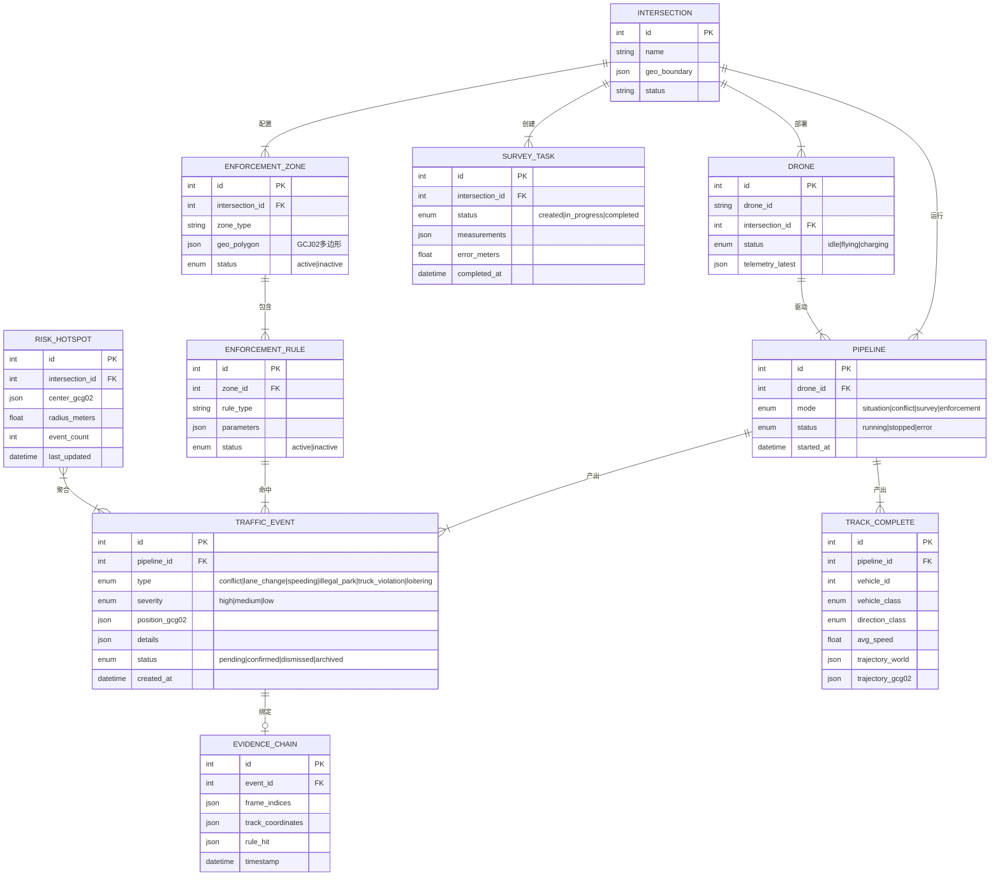
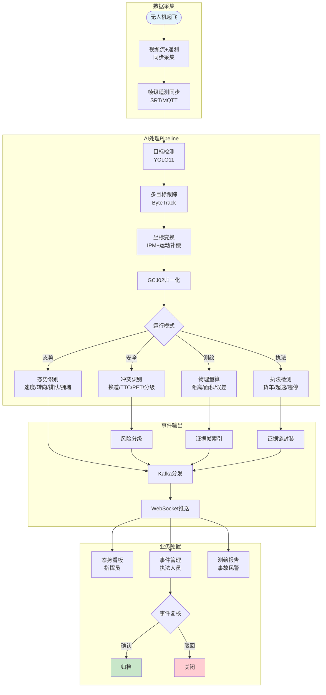
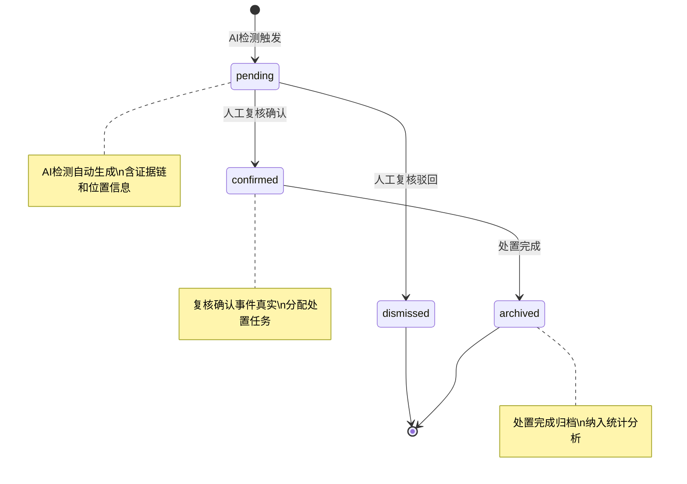

# 无人机交通智能感知系统 PRD

| PRD 审核人 | [TODO] |
| --- | --- |
| 重要性 | 高 |
| 紧迫性 | 高 |
| 需求方 | 交通管理部门 / 投标项目组 |
| PRD 编写人 | [TODO] |
| PRD 提交日期 | 2026-06-29 |

## PRD 修改记录

| 变更时间 | 变更内容 | 变更提出部门与理由 | 修改人 | 审核人 | 版本号 |
| --- | --- | --- | --- | --- | --- |
| 2026-06-29 | 初始版本，基于投标方案全量需求生成 | — | [TODO] | [TODO] | v1.0 |
| 2026-06-29 | 需求澄清更新：GCG02→GCJ02（国测坐标系）；路网GIS已采购；LSTM→运动学外推简化；货车细分类→下一阶段 | 需求方反馈 | [TODO] | [TODO] | v1.1 |

---

## 1、项目背景

### 1.1 业务现状

城市交通管理依赖固定杆件监控（电子警察、卡口、高点视频），覆盖率有限且存在大量视角盲区。现有 TrafficAnalyzer 系统已具备基础能力：

- **视频AI检测**：YOLO11 目标检测 + ByteTrack 多目标跟踪，支持机动车/非机动车/行人识别
- **坐标与运动补偿**：单应性矩阵（IPM）、电子图像稳定（EIS）、GPS锚定世界帧
- **交通参数计算**：车速估计、方向分类（直行/左转/右转/掉头）、车道级流量统计、排队长度
- **冲突检测**：基于 TTC 的机非冲突检测
- **数据管道**：Kafka 多主题分发 → InfluxDB 时序存储 → Grafana 可视化
- **管理平台**：FastAPI + WebSocket 实时推送，支持路口/无人机/管道生命周期管理

现有系统已在多个路口完成端到端验证（inter_xqh 视频 4K@30fps，49/49 测试 PASS），具备从视频采集到结构化数据输出的基础闭环能力。

### 1.2 面临问题

1. **态势感知能力不完整**：缺少多因子拥堵指数、GCJ02 全局坐标归一化、轨迹预测等高级分析能力，无法满足路口态势综合研判需求
2. **安全事件检测薄弱**：仅有基础 TTC 冲突检测，缺少换道识别、PET 指标、风险分级、热区聚类等安全事件全链路分析
3. **缺乏非接触式测绘能力**：无法从无人机视角进行事故现场物理参数量算（距离/面积/宽度），缺少证据帧管理和误差控制体系
4. **执法支撑能力不足**：无货车细分类、电子围栏、规则引擎和证据链管理，无法支撑机动化执法场景
5. **坐标体系未统一**：现有系统仅到 ENU 局部坐标，未实现 GCJ02 全局归一化，无法与路网 GIS 精确对齐

### 1.3 解决思路

在现有 TrafficAnalyzer 系统基础上，扩展 4 个核心 AI 模型能力：

1. **路口态势识别模型** — 增强拥堵指数、轨迹预测、坐标归一化
2. **换道与冲突识别模型** — 新增换道检测、PET、风险分级、热区聚类
3. **事故测绘模型** — 新增物理量算、误差控制、证据帧管理
4. **执法检测模型** — 新增货车分类、电子围栏、规则引擎、证据链

共性基础设施：统一坐标体系（ENU→GCJ02）、轨迹预测引擎（运动学外推+卡尔曼滤波）、规则引擎、证据链管理。

### 1.4 决策依据

- 投标方案明确要求 4 个 AI 模型的完整交付
- 现有系统已覆盖基础检测跟踪能力（~40-70%），扩展开发投入可控
- 端到端测试已验证基础管道稳定性（49/49 PASS）
- 城市管理对无人机交通监测的需求快速增长（重大活动保障、应急测绘、机动执法）

---

## 2、需求基本情况

| 要素 | 内容 |
| --- | --- |
| **需求提出人** | 投标项目组 / 交通管理部门 |
| **功能使用人** | 交通指挥员、交通执法人员、事故处理民警、系统运维人员 |
| **受影响人** | 交通管理层（依赖数据决策）、信号控制部门（依赖流量数据）、道路设施管理部门 |
| **场景描述** | 见下方详细场景 |
| **发生频率** | 日常巡检（每日 2-4 次）、重大活动保障（月均 1-2 次）、应急响应（不定期） |
| **核心痛点** | 固定监控盲区大、人工上路风险高、事件发现滞后、执法取证效率低 |
| **需求价值** | 扩大感知覆盖、缩短响应时间、提升执法精度、降低人员风险 |

### 核心场景描述

> 💡 场景六要素：人物、时间、地点、起因、经过、结果

**场景1：早晚高峰路口态势巡检**
- **人物**：交通指挥员，负责区域交通运行监控
- **时间**：工作日早高峰（7:00-9:00）和晚高峰（17:00-19:00）
- **地点**：城市重点路口，固定监控覆盖不足的交叉口
- **起因**：需要实时掌握路口各进口道流量、排队长度、拥堵指数
- **经过**：当前依赖人工观看固定监控画面，逐个路口切换查看，无法同时监控多个路口
- **结果**：发现拥堵滞后 5-10 分钟，无法量化拥堵程度，缺少预测能力

**场景2：交通事故现场快速测绘**
- **人物**：事故处理民警，需快速完成现场勘查
- **时间**：事故发生后 15-30 分钟内
- **地点**：城市快速路、高速公路等高风险路段
- **起因**：事故现场需要快速测量车辆位置、刹车痕迹、散落物分布
- **经过**：当前人工上路测量，需封闭车道、放置锥桶、手工量测，耗时长且有二次事故风险
- **结果**：现场处置 30-60 分钟，期间车道封闭造成大面积拥堵，人员安全风险高

**场景3：货车限行区域执法**
- **人物**：交通执法人员，负责重点路段货车管控
- **时间**：全天候，尤其夜间和凌晨违规高发时段
- **地点**：城市核心区、学校周边、限行区域
- **起因**：需发现和取证违规闯入限行区域的货车
- **经过**：当前依赖定点卡口抓拍，覆盖率低，货车可绕行规避
- **结果**：违规发现率不足 30%，取证不完整，人工复核工作量大

---

## 3、业务分析与系统调研

### 3.1 同类系统调研

| 调研对象 | 类型 | 核心能力 | 可借鉴点 | 局限性 |
| --- | --- | --- | --- | --- |
| TrafficAnalyzer 现有系统 | 内部 | YOLO检测+ByteTrack跟踪+速度/方向/车道分析+Kafka+InfluxDB | Pipeline架构成熟、端到端已验证 | 缺高级分析、缺测绘、缺执法 |
| 海康/大华高点视频 | 外部 | 固定高点AI检测、流量统计、事件检测 | 大规模部署经验丰富 | 固定视角有盲区、无法机动部署 |
| DJI 大疆机场+上云API | 外部 | 无人机自动巡飞、RTK定位、遥测数据 | 无人机平台成熟、API标准化 | 不含交通AI分析能力 |
| 交科所/同济大学交通仿真 | 外部 | 交通流仿真、信号优化评估 | 交通工程理论成熟 | 偏仿真非实时检测 |

### 3.2 业务痛点优先级

| 排序 | 痛点描述 | 影响范围 | 严重程度 | 紧迫度 | 涉及模块 |
| --- | --- | --- | --- | --- | --- |
| 1 | 固定监控盲区导致路口态势感知不完整 | 所有无固定监控路口 | 高 | 高 | 路口态势识别 |
| 2 | 安全事件（冲突、换道）发现滞后 | 快速路、复杂交叉口 | 高 | 高 | 换道与冲突识别 |
| 3 | 事故现场人工测绘耗时长、风险高 | 事故处理全流程 | 高 | 中 | 事故测绘 |
| 4 | 执法盲区大、取证效率低 | 限行/超速/违停场景 | 中 | 中 | 执法检测 |
| 5 | 坐标体系不统一，无法与GIS对齐 | 所有需要地理定位的场景 | 中 | 高 | 共性基础设施 |

### 3.3 投入产出初步评估

| 维度 | 估算 |
| --- | --- |
| **预计投入** | 4 个模型扩展开发，约 4-6 人月（复用现有 Pipeline 架构和平台基础设施） |
| **效率提升** | 事故测绘时间从 30-60 分钟降至 10-15 分钟；拥堵发现时间从 5-10 分钟降至秒级 |
| **业务价值** | 覆盖固定监控盲区，支撑机动化交通管理；提供结构化态势数据支撑信控优化 |

---

## 4、项目收益目标

### 4.1 项目目标

| 目标类型 | 目标描述 | 衡量指标 | 目标值 | 达成时限 |
| --- | --- | --- | --- | --- |
| **核心业务目标** | 4个AI模型全部上线并通过验收 | 模型功能完整度 | 100% 覆盖投标方案要求 | 项目交付期 |
| **效率目标** | 事故现场测绘时间大幅缩短 | 单事故测绘耗时 | ≤15分钟（原30-60分钟） | 上线3个月内 |
| **效率目标** | 拥堵事件发现时间缩短 | 从拥堵发生到系统告警延迟 | ≤30秒 | 上线即达标 |
| **精度目标** | 坐标映射精度满足测绘要求 | 平面误差 | ≤3米 | 上线即达标 |
| **采纳率目标** | 一线人员实际使用系统 | 日活用户比例 | ≥80% 目标用户 | 上线3个月内 |

### 4.2 验收标准

1. 路口态势识别模型：支持 9 类交通参与者检测、4 类转向分类、多因子拥堵指数（0-10 分）、GCJ02 坐标输出
2. 换道与冲突识别模型：支持换道事件检测（几何+运动双重验证）、TTC/PET 双指标、3-5 秒轨迹预测、风险 3 级分级
3. 事故测绘模型：距离/面积量算误差 ≤3 米、证据帧自动索引、现场平面示意数据输出
4. 执法检测模型：货车/非货车基础分类、电子围栏匹配、规则引擎可配置、完整证据链（帧+轨迹+位置+规则+时间戳）
5. 端到端延迟：从视频帧解析到事件输出 ≤ 秒级
6. 系统集成：4 个模型与现有 Pipeline 架构无缝集成，Kafka 消息格式兼容

### 4.3 成功标准

> 项目上线后 3 个月内，达到以下指标视为成功：

1. 日均无人机巡检任务 ≥ 4 次/路口，系统自动产出结构化态势报告
2. 安全事件（冲突/换道）预警准确率 ≥ 85%（人工复核确认）
3. 事故测绘使用率 ≥ 70%（适用场景中系统替代人工测绘的比例）
4. 执法事件自动取证率 ≥ 60%（系统自动完成从检测到证据链生成的比例）

---

## 5、项目方案概述

### 5.1 核心功能概述

本项目包含以下核心功能模块：

| 序号 | 功能模块 | 功能简述 | 优先级 |
| --- | --- | --- | --- |
| 1 | 路口态势识别 | 车辆检测/跟踪/速度/转向/排队/拥堵指数，GCJ02坐标输出 | P0 |
| 2 | 换道与冲突识别 | 换道检测、TTC/PET、轨迹预测、风险分级、热区聚类 | P0 |
| 3 | 事故测绘 | 非接触式物理量算、地理配准、误差控制、证据帧管理 | P1 |
| 4 | 执法检测 | 超速/货车限行/违停/滞留/占道 + 证据链管理（货车细分类下一阶段） | P1 |
| 5 | 坐标归一化引擎 | ENU→GCJ02 统一坐标转换（共性基础） | P0 |
| 6 | 轨迹预测引擎 | 运动学外推+卡尔曼滤波 3-5秒前瞻预测（共性基础） | P0 |
| 7 | 规则引擎 | 可配置的交通规则判定（共性基础） | P1 |
| 8 | 证据链管理 | 帧+轨迹+位置+规则+时间戳 结构化证据封装 | P1 |
| 9 | 平台集成与展示 | WebSocket 实时推送、事件管理、风险热区可视化 | P0 |

### 5.2 方案概述

- **产品方案**：在现有 TrafficAnalyzer 系统上扩展 4 个 AI 模型，通过新增 Pipeline Node 和增强现有 Node 实现，保持架构一致性
- **技术方案**：复用 Node-based Pipeline 架构、Kafka 消息管道、FastAPI 平台；新增运动学预测模块、规则引擎、证据链管理器
- **运营方案**：先在 1-2 个试点路口验证，逐步推广到全部目标路口

### 5.3 MVP 范围

> 💡 B端 MVP 原则：必须支撑核心业务流程闭环，不是"最简单的版本"

**MVP 包含的功能：**
1. 路口态势识别全功能（拥堵指数、转向分类、GCJ02 坐标）— 核心感知能力
2. 换道与冲突识别核心功能（TTC/PET、风险分级）— 安全事件检测
3. 坐标归一化引擎 — 共性基础
4. 轨迹预测引擎 — 共性基础
5. 平台集成展示（WebSocket 推送、事件列表）— 可视化闭环

**MVP 暂不包含的功能：**
1. 事故测绘模型 — 独立性强，可后续迭代
2. 执法检测模型 — 依赖规则配置数据，需业务方配合
3. 风险热区空间聚类 — 需要历史数据积累
4. 证据链管理 — 执法场景专用，随执法模型一起上线

**核心验证假设：**
1. 运动学轨迹预测在无人机视角下的精度是否满足 3-5 秒前瞻需求
2. GCJ02 坐标归一化精度是否满足 ≤3 米误差要求
3. 拥堵指数算法是否能真实反映路口运行态势

---

## 6、项目范围

### 6.1 涉及系统

| 系统名称 | 关系类型 | 影响描述 | 责任方 |
| --- | --- | --- | --- |
| TrafficAnalyzer Pipeline | 主体改造 | 新增/增强 Pipeline Node | 开发团队 |
| TrafficAnalyzer Platform | 主体改造 | 新增事件管理、风险热区 API | 开发团队 |
| DJI Cloud API / MQTT | 数据来源 | 无人机遥测数据接入 | DJI + 开发团队 |
| 路网 GIS 系统 | 数据来源 | 道路中心线、电子围栏、限速规则 | 已采购（GCJ02 坐标系） |
| Kafka / InfluxDB / Grafana | 基础设施 | 新增 Topic 和 Measurement | 运维 |
| 信号控制系统 | 数据消费方 | 接收转向流量数据用于信控优化 | [TODO] |

### 6.2 影响范围

- **用户影响**：交通指挥员新增态势监控界面、执法人员新增执法事件管理界面、事故处理民警新增测绘任务管理
- **流程影响**：巡检流程从人工观看视频变为系统自动告警；事故测绘流程从人工量测变为无人机非接触式测绘；执法流程从定点卡口变为机动巡飞检测
- **数据影响**：新增 Kafka Topic（`lane_change_*`、`risk_events_*`、`survey_*`、`enforcement_*`）；新增 InfluxDB Measurement；新增 PostgreSQL 表（事件、证据链、规则配置）
- **上下游影响**：信号控制系统可消费更丰富的转向流量数据

### 6.3 不在本期范围内

1. 信号灯配时优化算法 — 仅提供数据支撑，不负责信控决策
2. 无人机自动航线规划 — 依赖 DJI FlightHub，本系统仅消费遥测数据
3. 视频结构化数据长期归档 — 本期仅保留近 30 天热数据
4. 多无人机协同调度 — 本期单无人机单路口模式
5. 移动端 App — 本期仅 Web 端
6. 货车细分类（重卡/中货/轻货/专项作业车）— 下一阶段实现，本期仅货车/非货车二分类
7. 学习型轨迹预测（LSTM 等）— 本期采用运动学外推简化方案

---

## 7、项目风险

### 7.1 前提假设

| 编号 | 假设内容 | 如果假设不成立的影响 |
| --- | --- | --- |
| A1 | 无人机 RTK 定位精度可达厘米级 | 坐标归一化和测绘精度无法满足 ≤3 米要求 |
| A2 | 路网 GIS 数据可获取且质量满足要求 | 电子围栏、限速规则无法配置，GCJ02 对齐精度降低 |
| A3 | YOLO 基础车辆分类可区分货车/非货车（细分类下一阶段） | 执法检测的货车限行功能精度降低 |
| A4 | 无人机飞行时间（单架次 30-45 分钟）满足巡检需求 | 需要多架次接力或自动机场支撑 |

### 7.2 约束条件

| 编号 | 约束描述 | 对设计的影响 |
| --- | --- | --- |
| C1 | 端到端延迟 ≤ 秒级 | 模型推理和数据处理必须在帧率内完成，不能用重型模型 |
| C2 | 测绘平面误差 ≤ 3 米 | 需要控制点动态修正和误差校验机制 |
| C3 | 现有 Pipeline 架构不做大规模重构 | 新功能以新增 Node 形式集成，保持向后兼容 |
| C4 | GPU 资源有限（单卡推理） | 多模型不能同时运行，需要模式切换或模型融合 |

### 7.3 风险清单

| 编号 | 风险类别 | 风险描述 | 发生概率 | 影响程度 | 应对方案 |
| --- | --- | --- | --- | --- | --- |
| R1 | 技术风险 | 运动学外推预测在复杂轨迹（急转弯/加减速）下精度不足 | 中 | 中 | 结合卡尔曼滤波平滑；后续可迭代引入学习型预测模型 |
| R2 | 技术风险 | 多模型推理导致单帧延迟超标 | 中 | 高 | 模型按需加载（态势/安全/测绘/执法模式切换）；轻量模型优先 |
| R3 | 运营风险 | 一线人员对系统接受度低 | 中 | 中 | 早期介入用户调研、提供操作培训、收集反馈持续优化 |
| R4 | 产品风险 | 路网 GIS 数据质量差导致电子围栏不准 | 高 | 中 | 提供手动标注和校正工具；支持控制点动态修正 |
| R5 | 合规风险 | 无人机视频数据涉及个人隐私 | 中 | 高 | 数据脱敏处理（人脸/车牌模糊化）；严格数据访问权限；符合《个人信息保护法》 |
| R6 | 技术风险 | RTK 信号在城市峡谷环境下精度退化 | 中 | 中 | 引入地面控制点辅助校正；多源定位融合（RTK+视觉+IMU） |

---

## 8、术语和缩略语

| 术语/缩略语 | 全称 | 定义说明 |
| --- | --- | --- |
| ENU | East-North-Up | 东北天坐标系，无人机局部空间计算坐标系 |
| GCJ02 | 国测坐标系 |中国国家测绘局制定的坐标系统，基于 WGS84 加密偏移，国内地图和路网 GIS 使用的标准坐标系 |
| GCJ02 | — | 全局地理坐标系，用于与路网 GIS 对齐 |
| TTC | Time-to-Collision | 碰撞时间，评估碰撞风险的核心指标 |
| PET | Post-Encroachment Time | 后车侵入时间，评估车辆通过冲突点的时间差 |
| IPM | Inverse Perspective Mapping | 逆透视变换，将斜视影像转换为鸟瞰图 |
| EIS | Electronic Image Stabilization | 电子图像稳定 |
| RTK | Real-Time Kinematic | 实时动态差分定位，厘米级精度 |
| LSTM | Long Short-Term Memory | 长短期记忆网络（本期暂不使用，后续迭代可引入学习型轨迹预测） |
| ByteTrack | — | 多目标跟踪算法，基于 IoU 距离矩阵关联 |
| Pipeline Node | — | 数据处理节点，帧数据流经各 Node 逐步增强 |

## 9、参考文献和引用文档

| 文档名称 | 版本 | 链接/位置 | 说明 |
| --- | --- | --- | --- |
| 投标方案（智能体和智算模型部分-无人机） | v1.0 | `req/智能体和智算模型部分-无人机.docx` | 需求来源 |
| 系统架构文档 | 当前 | `docs/ARCHITECTURE.md` | 现有系统架构 |
| 业务逻辑文档 | 当前 | `docs/BUSINESS_LOGIC.md` | 现有业务逻辑 |
| 交通态势感知系统设计 | 2026-05-29 | `docs/2026-05-29-srt-traffic-situation-design.md` | 已有设计参考 |
| 无人机运动补偿设计 | 2026-05-30 | `docs/2026-05-30-drone-motion-compensation-design.md` | 运动补偿设计 |
| 总体技术设计方案 | 2026-05-31 | `docs/2026-05-31-uav-traffic-perception-system-design.md` | 总体设计 |
| API 契约文档 | 当前 | `docs/API_CONTRACTS.md` | Kafka 消息格式 |

---

## 10、功能需求

### 10.1 产品框架概述

#### 10.1.1 应用架构图

```mermaid
graph TB
    subgraph 用户层
        CMD[交通指挥员<br/>态势监控]
        ENF[执法人员<br/>事件管理]
        ACC[事故处理民警<br/>测绘任务]
        OPS[系统运维<br/>系统管理]
    end

    subgraph 接入层
        AUTH[JWT 认证]
        WS[WebSocket<br/>实时推送]
        REST[REST API<br/>43+路由]
    end

    subgraph 业务服务层
        subgraph AI模型引擎
            M1[路口态势识别<br/>检测/跟踪/速度/转向/排队/拥堵]
            M2[换道与冲突识别<br/>换道/TTC/PET/风险分级]
            M3[事故测绘<br/>量算/配准/证据帧]
            M4[执法检测<br/>超速/货车/违停/证据链]
        end
        subgraph 共性基础
            COORD[坐标归一化<br/>ENU→GCJ02]
| PRED[轨迹预测<br/>运动学外推+卡尔曼]
            RULE[规则引擎<br/>可配置规则]
            EVID[证据链管理<br/>帧+轨迹+位置]
        end
        subgraph 平台服务
            EVT[事件管理<br/>告警/处置/归档]
            PIPE[管道管理<br/>启停/监控]
            DRONE[无人机管理<br/>遥测/状态]
            DASH[数据看板<br/>态势/热区/统计]
        end
    end

    subgraph 数据层
        KAFKA[(Kafka<br/>多Topic分发)]
        INFLUX[(InfluxDB<br/>时序数据)]
        PG[(PostgreSQL<br/>业务数据)]
    end

    subgraph 外部系统
        DJI[DJI Cloud API<br/>MQTT遥测]
        GIS[路网GIS<br/>围栏/限速]
        SIG[信号控制<br/>消费流量数据]
    end

    CMD --> REST --> AUTH
    ENF --> REST
    ACC --> REST
    OPS --> REST
    AUTH --> WS

    WS --> EVT & DASH
    REST --> EVT & PIPE & DRONE & DASH

    M1 & M2 & M3 & M4 --> COORD & PRED
    M2 --> RULE
    M4 --> RULE & EVID
    M3 --> EVID

    M1 & M2 & M3 & M4 --> KAFKA
    KAFKA --> INFLUX
    EVT & PIPE & DRONE --> PG

    DJI -.->|遥测数据| M1
    GIS -.->|围栏/限速| RULE
    KAFKA -.->|转向流量| SIG

    style M1 fill:#E3F2FD
    style M2 fill:#E3F2FD
    style M3 fill:#FFF3E0
    style M4 fill:#FFF3E0
```

#### 10.1.2 数据模型图



**实体说明：**

| 实体 | 说明 | 核心状态 |
| --- | --- | --- |
| INTERSECTION | 路口，系统管理的核心空间单元 | — |
| DRONE | 无人机，路口部署的执行设备 | idle → flying → charging |
| PIPELINE | 检测管道，运行模式切换 | running ↔ stopped / error |
| TRAFFIC_EVENT | 交通事件（冲突/换道/超速/违停等） | pending → confirmed/dismissed → archived |
| EVIDENCE_CHAIN | 证据链，与事件一对一绑定 | — |
| SURVEY_TASK | 测绘任务，事故现场勘查 | created → in_progress → completed |
| ENFORCEMENT_ZONE | 执法区域（电子围栏） | active ↔ inactive |
| ENFORCEMENT_RULE | 执法规则（限速/限行/禁停） | active ↔ inactive |
| RISK_HOTSPOT | 风险热区，事件空间聚类结果 | — |
| TRACK_COMPLETE | 完整轨迹记录 | — |

#### 10.1.3 核心业务流程图



#### 10.1.4 事件状态机



**状态转换表：**

| 当前状态 | 触发事件 | 目标状态 | 操作角色 | 备注 |
| --- | --- | --- | --- | --- |
| — | AI 检测到事件 | pending | 系统 | 自动创建，含证据链 |
| pending | 复核确认 | confirmed | 执法人员/指挥员 | 确认事件真实 |
| pending | 复核驳回 | dismissed | 执法人员/指挥员 | 误报或无需处理 |
| confirmed | 处置完成 | archived | 执法人员 | 归档纳入统计 |

#### 10.1.5 功能清单

| 子系统 | 页面/功能 | 平台端 | 说明 |
| --- | --- | --- | --- |
| 态势监控 | 实时态势看板 | ✓ | 流量/速度/排队/拥堵指数 |
| 态势监控 | 转向流量统计 | ✓ | 各进口道×各转向 |
| 态势监控 | 拥堵指数趋势 | ✓ | 时间序列+阈值告警 |
| 态势监控 | 车道级分析 | ✓ | 车道占用/排队/车头时距 |
| 事件管理 | 事件列表 | ✓ | 筛选/搜索/分页 |
| 事件管理 | 事件详情 | ✓ | 证据链回放+复核操作 |
| 事件管理 | 风险热区 | ✓ | 空间聚类可视化 |
| 测绘管理 | 测绘任务列表 | ✓ | 创建/查看/导出 |
| 测绘管理 | 测绘报告 | ✓ | 量算结果+平面示意 |
| 执法管理 | 执法区域配置 | ✓ | 电子围栏+规则设置 |
| 执法管理 | 执法事件管理 | ✓ | 取证+复核+归档 |
| 执法管理 | 货车监控 | ✓ | 实时位置+限行判定 |
| 系统管理 | 管道管理 | ✓ | 启停/模式切换/监控 |
| 系统管理 | 无人机管理 | ✓ | 状态/遥测/历史 |
| 系统管理 | 规则配置 | ✓ | 拥堵/冲突/执法规则 |

---

### 10.2 产品需求详解

#### 10.2.1 路口态势识别模块

##### 10.2.1.1 业务流程

1. VideoReader 读取视频帧 + 遥测数据
2. DetectionTrackingNode 执行 YOLO11 检测 + ByteTrack 跟踪
3. HomographyCalibrationNode 计算单应性矩阵
4. MotionCompensationNode GPS 锚定世界帧
5. SpeedEstimationNode 计算车速（含无人机运动补偿）
6. DirectionFlowNode 方向分类（直行/左转/右转/掉头）
7. LaneDetectionNode + LaneAnalysisNode 车道级分析
8. **[新增] CongestionIndexNode** 计算多因子拥堵指数
9. **[增强] TrajectoryNode** 运动学轨迹预测 + GCJ02 坐标归一化
10. CalcStatisticsNode 统计汇总
11. KafkaProducerNode 分发到 `statistics_{n}` 和 `track_complete_{n}`

##### 10.2.1.2 页面交互

**实时态势看板：**

**查询条件：**

| 字段名称 | 默认值 | 字段类型 | 备注 |
| --- | --- | --- | --- |
| 路口 | 全部 | 下拉 | 选择路口 |
| 时间范围 | 今日 | 日期选择 | 支持近7天 |
| 进口道 | 全部 | 多选 | 东/南/西/北 |
| 刷新间隔 | 5秒 | 下拉 | 1/5/10/30秒 |

**列表字段（按进口道×转向的聚合指标）：**

| 字段名称 | 字段类型 | 必输项 | 备注 |
| --- | --- | --- | --- |
| 进口道 | 文本 | 是 | 东/南/西/北 |
| 转向 | 文本 | 是 | 直行/左转/右转/掉头 |
| 流量（辆/分钟） | 数字 | — | 仅统计存活>3秒且有起始道路的轨迹 |
| 平均车速（km/h） | 数字 | — | EMA 平滑 |
| 排队长度（米） | 数字 | — | 队末车辆到停止线物理距离 |
| 拥堵指数 | 数字 | — | 0-10 分，颜色编码 |
| 车头时距（秒） | 数字 | — | 前后车通过同一点的时间差 |

**操作按钮：**

| 按钮名称 | 操作说明 | 触发条件 | 权限要求 |
| --- | --- | --- | --- |
| 导出报表 | 导出当前时段态势数据为 CSV | 有数据 | 查看权限 |
| 历史回放 | 回放指定时段态势数据 | — | 查看权限 |
| 告警配置 | 配置拥堵指数告警阈值 | — | 管理权限 |

##### 10.2.1.3 业务规则

| 编号 | 规则类型 | 规则描述 |
| --- | --- | --- |
| R1 | 计算 | 拥堵指数 = 车辆密度分(0-4) + 排队长度占比分(0-3) + 低速车辆比例分(0-3)，总计 0-10 |
| R2 | 计算 | 车辆密度分：0辆→0分，1-5辆→1分，6-10辆→2分，11-15辆→3分，>15辆→4分（基于25帧滑动窗口均值） |
| R3 | 计算 | 排队长度：队末车辆位置到停止线的真实物理距离，通过单应性矩阵+运动补偿计算 |
| R4 | 约束 | 仅统计速度<阈值且持续一定时间的车辆为排队状态 |
| R5 | 约束 | 流量统计仅计算存活时间>3秒且有明确起始道路的轨迹 |
| R6 | 计算 | 航向角采用动态滑动窗口平滑，窗口大小=轨迹总帧数/2，最小位移阈值10像素 |
| R7 | 约束 | 转向分类：起始航向与结束航向对比，引入自引用保护（剔除北向北等不合理标签） |
| R8 | 触发条件 | 拥堵指数 ≥ 7 时触发预警推送 |

##### AI 功能设计

> 💡 确定性-容错性四象限分析 + 六脉神剑交互模式选择

**任务特征分析：**

| 分析维度 | 评估 |
| --- | --- |
| 确定性 | 高（目标明确：检测→跟踪→计算结构化指标） |
| 容错性 | 中（允许少量漏检/误检，通过滑动窗口平滑） |
| 推荐交互模式 | **后台自动化**（AI 全自动处理，人工查看结果看板） |

**AI 交互设计：**
- **交互模式**：后台自动化 — AI 全自动处理视频流，输出结构化态势数据到看板
- **人机边界**：AI 执行检测/跟踪/计算全流程；人工仅配置参数（ROI、车道、阈值）和查看结果
- **降级方案**：YOLO 推理失败时保持上一帧结果；遥测数据缺失时使用静态标定降级
- **监控指标**：检测 mAP、跟踪 ID 连续性、速度估计误差、拥堵指数与实际感知一致性

---

#### 10.2.2 换道与冲突识别模块

##### 10.2.2.1 业务流程

1. 前置：检测+跟踪+坐标变换（同态势模块共享）
2. **[新增] LaneChangeDetectionNode** 换道事件检测
   - 几何验证：车辆中心点跨越车道多边形边界
   - 运动验证：横向位移比例 + 航向角与车道走向一致性
   - 双重验证通过 → 生成换道事件
3. **[增强] ConflictDetectionNode** 冲突风险评估
   - 计算 TTC（碰撞时间）
   - **[新增]** 计算 PET（后车侵入时间）
   - **[新增]** 运动学轨迹预测（3-5 秒前瞻，沿当前方向和速度外推）
   - **[新增]** 风险分级（高/中/低）
4. **[新增] RiskHotspotNode** 风险热区空间聚类
5. Kafka 分发到 `lane_change_{n}`、`risk_events_{n}`

##### 10.2.2.2 页面交互

**事件管理列表：**

**查询条件：**

| 字段名称 | 默认值 | 字段类型 | 备注 |
| --- | --- | --- | --- |
| 事件类型 | 全部 | 多选 | 冲突/换道 |
| 风险等级 | 全部 | 多选 | 高/中/低 |
| 路口 | 全部 | 下拉 | — |
| 时间范围 | 今日 | 日期范围 | — |
| 复核状态 | 待复核 | 下拉 | 待复核/已确认/已驳回 |

**列表字段：**

| 字段名称 | 字段类型 | 备注 |
| --- | --- | --- |
| 事件ID | 文本 | 唯一标识 |
| 事件类型 | 文本 | 冲突/换道 |
| 风险等级 | 文本 | 高(红)/中(橙)/低(黄) |
| 路口 | 文本 | — |
| 车辆ID | 文本 | 涉及车辆 |
| TTC (秒) | 数字 | 碰撞时间 |
| PET (秒) | 数字 | 后车侵入时间 |
| 时间 | 时间 | 事件发生时间 |
| 复核状态 | 文本 | 待复核/已确认/已驳回 |
| 操作 | 按钮 | 查看详情/确认/驳回 |

**风险热区页面：**

| 字段名称 | 字段类型 | 备注 |
| --- | --- | --- |
| 热区位置 | 地图标注 | GCJ02 坐标在地图上显示 |
| 热区半径 | 数字（米） | — |
| 事件数量 | 数字 | 聚类内事件数 |
| 最高风险等级 | 文本 | 聚类内最高等级 |
| 最后更新 | 时间 | — |

##### 10.2.2.3 业务规则

| 编号 | 规则类型 | 规则描述 |
| --- | --- | --- |
| R1 | 约束 | 换道判定需几何验证+运动验证双重通过，仅满足一项不判定为换道 |
| R2 | 计算 | TTC = 相对距离 / 相对速度（相对速度>0 且存在碰撞趋势时） |
| R3 | 计算 | PET = 后车到达冲突点时间 - 前车离开冲突点时间 |
| R4 | 推论 | TTC < 1.5秒 → 高风险；1.5-3.0秒 → 中风险；3.0-5.0秒 → 低风险 |
| R5 | 推论 | PET < 1.0秒 补充判定为高风险（低速/静止状态下 TTC 失效场景） |
| R6 | 触发条件 | 高风险事件立即推送 WebSocket 告警；中风险批量推送；低风险仅记录 |
| R7 | 约束 | 轨迹预测采用运动学外推（沿当前方向和速度前进）+ 卡尔曼滤波平滑，预测未来 3-5 秒 |
| R8 | 计算 | 风险热区：基于 DBSCAN 空间聚类，最小事件数 3，聚类半径 50 米 |
| R9 | 约束 | 卡尔曼滤波过滤检测抖动、ID 切换和平台运动造成的伪事件 |

---

#### 10.2.3 事故测绘模块

##### 10.2.3.1 业务流程

1. 创建测绘任务（指定路口/位置/任务描述）
2. 无人机到达现场，开始视频采集
3. Pipeline 切换到测绘模式
4. **[新增] MeasurementNode** 物理参数量算
   - 距离量算：两点间真实物理距离
   - 面积量算：多边形区域面积
   - 车道宽度：垂直于车道方向的横向距离
5. **[新增] GeoRefNode** 地理配准
   - ENU → GCJ02 坐标转换
   - 控制点动态修正
   - 误差校验（≤ 3 米）
6. **[新增] EvidenceFrameNode** 证据帧管理
   - 自动标记关键帧（事故车辆、散落物、刹车痕迹）
   - 帧索引与测绘结果关联
7. 生成测绘报告（平面示意 + 量算数据 + 误差指标）

##### 10.2.3.2 页面交互

**测绘任务管理：**

**查询条件：**

| 字段名称 | 默认值 | 字段类型 | 备注 |
| --- | --- | --- | --- |
| 路口 | 全部 | 下拉 | — |
| 任务状态 | 全部 | 下拉 | 已创建/进行中/已完成 |
| 时间范围 | 近7天 | 日期范围 | — |

**列表字段：**

| 字段名称 | 字段类型 | 备注 |
| --- | --- | --- |
| 任务ID | 文本 | — |
| 路口 | 文本 | — |
| 状态 | 文本 | 已创建/进行中/已完成 |
| 测绘面积（㎡） | 数字 | 仅已完成任务 |
| 平面误差（米） | 数字 | 仅已完成任务 |
| 证据帧数 | 数字 | — |
| 创建时间 | 时间 | — |
| 操作 | 按钮 | 查看/导出/删除 |

**测绘报告：**

| 字段名称 | 字段类型 | 备注 |
| --- | --- | --- |
| 事故车辆位置 | 地图标注 | GCJ02 坐标 |
| 散落物分布 | 多边形标注 | 面积量算结果 |
| 刹车痕迹 | 线段标注 | 长度量算结果 |
| 道路宽度 | 标注 | 横向距离 |
| 平面示意图 | 图片 | 自动生成 |
| 误差报告 | 文本 | 控制点误差、总误差 |

##### 10.2.3.3 业务规则

| 编号 | 规则类型 | 规则描述 |
| --- | --- | --- |
| R1 | 计算 | 距离量算：ENU 坐标系下两点空间向量模长，经单应性矩阵投影 |
| R2 | 计算 | 面积量算：ENU 坐标系下多边形面积，经 GCJ02 归一化 |
| R3 | 约束 | 平面误差 ≤ 3 米，超出时提示需要增加控制点 |
| R4 | 约束 | 证据帧必须绑定测绘任务ID、时间戳、GCJ02坐标 |
| R5 | 触发条件 | 误差校验不通过时，自动提示"建议增加地面控制点" |

---

#### 10.2.4 执法检测模块

##### 10.2.4.1 业务流程

1. 预先配置执法区域（电子围栏）和规则（限速/限行/禁停）
2. Pipeline 切换到执法模式
3. **[增强] DetectionTrackingNode** 货车检测（本期使用 YOLO 基础车辆分类，货车细分类下一阶段实现）
4. **[新增] EnforcementDetectionNode** 执法事件检测
   - 超速检测：车辆速度 vs 路段限速
   - 货车限行：车辆位置 vs 电子围栏 + 时间 + 车辆类型（本期基于 YOLO 货车/非货车分类）
   - 违停检测：车辆在禁停区域停留 > 阈值时间
   - 区域滞留：车辆在管控区域停留 > 阈值时间
5. **[新增] EvidenceChainNode** 证据链封装
   - 绑定视频帧（事件前后各 N 帧）
   - 绑定车辆轨迹（完整跟踪轨迹）
   - 绑定空间位置（GCJ02 坐标）
   - 绑定规则命中依据
   - 绑定时间戳
6. 输出到 `enforcement_{n}` Kafka Topic
7. 平台端人工复核 → 确认/驳回 → 归档

##### 10.2.4.2 页面交互

**执法区域配置：**

**查询条件：**

| 字段名称 | 默认值 | 字段类型 | 备注 |
| --- | --- | --- | --- |
| 路口 | 全部 | 下拉 | — |
| 区域类型 | 全部 | 下拉 | 限速/限行/禁停/管控 |
| 状态 | 启用 | 下拉 | 启用/停用 |

**列表字段：**

| 字段名称 | 字段类型 | 备注 |
| --- | --- | --- |
| 区域名称 | 文本 | — |
| 区域类型 | 文本 | 限速/限行/禁停/管控 |
| 地理范围 | 地图显示 | GCJ02 多边形 |
| 关联规则数 | 数字 | — |
| 状态 | 文本 | 启用/停用 |
| 操作 | 按钮 | 编辑/停用/删除 |

**执法事件管理（同事件管理列表，增加执法专属字段）：**

| 字段名称 | 字段类型 | 备注 |
| --- | --- | --- |
| 事件类型 | 文本 | 超速/货车限行/违停/区域滞留/占道 |
| 车辆类别 | 文本 | 货车/非货车（本期，细分类下一阶段） |
| 实测速度 | 数字 | km/h |
| 限速值 | 数字 | km/h |
| 命中规则 | 文本 | 具体规则名称 |
| 证据帧数 | 数字 | 自动截帧数量 |
| 操作 | 按钮 | 详情/确认/驳回/导出 |

##### 10.2.4.3 业务规则

| 编号 | 规则类型 | 规则描述 |
| --- | --- | --- |
| R1 | 约束 | 货车检测本期使用 YOLO 基础分类（货车/非货车）；细分4类（重型卡车、中型货车、轻型货车、专项作业车）在下一阶段实现 |
| R2 | 约束 | 货车专属限速：货车的限速阈值低于小型客车（具体值由规则配置，本期按货车/非货车两类区分） |
| R3 | 推论 | 货车进入限行区域多边形 + 当前时间命中限行时段 + 车辆类型为货车 → 生成限行违规事件 |
| R4 | 约束 | 违停判定：车辆在禁停区域速度 < 阈值 + 停留时间 > 配置阈值 + 轨迹连续 |
| R5 | 约束 | 证据链必须包含：原始视频帧（≥3帧）、完整跟踪轨迹、GCJ02坐标、规则命中依据、时间戳 |
| R6 | 触发条件 | 超速事件：实测速度 > 路段限速（含车型差异化限速） |
| R7 | 约束 | 速度计算需进行无人机运动补偿（减去无人机速度向量） |
| R8 | 计算 | 速度平滑：EMA 指数移动平均，窗口可配置 |

---

#### 10.2.5 共性基础模块

##### 10.2.5.1 坐标归一化引擎（GCJ02）

| 编号 | 规则类型 | 规则描述 |
| --- | --- | --- |
| R1 | 事实 | 系统在无人机局部空间使用 ENU（东北天）坐标系进行计算 |
| R2 | 计算 | ENU → GCJ02：结合无人机 RTK 位置、云台姿态、SRT 帧级遥测、相机校正参数进行地理配准 |
| R3 | 约束 | 长轨迹在快速巡飞场景下需保证 GCJ02 坐标精度 |
| R4 | 触发条件 | 所有输出到 Kafka 的轨迹和事件数据必须包含 GCJ02 坐标字段 |

##### 10.2.5.2 轨迹预测引擎（运动学外推 + 卡尔曼滤波）

| 编号 | 规则类型 | 规则描述 |
| --- | --- | --- |
| R1 | 事实 | 采用运动学外推（沿当前航向和速度方向前进）+ 卡尔曼滤波平滑算法 |
| R2 | 约束 | 预测未来 3-5 秒内的车辆行驶轨迹 |
| R3 | 约束 | 预测路径需满足平滑性和物理合理性（不穿越障碍物） |
| R4 | 约束 | 需处理无人机视角下的目标遮挡与轨迹中断问题 |
| R5 | 触发条件 | 预测结果供冲突检测、风险分级模块消费 |

##### 10.2.5.3 规则引擎

| 编号 | 规则类型 | 规则描述 |
| --- | --- | --- |
| R1 | 事实 | 规则通过 JSON 配置，支持热更新无需重启 |
| R2 | 约束 | 每条规则包含：规则类型、匹配条件（空间/时间/车型/速度）、触发动作 |
| R3 | 约束 | 规则支持启用/停用状态切换 |
| R4 | 触发条件 | 每帧检测完成后，匹配所有启用规则，命中则生成事件 |

##### 10.2.5.4 证据链管理

| 编号 | 规则类型 | 规则描述 |
| --- | --- | --- |
| R1 | 事实 | 证据链 = 视频帧 + 跟踪轨迹 + 空间位置 + 规则命中 + 时间戳 |
| R2 | 约束 | 每个执法/测绘事件必须绑定唯一证据链 |
| R3 | 约束 | 证据帧为原始未压缩帧，不可后期修改 |
| R4 | 约束 | 证据链数据保留期限 ≥ 180 天（执法场景法律要求） |

---

### 10.3 异常情况处理方案

| 异常类型 | 异常场景 | 处理方案 |
| --- | --- | --- |
| 遥测数据中断 | MQTT/SRT 遥测数据流中断 | 使用最后已知遥测数据 + IMU 推算降级；超过 5 秒无遥测则暂停坐标输出并告警 |
| YOLO 推理超时 | 单帧推理时间超过帧间隔 | 跳过当前帧检测，使用上一帧跟踪结果外推；连续 3 帧超时则告警 |
| RTK 信号丢失 | 城市峡谷/隧道环境 RTK 精度退化 | 切换为 RTK+IMU+视觉融合定位模式；标记坐标精度降级 |
| 跟踪 ID 切换 | 遮挡导致目标 ID 跳变 | ByteTrack 低置信度框二次关联；ReID 特征匹配辅助重识别 |
| Kafka 连接断开 | 消息无法发送到 Kafka | 本地缓冲队列（最多 1000 条）；恢复后自动重发；超时丢弃并记录日志 |
| 规则引擎异常 | 规则配置 JSON 格式错误 | 校验拦截 + 回退到上一有效配置 + 告警管理员 |
| 证据帧存储满 | 磁盘空间不足 | 按保留策略自动清理过期数据；空间低于 10% 时告警 |
| 管道进程崩溃 | Pipeline 子进程异常退出 | ProcessManager 自动重启（最多 3 次）；3 次后标记 error 并通知运维 |

---

## 11、数据埋点

### 11.1 埋点策略

- **埋点目标**：监控各 AI 模型使用率、事件处理效率、系统性能指标
- **埋点工具**：Kafka Topic → InfluxDB（系统指标）；PostgreSQL（业务指标）

### 11.2 系统性能埋点

| 指标名称 | 采集参数 | 统计周期 |
| --- | --- | --- |
| 帧处理延迟 | frame_process_ms, node_name | 实时 |
| 检测推理耗时 | inference_ms, model_name | 实时 |
| 跟踪 ID 连续性 | id_switch_count / total_tracks | 每分钟 |
| Kafka 发送延迟 | kafka_send_ms, topic | 实时 |
| 管道健康状态 | pipeline_id, status, uptime_sec | 每分钟 |

### 11.3 业务指标埋点

| 指标名称 | 计算方式 | 数据来源 | 统计周期 |
| --- | --- | --- | --- |
| 日均检测车辆数 | count(unique vehicle_id) per day | track_complete | 日 |
| 事件检出数 | count(event) by type | traffic_event | 日 |
| 事件确认率 | confirmed / (confirmed + dismissed) | traffic_event | 周 |
| 平均事件复核时间 | avg(confirmed_at - created_at) | traffic_event | 周 |
| 拥堵指数分布 | histogram(congestion_index) by intersection | statistics | 日 |
| 测绘任务完成数 | count(completed survey_task) | survey_task | 月 |
| 执法事件归档数 | count(archived enforcement_event) | traffic_event | 月 |

### 11.4 AI 模型质量埋点

| 指标名称 | 计算方式 | 统计周期 |
| --- | --- | --- |
| 检测 mAP | 定期离线评估 | 周 |
| 跟踪 MOTA | 定期离线评估 | 周 |
| 速度估计 MAE | 与雷达/地面对比 | 月 |
| 拥堵指数一致性 | 与人工评估对比 | 月 |
| 事件误报率 | dismissed / total events | 周 |
| 轨迹预测精度 | ADE/FDE vs 真实轨迹 | 周 |

---

## 12、角色和权限

### 12.1 角色定义

| 角色名称 | 角色说明 | 典型人群 | 数据范围 |
| --- | --- | --- | --- |
| 系统管理员 | 系统配置、用户管理、规则配置 | IT 运维人员 | 全部数据 |
| 交通指挥员 | 实时监控态势、确认冲突告警、指挥调度 | 指挥中心值班员 | 所管辖路口 |
| 交通执法人员 | 执法事件复核、取证归档 | 一线执法民警 | 所管辖区域 |
| 事故处理民警 | 测绘任务管理、测绘报告导出 | 事故处理组 | 所分配任务 |
| 数据分析员 | 数据统计、报表导出、趋势分析 | 交通研究人员 | 授权路口 |

### 12.2 功能权限矩阵

| 序号 | 一级导航 | 页面 | 页面元素 | 管理员 | 指挥员 | 执法人员 | 事故民警 | 分析员 |
| --- | --- | --- | --- | --- | --- | --- | --- | --- |
| 1 | 态势监控 | 实时看板 | — | ✓ | ✓ | ✓ | ✓ | ✓ |
| 2 | 态势监控 | 实时看板 | "导出报表" | ✓ | ✓ | — | — | ✓ |
| 3 | 态势监控 | 实时看板 | "告警配置" | ✓ | ✓ | — | — | — |
| 4 | 事件管理 | 事件列表 | — | ✓ | ✓ | ✓ | — | ✓ |
| 5 | 事件管理 | 事件列表 | "确认/驳回" | ✓ | ✓ | ✓ | — | — |
| 6 | 事件管理 | 风险热区 | — | ✓ | ✓ | ✓ | — | ✓ |
| 7 | 测绘管理 | 任务列表 | — | ✓ | — | — | ✓ | — |
| 8 | 测绘管理 | 任务列表 | "创建任务" | ✓ | — | — | ✓ | — |
| 9 | 测绘管理 | 测绘报告 | "导出" | ✓ | — | — | ✓ | — |
| 10 | 执法管理 | 执法区域 | — | ✓ | — | ✓ | — | — |
| 11 | 执法管理 | 执法区域 | "新建/编辑" | ✓ | — | ✓ | — | — |
| 12 | 执法管理 | 执法事件 | "确认/驳回" | ✓ | — | ✓ | — | — |
| 13 | 执法管理 | 执法事件 | "导出" | ✓ | — | ✓ | — | — |
| 14 | 系统管理 | 管道管理 | — | ✓ | — | — | — | — |
| 15 | 系统管理 | 无人机管理 | — | ✓ | — | — | — | — |
| 16 | 系统管理 | 规则配置 | — | ✓ | — | — | — | — |
| 17 | 系统管理 | 用户管理 | — | ✓ | — | — | — | — |

### 12.3 数据权限设计

**数据权限策略**：基于管辖路口/区域的数据范围控制

| 角色 | 数据范围规则 | 说明 |
| --- | --- | --- |
| 系统管理员 | 全部数据 | — |
| 交通指挥员 | 所管辖路口的数据 | 基于路口分配 |
| 交通执法人员 | 所管辖区域的执法事件 | 基于区域分配 |
| 事故处理民警 | 分配给自己的测绘任务 | 基于任务分配 |
| 数据分析员 | 授权的路口历史数据 | 基于授权申请 |

### 12.4 管理功能

- **用户管理**：创建/编辑/停用/启用用户账号，分配角色和管辖路口
- **角色管理**：创建/编辑/删除角色，配置权限集（已有预设角色）
- **路口分配**：将路口分配给指定用户，控制数据可见范围

---

## 13、运营计划

### 13.1 上线发布计划

| 阶段 | 时间 | 范围 | 目标 | 回滚方案 |
| --- | --- | --- | --- | --- |
| 开发验证 | [TODO] | 开发环境 | 4 个模型功能开发完成 | — |
| 试点路口 | [TODO] | 1-2 个试点路口 | 验证核心流程、收集反馈 | 回退到现有系统 |
| 扩大部署 | [TODO] | 5-10 个路口 | 覆盖主要用户群体 | 保留试点配置 |
| 全面推广 | [TODO] | 全部目标路口 | 替换现有人工流程 | — |

### 13.2 培训计划

| 培训对象 | 培训内容 | 培训方式 | 培训时间 | 负责人 |
| --- | --- | --- | --- | --- |
| 管理层 | 系统价值、数据看板、决策支撑 | 专场演示 | 试点前 | 产品经理 |
| 交通指挥员 | 态势监控、告警处置、调度操作 | 线下实操+手册 | 试点前 | 产品经理 |
| 执法人员 | 事件复核、证据管理、区域配置 | 线下实操+视频 | 试点前 | 产品经理 |
| 事故处理民警 | 测绘任务创建、报告导出 | 一对一辅导 | 试点前 | 技术工程师 |
| 系统运维 | 管道管理、故障排查、规则配置 | 技术培训 | 开发验证阶段 | 开发团队 |

### 13.3 推广与采纳

- **推广策略**：试点路口成功案例分享 → 内部启动会 → 管理层推动
- **采纳率目标**：上线 4 周内达到 80% 目标用户日活
- **激励措施**：将系统使用纳入绩效考核（使用率指标）
- **旧流程下线计划**：试点验证通过后 2 个月内，试点路口全面切换为系统辅助模式

### 13.4 运营流程建设

| 运营流程 | 流程描述 | 负责角色 | 频率 |
| --- | --- | --- | --- |
| 需求收集 | 一线人员反馈 → 产品经理汇总 → 评审排期 | 产品经理 | 双周 |
| 问题反馈 | 系统异常 → 运维工单 → 开发排查 → 修复上线 | 运维 | 持续 |
| 规则更新 | 业务规则变更 → 管理员配置 → 验证生效 | 系统管理员 | 按需 |
| 定期复盘 | 使用数据分析 + 用户满意度 → 优化方向 | 产品经理 | 月度 |
| 模型优化 | 收集误报/漏报样本 → 模型重训练 → 灰度验证 → 上线 | 算法工程师 | 月度 |

---

## 14、待决事项

| 编号 | 待决事项 | 涉及章节 | 负责人 | 预计决策时间 | 当前状态 |
| --- | --- | --- | --- | --- | --- |
| TBD-1 | 信号控制系统对接接口协议 | 第6章 | [TODO] | [TODO] | 待讨论 |
| TBD-2 | 执法证据保留期限的法律合规要求确认 | 第10章 | [TODO] | [TODO] | 待讨论 |
| TBD-3 | 试点路口的具体选择标准和名单 | 第13章 | [TODO] | [TODO] | 待讨论 |
| TBD-4 | 货车细分类模型训练方案（下一阶段） | 第10章 | [TODO] | [TODO] | 待讨论 |
| TBD-5 | 学习型轨迹预测（LSTM等）引入时机和条件 | 第10章 | [TODO] | [TODO] | 待讨论 |

> ✅ 已解决：GCJ02 坐标定义（国测坐标系）、路网 GIS 数据源（已采购并转为 GCJ02）、轨迹预测方案（运动学外推简化方案）

---

## 附：待完善清单

### 🔴 必须补充（影响PRD可评审性）

1. **信号控制系统接口**：需要与信控系统供应商确认数据消费接口协议和延迟要求。建议提前沟通。
2. **执法证据法律合规**：需要与法务部门确认无人机取证的法律效力、证据保留期限、隐私保护要求。

### 🟡 建议补充（提升PRD质量）

1. **竞品分析**：虽然定位为企业自研，但建议补充同类无人机交通监测方案的对标分析（海康高点视频、DJI+第三方AI方案），明确差异化优势
2. **试点路口选择标准**：建议明确试点路口的筛选条件（流量、几何形态、现有监控覆盖度等）
3. **货车细分类方案（下一阶段）**：货车细分4类（重卡/中货/轻货/专项作业车）的样本库构建方案和精度目标，需在下一阶段启动前完成规划
4. **学习型预测演进路径**：当前采用运动学外推简化方案，后续引入 LSTM 等学习型预测的时机和条件评估

### 🟢 可选完善（锦上添花）

1. **成本效益详细分析**：单路口部署成本、运维成本、人力节省量化
2. **多无人机协同方案**：未来演进的自动机场+多机接力巡检方案概要
3. **移动端 App 规划**：一线人员移动端查看态势和接收告警的需求评估

---

> 💡 建议：优先补充🔴类内容后，可使用 `/check-prd` 对完善后的 PRD 进行完整评审。
