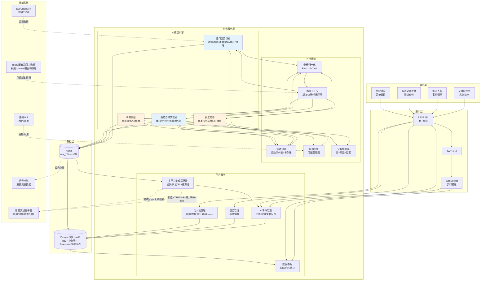
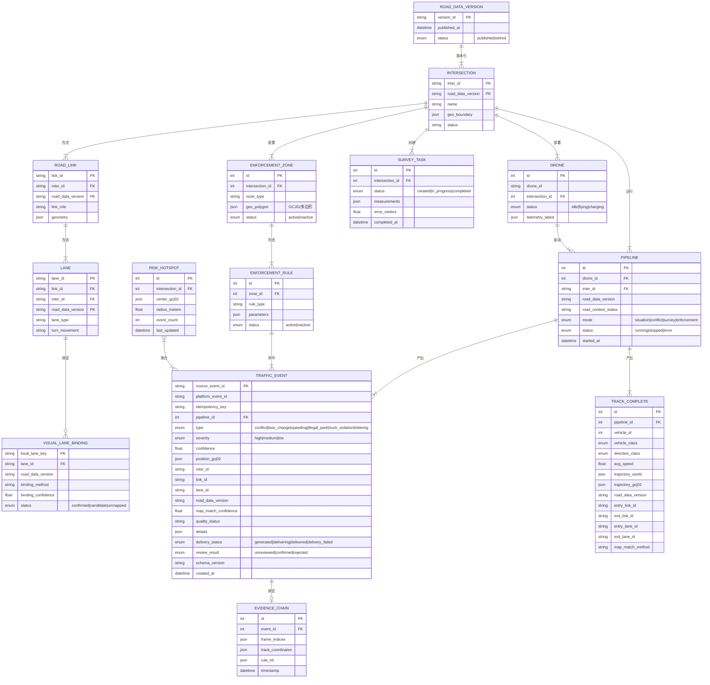
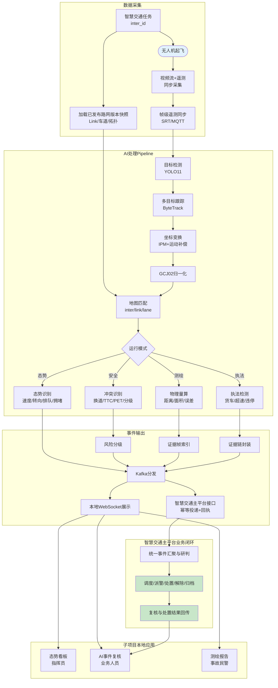
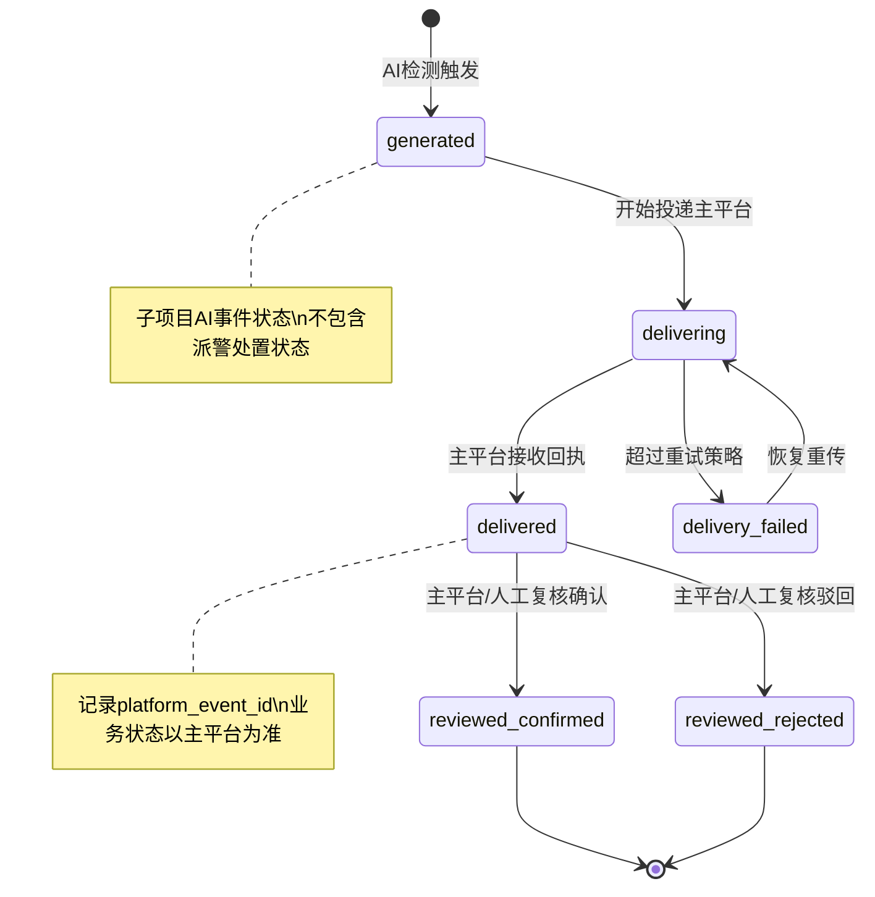

# 无人机交通智能感知系统 PRD

| PRD 审核人 | 【待补充：姓名/部门】 |
| --- | --- |
| 重要性 | 高 |
| 紧迫性 | 高 |
| 需求方 | 交通管理部门 / 投标项目组 |
| PRD 编写人 | 【待补充：姓名/部门】 |
| PRD 提交日期 | 2026-06-29 |
| 当前版本 | v2.2（2026-07-15） |
| 项目定位 | 智慧交通整体项目下的无人机 AI 子项目 |

## PRD 修改记录

| 变更时间 | 变更内容 | 变更提出部门与理由 | 修改人 | 审核人 | 版本号 |
| --- | --- | --- | --- | --- | --- |
| 2026-06-29 | 初始版本，基于投标方案全量需求生成 | — | 【待补充】 | 【待补充】 | v1.0 |
| 2026-06-29 | 需求澄清更新：GCG02→GCJ02（国测坐标系）；路网GIS已采购；LSTM→运动学外推简化；货车细分类→下一阶段 | 需求方反馈 | 【待补充】 | 【待补充】 | v1.1 |
| 2026-06-29 | 前端功能融合：将 traffic-fly-console 已有 10 个功能模块详细描述融入 PRD，标注已有/增强/待开发状态 | 前端现状对齐 | 【待补充】 | 【待补充】 | v1.2 |
| 2026-07-13 | 明确无人机 AI 子项目边界；增加智慧交通主平台联动契约、投标符合性矩阵、偏差确认与分阶段交付要求；校准事件状态和验收口径 | 交警指挥中心评审意见 | 【待补充】 | 【待补充】 | v1.3 |
| 2026-07-13 | 固化货车识别范围：基于现有模型仅提供货车/非货车分类，不新增重/中/轻型货车及专项作业车细分模型、训练数据或核定载质量识别 | 项目范围确认 | 【待补充】 | 【待补充】 | v1.4 |
| 2026-07-13 | 结合现有 ycx 路网库调查结果，新增路口/Link/车道主数据映射、版本治理、坐标校验、轨迹地图匹配和降级策略 | 路网数据融合评审 | 【待补充】 | 【待补充】 | v1.5 |
| 2026-07-13 | 按“总 PRD + 7 个分册 PRD”重整文档结构，建立统一需求编号、分册边界、评审门禁及待补充项台账 | 分板块细化要求 | 【待补充】 | 【待补充】 | v1.6 |
| 2026-07-13 | 完成 S1-S7 七个分册详细评审草案；经跨分册审查校准合同边界、面积量纲、候选阈值、规划/现状、统一身份与主平台责任；总台账覆盖全部分册 TBD | 分册专项细化与统审 | 【待补充】 | 【待补充】 | v1.7 |
| 2026-07-13 | 冻结数据架构决策：PostgreSQL 连接数据库选择 `road9`；无人机平台消息、Topic/通道和自建表统一 `uav_` 前缀；废弃 Grafana/InfluxDB/Telegraf 链路，指标合并至启用 TimescaleDB 的 PostgreSQL | 数据架构与命名规范确认 | 【待补充】 | 【待补充】 | v1.8 |
| 2026-07-13 | 新增 S8 城市一图概览分册；以交通指挥中心主任为首要用户，将 `/` 重构为城市地图主导的项目首屏，突出全局态势、重点关注、变化趋势、无人机保障和数据可信度 | 首屏 Dashboard 专项需求 | 【待补充】 | 【待补充】 | v1.9 |
| 2026-07-13 | 新增 S9 无人机对接与飞行计划管理分册；冻结无人机档案、RTSP+MQTT/MP4+SRT 成对数据源、单次/周期计划、Mission 执行、调度幂等及本地回放边界 | 无人机接入与任务排期专项需求 | 【待补充】 | 【待补充】 | v2.0 |
| 2026-07-14 | 冻结 Console2 信息架构为六个工作域并切换为唯一发布前端；首页更名为“工作台首屏”，视频分析、风险热区、报告、执法子页、质量、证据和身份能力归并到正式工作台或页内视图，旧前端路由直接下线 | 页面与 PRD 裁剪归并、四模块迁移上线 | 【待补充】 | 【待补充】 | v2.1 |
| 2026-07-15 | 完成 I4 执法候选线索本地工程闭环：candidate 围栏/规则、统一 AI 事件、通用证据、技术复核审计和 Console2 三视图真实化；权威发布、雷达、法制和主平台合同继续阻断正式验收 | PRD/UI 滚动实施 | 【待补充】 | 【待补充】 | v2.2 |

---

## 0、文档总分结构与使用说明

### 0.1 文档定位

本文件是无人机 AI 子项目的**总 PRD（母文档）**，用于冻结项目目标、范围边界、总体方案、跨板块契约和项目级验收原则。各业务及技术板块的详细需求在分册 PRD 中维护；总 PRD 与分册发生冲突时，按“已签署的合同/澄清文件 → 总 PRD 最新批准版本 → 分册 PRD 最新批准版本”的顺序处理。

### 0.2 PRD 分册地图

| 分册编号 | 分册名称 | 核心责任 | 主要评审方 | 当前成熟度 | 文档 |
| --- | --- | --- | --- | --- | --- |
| S1 | 路口态势识别 | 检测、跟踪、速度、转向、排队、拥堵及态势输出 | 指挥中心、算法、交通工程 | 详细评审草案；业务阈值待冻结 | [S1 路口态势识别 PRD](uav-traffic-ai-prd/S1-intersection-situation-prd.md) |
| S2 | 换道与冲突识别 | 换道、TTC/PET、轨迹预测、风险分级、风险热区 | 指挥中心、算法、交安专家 | 详细评审草案；合同偏差待关闭 | [S2 换道与冲突识别 PRD](uav-traffic-ai-prd/S2-conflict-prd.md) |
| S3 | 事故测绘 | 测绘任务、量算、误差、示意数据及证据管理 | 事故民警、测绘、法制 | 工程闭环与真实材料验证已完成；精度、法制和主平台合同仍待冻结 | [S3 事故测绘 PRD](uav-traffic-ai-prd/S3-accident-survey-prd.md) |
| S4 | 执法检测 | 货车/非货车、围栏、规则、速度融合、违法线索证据 | 执法、法制、算法 | I4 本地候选闭环已实现；权威规则/围栏、雷达、法制和主平台合同仍阻断 | [S4 执法检测 PRD](uav-traffic-ai-prd/S4-enforcement-prd.md) |
| S5 | 路网与共性能力 | 路网主数据、坐标、视觉车道绑定、质量状态、规则与证据共性能力 | 数据、GIS、算法、架构 | 内部 RoadContext/DDL 已冻结；权威数据合同待关闭 | [S5 路网与共性能力 PRD](uav-traffic-ai-prd/S5-road-and-common-capabilities-prd.md) |
| S6 | 智慧交通主平台集成 | AI 事件、幂等、回执、重试、复核反馈和责任边界 | 大项目平台方、架构、运维 | 内部 EventDelivery/DDL 已冻结；外部主平台合同待关闭 | [S6 主平台集成 PRD](uav-traffic-ai-prd/S6-main-platform-integration-prd.md) |
| S7 | 质量验收与运营 | 数据集、指标、性能、试点、上线、监控和持续优化 | 甲方、监理、测试、运维 | I6 ADR-019 就绪审计已实现；阈值、样本、性能、RPO/RTO、试点、迁移对账与退役批准待冻结 | [S7 质量验收与运营 PRD](uav-traffic-ai-prd/S7-quality-acceptance-operations-prd.md) |
| S8 | 全域态势工作台（首屏 Dashboard） | 城市地图背景下的无人机路口态势纵览、平台核心指标、待办任务、监测保障、数据可信度和专业下钻 | 指挥中心主任、产品、GIS、平台、前端 | I5-A 真实读模型及 I5-B 内部查询/降级已实现；项目范围、正式底图/口径、全局增量回补和正式视觉验收仍待冻结 | [S8 全域态势工作台 PRD](uav-traffic-ai-prd/S8-dashboard-one-map-prd.md) |
| S9 | 无人机对接与飞行计划管理 | 无人机档案、视频/遥测源、单次/周期计划、Mission 调度执行和本地 MP4+SRT 回放 | 无人机作业方、指挥中心、平台、运维、测试、网安 | 工程闭环完成；设备权威、生产接入、权限、容量与高可用待正式验收 | [S9 无人机对接与飞行计划管理 PRD](uav-traffic-ai-prd/S9-drone-integration-flight-plan-prd.md) |

分册目录和统一模板见 [PRD 分册索引](uav-traffic-ai-prd/README.md)。原第 10 章保留各分册的概要需求和总体数据流，避免总 PRD 失去独立评审能力；字段级、规则级、页面级和测试用例级细节逐步下沉至对应分册。

### 0.3 需求层级与编号

| 层级 | 编号示例 | 用途 | 变更要求 |
| --- | --- | --- | --- |
| 项目级目标/约束 | `G-01`、`C-01` | 总体目标、范围及跨板块约束 | 总 PRD 评审批准 |
| 分册能力 | `S1-CAP-01` | 可独立交付的业务能力 | 分册负责人和总 PRD 负责人共同批准 |
| 功能需求 | `S1-FR-001` | 用户可感知或接口可验证的功能 | 分册评审批准 |
| 业务规则 | `S4-BR-001` | 判定口径、阈值、降级及人工复核规则 | 业务负责人批准 |
| 非功能需求 | `S6-NFR-001` | 性能、可靠性、安全和可运维性 | 架构/运维/安全评审 |
| 验收用例 | `S2-AC-001` | 可重复执行的验收条件 | 甲方/监理/测试共同确认 |
| 待补充项 | `S5-TBD-001` | 尚未取得结论且会影响设计或验收的事项 | 必须有负责人、截止时间和关闭依据 |

分册可只展示负责人和当前状态，以避免九册重复维护排期；计划关闭时间和关闭依据由第 14 章总台账集中管理并作为唯一进度真源。总台账聚合同主题事项时，关闭任一分册项前必须记录该项自己的结论和证据；若计划时间或关闭依据不同，应拆分总项后再关闭。

### 0.4 待补充标记规则

- `【待补充：内容】`：信息缺失，但不立即阻断其他板块编写。
- `【待确认：选项/口径】`：已有候选方案，需要业务或技术负责人决策。
- `【外部依赖：责任方/材料】`：依赖大项目、设备方、数据方或法制意见。
- `【验收阻断】`：未关闭前不能冻结验收方案或承诺交付完成。
- `【范围冻结】`：已经明确不扩展的内容，后续只能通过正式变更流程调整。

所有待补充项必须进入第 14 章总台账，并在分册内保留相同编号，禁止仅在正文以模糊的“后续确定”表达。

### 0.5 分册细化顺序与评审门禁

1. **先冻结 S5 与 S6**：明确路网/坐标/车道标识和主平台事件契约，作为四个 AI 场景的共同输入输出基线。
2. **并行细化 S1-S4**：逐场景补齐用户流程、输入输出、规则、异常、页面和验收样本；S4 继续遵守货车二分类范围冻结。
3. **冻结 S9 无人机接入与排期契约**：与 S5、`road9` 迁移共同冻结设备身份、成对数据源、FlightPlan/Mission、调度幂等、权限和恢复边界；不得继续把内存 `DRONES/MISSIONS` 当作目标真源。
4. **冻结 S8 首屏决策口径**：在 S1-S6、S9 的事实和状态基础上冻结主任视角的信息优先级、项目覆盖/在监口径、聚合 API、真实地图和专业下钻；不得另建第二套业务真源。
5. **最后冻结 S7**：汇总各分册指标以及 S8/S9 验收，形成统一数据集、试点、性能、上线和运维验收方案。
6. 分册进入开发前，至少完成：范围确认、主流程、输入输出、核心规则、异常降级、验收指标、待补充责任人七项。

---

## 1、项目背景

### 1.0 项目定位与责任边界

本项目是智慧交通整体项目下的**无人机 AI 感知子项目**，重点建设无人机视频与遥测接入、AI 识别、轨迹与风险计算、事故量算、违法线索提取、证据数据封装及标准化输出能力。路网、路口、Link、车道及其版本信息复用智慧交通项目现有路网主数据，本子项目不重复建设路网底库。

本项目数据持久化统一进入 PostgreSQL 连接数据库 `road9`。无人机平台自建表全部使用 `uav_` 前缀；指标、遥测和高频时序数据由 `road9` 中启用的 TimescaleDB 扩展承载。Grafana、InfluxDB 和 Telegraf 链路列为废弃链路，完成数据迁移、查询切换和验收后停用，不再作为目标架构组成部分。

智慧交通主平台负责跨系统的事件汇聚、统一事件编号、重复事件合并、人工研判、指挥调度、派警签收、到场处置、升级转派、解除归档和运营考核。本子项目不重复建设主平台的指挥处置闭环，但必须提供可靠、可追溯、可幂等重传的事件和证据接口，并接收主平台回传的确认、驳回及处置结果，用于质量评估和模型优化。

本 PRD 中的“事件确认/驳回”均指**AI 识别结果的技术或业务复核**，不等同于智慧交通主平台中的警情确认、派警或执法定案。

### 1.1 业务现状

城市交通管理依赖固定杆件监控（电子警察、卡口、高点视频），覆盖率有限且存在大量视角盲区。现有 TrafficAnalyzer 系统已具备基础能力：

- **视频AI检测**：YOLO11 目标检测 + ByteTrack 多目标跟踪，支持机动车/非机动车/行人识别
- **坐标与运动补偿**：单应性矩阵（IPM）、电子图像稳定（EIS）、GPS锚定世界帧
- **交通参数计算**：车速估计、方向分类（直行/左转/右转/掉头）、车道级流量统计、排队长度
- **冲突检测**：基于 TTC 的机非冲突检测
- **遗留数据管道**：当前代码仍存在 Kafka → Telegraf/InfluxDB → Grafana 链路；该链路已决定废弃，须迁移为 Kafka/平台消费者 → PostgreSQL `road9` + TimescaleDB → 平台 API/WebSocket 页面
- **管理平台**：FastAPI + WebSocket 实时推送，支持路口/无人机/管道生命周期管理

现有系统已使用 inter_xqh 路口 4K@30fps 视频完成端到端验证（2026-07-02: 56 PASS / 0 FAIL / 0 WARN），具备从视频采集到结构化数据输出的基础链路能力。该结果仅代表单路口测试资产下的技术基线，不等同于多路口、多天气和全业务场景验收。

### 1.2 面临问题

1. **态势感知能力不完整**：缺少多因子拥堵指数、GCJ02 全局坐标归一化、轨迹预测等高级分析能力，无法满足路口态势综合研判需求
2. **安全事件检测薄弱**：仅有基础 TTC 冲突检测，缺少换道识别、PET 指标、风险分级、热区聚类等安全事件全链路分析
3. **缺乏非接触式测绘能力**：无法从无人机视角进行事故现场物理参数量算（距离/面积/宽度），缺少证据帧管理和误差控制体系
4. **执法支撑能力不足**：现有模型仅能提供货车/非货车基础分类，且缺少电子围栏、规则引擎和证据链管理，无法形成稳定的机动化执法线索输出
5. **坐标体系未统一**：现有系统仅到 ENU 局部坐标，未实现 GCJ02 全局归一化，无法与路网 GIS 精确对齐

### 1.3 解决思路

在现有 TrafficAnalyzer 系统基础上，扩展 4 个核心 AI 模型能力：

1. **路口态势识别模型** — 增强拥堵指数、轨迹预测、坐标归一化
2. **换道与冲突识别模型** — 新增换道检测、PET、风险分级、热区聚类
3. **事故测绘模型** — 新增物理量算、误差控制、证据帧管理
4. **执法检测模型** — 复用现有货车/非货车分类，新增电子围栏、规则引擎和证据链

共性基础设施：统一坐标体系（ENU→GCJ02）、路网主数据适配与地图匹配、轨迹预测引擎、规则引擎、证据链管理和智慧交通主平台联动适配器。

### 1.4 决策依据

- 投标方案明确要求 4 个 AI 模型的完整交付
- 本项目作为无人机 AI 子项目，输出的结构化态势、风险、测绘和执法线索由智慧交通主平台承接后续指挥处置闭环
- 现有系统已覆盖基础检测跟踪能力（~40-70%），扩展开发投入可控
- 端到端测试已验证基础管道稳定性（2026-07-02: 56 PASS / 0 FAIL / 0 WARN）
- 城市管理对无人机交通监测的需求快速增长（重大活动保障、应急测绘、机动执法）

---

## 2、需求基本情况

| 要素 | 内容 |
| --- | --- |
| **需求提出人** | 投标项目组 / 交通管理部门 |
| **功能使用人** | 交通指挥员、交通执法人员、事故处理民警、系统运维人员 |
| **受影响人** | 交通管理层（依赖数据决策）、信号控制部门（依赖流量数据）、道路设施管理部门 |
| **场景描述** | 见下方详细场景 |
| **发生频率** | 日常巡检（每日 2-4 次）、重大活动保障（月均 1-2 次）、应急响应（不定期） |
| **核心痛点** | 固定监控盲区大、人工上路风险高、事件发现滞后、执法取证效率低 |
| **需求价值** | 扩大感知覆盖、缩短响应时间、提升执法精度、降低人员风险 |

### 核心场景描述

> 💡 场景六要素：人物、时间、地点、起因、经过、结果

**场景1：早晚高峰路口态势巡检**
- **人物**：交通指挥员，负责区域交通运行监控
- **时间**：工作日早高峰（7:00-9:00）和晚高峰（17:00-19:00）
- **地点**：城市重点路口，固定监控覆盖不足的交叉口
- **起因**：需要实时掌握路口各进口道流量、排队长度、拥堵指数
- **经过**：当前依赖人工观看固定监控画面，逐个路口切换查看，无法同时监控多个路口
- **结果**：发现拥堵滞后 5-10 分钟，无法量化拥堵程度，缺少预测能力

**场景2：交通事故现场快速测绘**
- **人物**：事故处理民警，需快速完成现场勘查
- **时间**：事故发生后 15-30 分钟内
- **地点**：城市快速路、高速公路等高风险路段
- **起因**：事故现场需要快速测量车辆位置、刹车痕迹、散落物分布
- **经过**：当前人工上路测量，需封闭车道、放置锥桶、手工量测，耗时长且有二次事故风险
- **结果**：现场处置 30-60 分钟，期间车道封闭造成大面积拥堵，人员安全风险高

**场景3：货车限行区域执法**
- **人物**：交通执法人员，负责重点路段货车管控
- **时间**：全天候，尤其夜间和凌晨违规高发时段
- **地点**：城市核心区、学校周边、限行区域
- **起因**：需发现和取证违规闯入限行区域的货车
- **经过**：当前依赖定点卡口抓拍，覆盖率低，货车可绕行规避
- **结果**：违规发现率不足 30%，取证不完整，人工复核工作量大

---

## 3、业务分析与系统调研

### 3.1 同类系统调研

| 调研对象 | 类型 | 核心能力 | 可借鉴点 | 局限性 |
| --- | --- | --- | --- | --- |
| TrafficAnalyzer 现有系统 | 内部 | YOLO检测+ByteTrack跟踪+速度/方向/车道分析+Kafka+InfluxDB | Pipeline架构成熟、端到端已验证 | 缺高级分析、缺测绘、缺执法 |
| 海康/大华高点视频 | 外部 | 固定高点AI检测、流量统计、事件检测 | 大规模部署经验丰富 | 固定视角有盲区、无法机动部署 |
| DJI 大疆机场+上云API | 外部 | 无人机自动巡飞、RTK定位、遥测数据 | 无人机平台成熟、API标准化 | 不含交通AI分析能力 |
| 交科所/同济大学交通仿真 | 外部 | 交通流仿真、信号优化评估 | 交通工程理论成熟 | 偏仿真非实时检测 |

### 3.2 业务痛点优先级

| 排序 | 痛点描述 | 影响范围 | 严重程度 | 紧迫度 | 涉及模块 |
| --- | --- | --- | --- | --- | --- |
| 1 | 固定监控盲区导致路口态势感知不完整 | 所有无固定监控路口 | 高 | 高 | 路口态势识别 |
| 2 | 安全事件（冲突、换道）发现滞后 | 快速路、复杂交叉口 | 高 | 高 | 换道与冲突识别 |
| 3 | 事故现场人工测绘耗时长、风险高 | 事故处理全流程 | 高 | 中 | 事故测绘 |
| 4 | 执法盲区大、取证效率低 | 限行/超速/违停场景 | 中 | 中 | 执法检测 |
| 5 | 坐标体系不统一，无法与GIS对齐 | 所有需要地理定位的场景 | 中 | 高 | 共性基础设施 |

### 3.3 投入产出初步评估

| 维度 | 估算 |
| --- | --- |
| **预计投入** | 4 个模型扩展开发，约 4-6 人月（复用现有 Pipeline 架构和平台基础设施） |
| **效率提升** | 事故测绘时间从 30-60 分钟降至 10-15 分钟；拥堵发现时间从 5-10 分钟降至秒级 |
| **业务价值** | 覆盖固定监控盲区，支撑机动化交通管理；提供结构化态势数据支撑信控优化 |

---

## 4、项目收益目标

### 4.1 项目目标

| 目标类型 | 目标描述 | 衡量指标 | 目标值 | 达成时限 |
| --- | --- | --- | --- | --- |
| **核心业务目标** | 4个AI模型全部上线并通过验收 | 投标符合性矩阵 | 100% 条款有交付结果或已签署变更依据 | 项目交付期 |
| **效率目标** | 事故现场测绘时间大幅缩短 | 单事故测绘耗时 | ≤15分钟（原30-60分钟） | 上线3个月内 |
| **效率目标** | 有效监测窗口内拥堵发现时间缩短 | 无人机到位、视频/遥测正常且对应模式运行时，从拥堵形成到 AI 事件输出 | ≤30秒 | 上线即达标 |
| **精度目标** | 坐标映射与量算精度满足冻结的分对象要求 | 点位误差、长度误差、面积绝对/相对误差分别计算 | `【验收阻断：S3-TBD-001/002】`；点位/长度可将≤3米作为候选，面积不得用米 | 上线即按冻结方案达标 |
| **采纳率目标** | 一线人员实际使用系统 | 日活用户比例 | ≥80% 目标用户 | 上线3个月内 |

### 4.2 验收标准

1. 路口态势识别模型：支持 9 类交通参与者检测、4 类转向分类、多因子拥堵指数（0-10 分）、GCJ02 坐标输出
2. 换道与冲突识别模型：支持换道事件检测（几何+运动双重验证）、TTC/PET/最小距离/冲突角度、3-5 秒轨迹预测、风险 3 级分级和风险热区聚类
3. 事故测绘模型：点位/长度量算以 ≤3 米作为待细化目标，面积须以 m² 或相对误差单独定义；具体对象、公式、基准、样本量和通过规则由 S3-TBD-002 书面冻结；同时验收证据帧索引和现场平面示意数据输出
4. 执法检测模型：基于现有模型支持货车/非货车基础分类、电子围栏匹配、规则引擎、视频 AI 速度估计、雷达测速融合接口及完整证据数据（帧/视频片段索引+轨迹+位置+规则+时间戳）；不以重/中/轻型货车及专项作业车细分类作为本子项目验收项
5. 端到端延迟：在视频、遥测和消息链路正常条件下，视频帧时间戳至 AI 事件成功写入出站消息队列的 P95 ≤ 3 秒；至智慧交通主平台成功接收的 P95 目标值由双方接口联调确认
6. 系统集成：4 个模型与现有 Pipeline 架构集成；事件具备全局关联键、模式与质量状态、幂等键、重试状态和接口版本；Kafka/API 契约通过联调验收
7. 模型质量：各类事件分别统计 Precision、Recall、漏报率和单位小时误报数；白天/夜间、遮挡、不同飞行高度和视角分别出具结果，具体阈值由验收方案确认
8. 路网融合：任务以权威 `inter_id + road_data_version` 启动；统计、轨迹和事件可关联正确的进口/出口 Link 及可识别车道；通过版本切换、断连缓存、低置信度 `unmapped` 和历史版本不回写测试

### 4.3 成功标准

> 项目上线后 3 个月内，达到以下指标视为成功：

1. 日均无人机巡检任务 ≥ 4 次/路口，系统自动产出结构化态势报告
2. 安全事件（冲突/换道）Precision ≥ 85%，同时满足经确认的 Recall 和单位小时误报上限，不得通过减少事件输出单独提高准确率
3. 事故测绘使用率 ≥ 70%（适用场景中系统替代人工测绘的比例）
4. 执法事件自动取证率 ≥ 60%（系统自动完成从检测到证据链生成的比例）

---

## 5、项目方案概述

### 5.1 核心功能概述

本项目包含以下核心功能模块：

| 序号 | 功能模块 | 功能简述 | 优先级 |
| --- | --- | --- | --- |
| 1 | 路口态势识别 | 车辆检测/跟踪/速度/转向/排队/拥堵指数，GCJ02坐标输出 | P0 |
| 2 | 换道与冲突识别 | 换道检测、TTC/PET、轨迹预测、风险分级、热区聚类 | P0 |
| 3 | 事故测绘 | 非接触式物理量算、地理配准、误差控制、证据帧管理 | P1 |
| 4 | 执法检测 | 超速/货车限行/违停/滞留/占道 + 证据链管理；车辆类型基于现有模型仅区分货车/非货车 | P1 |
| 5 | 坐标归一化引擎 | ENU→GCJ02 统一坐标转换（共性基础） | P0 |
| 6 | 轨迹预测引擎 | 运动学外推+卡尔曼滤波 3-5秒前瞻预测；与投标 LSTM 方案的等效性或变更须书面确认 | P0 |
| 7 | 规则引擎 | 可配置的交通规则判定（共性基础） | P1 |
| 8 | 证据链管理 | 帧+轨迹+位置+规则+时间戳 结构化证据封装 | P1 |
| 9 | 平台集成与展示 | WebSocket 实时推送、事件管理、风险热区可视化 | P0 |
| 10 | 无人机对接与飞行计划管理 | 无人机档案、RTSP+MQTT/MP4+SRT 数据源、单次/周期排期、Mission 自动启停与执行审计 | P0 |

### 5.2 方案概述

- **产品方案**：在现有 TrafficAnalyzer 系统上扩展 4 个 AI 模型，通过新增 Pipeline Node 和增强现有 Node 实现，保持架构一致性；AI 事件上送智慧交通主平台完成统一指挥处置
- **技术方案**：复用 Node-based Pipeline 架构、Kafka 消息管道、FastAPI 平台；新增运动学预测模块、规则引擎、证据链管理器
- **运营方案**：先在 1-2 个试点路口验证，逐步推广到全部目标路口

### 5.3 MVP 范围

> 💡 B端 MVP 原则：必须支撑核心业务流程闭环，不是"最简单的版本"

**MVP 包含的功能：**
1. 路口态势识别全功能（拥堵指数、转向分类、GCJ02 坐标）— 核心感知能力
2. 换道与冲突识别核心功能（TTC/PET、风险分级）— 安全事件检测
3. 坐标归一化引擎 — 共性基础
4. 轨迹预测引擎 — 共性基础
5. 平台集成展示（WebSocket 推送、事件列表）与主平台最小联调闭环（生成→投递→回执→复核结果回流）

**MVP 暂不包含的功能：**
1. 事故测绘模型 — 独立性强，可后续迭代
2. 执法检测模型 — 依赖规则配置数据，需业务方配合
3. 风险热区空间聚类 — MVP 先完成事件坐标和样本积累，合同验收阶段完成聚类和展示
4. 证据链管理 — 执法场景专用，随执法模型一起上线

**核心验证假设：**
1. 运动学轨迹预测在无人机视角下的精度是否满足 3-5 秒前瞻需求
2. GCJ02 坐标归一化精度是否满足 ≤3 米误差要求
3. 拥堵指数算法是否能真实反映路口运行态势

**分阶段交付约束：** MVP 范围仅用于技术验证和试点。事故测绘、执法检测、风险热区及经确认的预测方案必须在合同验收里程碑前完成，或取得甲方书面变更/延期确认。货车识别以现有模型的货车/非货车二分类为本子项目范围基线，不新增细分类建设。

---

## 6、项目范围

### 6.1 涉及系统

| 系统名称 | 关系类型 | 影响描述 | 责任方 |
| --- | --- | --- | --- |
| TrafficAnalyzer Pipeline | 主体改造 | 新增/增强 Pipeline Node | 开发团队 |
| TrafficAnalyzer Platform | 主体改造 | 新增事件管理、风险热区 API | 开发团队 |
| 智慧交通主平台 | 上游任务与下游业务平台 | 接收 AI 事件和证据引用，负责统一研判、调度、处置、归档并回传复核结果 | 智慧交通大项目平台方 |
| DJI 无人机 / Cloud API / MQTT | 数据来源 | RTSP 视频、MQTT 实时遥测和设备身份对接；飞行控制仍由 DJI 平台负责 | DJI + 无人机作业方 + 开发团队 |
| 服务器本地测试资产 | 测试数据来源 | 受 allowlist 限制的 MP4 视频和 DJI `.srt` 遥测字幕回放 | 测试 + 运维 + 开发团队 |
| 路网 GIS 系统 | 数据来源 | 道路中心线、电子围栏、限速规则 | 已采购；业务约定使用 GCJ02，数据库几何实际 SRID/坐标语义待核验 |
| PostgreSQL `road9` | 统一目标数据库 | 承载既有路网主数据访问，以及所有 `uav_` 自建业务表和 TimescaleDB 时序表；具体既有路网 schema/视图待数据方冻结 | 智慧交通大项目数据平台方 / 开发团队 |
| Kafka | 实时消息基础设施 | 所有无人机平台 Topic、`msg_type` 和 WebSocket 消息通道统一使用 `uav_` 前缀 | 开发团队 / 运维 |
| TimescaleDB | PostgreSQL 扩展 | 在 `road9` 中承载交通指标、遥测、系统指标、轨迹/冲突等高频时序数据 | DBA / 开发团队 |
| InfluxDB / Telegraf / Grafana | 废弃基础设施 | 仅用于迁移前遗留链路；完成数据校验、查询切换和回滚观察后停用 | 运维 / 开发团队 |
| 信号控制系统 | 数据消费方 | 接收转向流量数据用于信控优化 | 【待补充：协议、频率、延迟】 |

### 6.2 影响范围

- **用户影响**：交通指挥员新增态势监控界面；执法人员新增执法事件管理界面；事故处理民警新增测绘任务管理；系统管理员新增无人机档案、数据源、飞行计划和 Mission 执行管理
- **流程影响**：本子项目将无人机视频转换为可供主平台研判的态势、风险、测绘和违法线索；主平台继续负责统一指挥处置流程
- **数据影响**：消息统一为 `uav_` 前缀；在 `road9` 新增 `uav_` 前缀业务表及 TimescaleDB hypertable；停止新增 InfluxDB Measurement，旧 InfluxDB 数据按批准范围迁移或归档
- **上下游影响**：信号控制系统可消费更丰富的转向流量数据

### 6.3 不在本期范围内

1. 信号灯配时优化算法 — 仅提供数据支撑，不负责信控决策
2. 无人机自动航线规划、起降、返航和飞控下发 — 依赖 DJI FlightHub/Cloud API；本系统的 FlightPlan 只按路口和时间自动启停 AI 检测 Pipeline
3. 视频结构化数据长期归档 — 本期仅保留近 30 天热数据
4. 多无人机协同调度 — 本期单无人机单路口模式
5. 移动端 App — 本期仅 Web 端
6. 货车细分类（重卡/中货/轻货/专项作业车）及核定载质量识别 — 不在本子项目范围内；仅复用现有模型的货车/非货车二分类能力
7. 学习型轨迹预测（LSTM 等）— 本期采用运动学外推简化方案

> 注：第 6 项为已明确的项目范围基线，不规划后续扩展；第 7 项仍须通过甲方书面变更或等效验收方式固化。

### 6.4 与智慧交通主平台的责任边界

| 能力 | 无人机 AI 子项目 | 智慧交通主平台 |
| --- | --- | --- |
| 无人机视频、遥测、标定和 GIS 数据接入 | 负责接入、同步和质量标记 | 提供任务、基础数据或接口条件 |
| 路口、Link、车道和道路/RID主数据 | 按只读接口加载、缓存、绑定并携带版本输出，不维护权威底库 | 数据平台维护权威ID、拓扑、版本、代码表和变更通知 |
| 目标检测、跟踪、态势、风险、测绘和执法线索计算 | 负责 | 消费结果，不重复计算 |
| AI 事件生成 | 生成 `source_event_id`、幂等键和证据引用 | 分配或映射全局事件编号 |
| 事件去重与跨来源合并 | 提供同源去重和关联字段 | 负责跨无人机、卡口、警情等全局合并 |
| 人工研判、派警、签收、到场、处置、升级和解除 | 不负责 | 负责，作为业务状态唯一真源 |
| 用户、组织、辖区和通知通道 | 仅执行接口鉴权与最小本地运维权限 | 统一管理 |
| 证据数据 | 生成原始材料、哈希、时间戳和不可变引用 | 调阅、案件关联、授权和归档 |
| 复核与处置反馈 | 接收并用于质量统计、样本闭环 | 回传确认、驳回、原因和处置结果 |

**联动最小契约：**

1. 每条事件必须包含 `source_system`、`source_event_id`、`idempotency_key`、`event_type`、`occurred_at`、`intersection_id`、`inter_id`、`road_data_version`、可用的 `link_id/lane_id`、`map_match_method`、`position_gcj02`、`severity`、`confidence`、`quality_status`、`evidence_refs`、`schema_version`。
2. 主平台返回 `platform_event_id`、接收时间和接收结果；重复投递同一幂等键不得产生重复事件。
3. 投递失败采用持久化缓冲、指数退避和恢复重传；超过约定时限进入死信并告警，不得静默丢弃。
4. 主平台回传 `confirmed/rejected`、驳回原因、处置结果等反馈；子项目保留映射关系，不自行维护派警状态。
5. AI 风险等级与主平台警情等级的映射由双方共同配置，AI 的 `high/medium/low` 不直接等同于主平台 P1/P2/P3。

### 6.5 投标符合性与偏差管理

| 投标要求 | PRD 实施方案 | 符合性 | 定稿/验收要求 |
| --- | --- | --- | --- |
| 四类无人机 AI 模型 | 态势、换道与冲突、事故测绘、执法检测 | 符合 | 合同验收前全部交付 |
| ENU 到地理坐标归一化 | 统一采用正确术语 GCJ02；投标原文 GCG02 视为笔误 | 等效修正 | 在澄清纪要中确认 |
| LSTM + 时序卡尔曼预测 3-5 秒 | 当前拟采用运动学外推 + 卡尔曼 | 待确认偏差 | 提供书面变更或以 ADE/FDE 等指标证明等效满足 |
| 风险热区与空间聚类 | MVP 积累事件坐标，合同验收阶段交付 DBSCAN 聚类 | 分阶段符合 | 写入里程碑和验收用例 |
| 重/中/轻型货车及专项作业车分类 | 基于现有模型仅提供货车/非货车二分类，不新增训练、样本库和细分识别能力 | 范围边界已明确 | 不纳入本子项目功能和验收范围；规则命中结果按基础分类输出待复核线索 |
| 雷达测速融合 | 建设雷达输入和目标关联接口；无雷达时仅输出视频估算值 | 依赖项待确认 | 明确设备、接口、检定和责任方 |
| 原始帧、轨迹、位置、规则和时间戳证据数据 | 证据数据封装并上送主平台 | 符合但需法制确认 | 明确哈希、防篡改、授权和保存期限 |

所有“待确认偏差”必须关联需求澄清纪要、招投标答疑、合同变更或分阶段验收文件；在文件取得前，不得在项目计划中视为已减少的合同范围。

### 6.6 现有路网、路口与车道数据融合

#### 6.6.1 已有数据资产调查

2026-07-13 的早期只读调查连接到 `ycx` 数据库并观察了 `road10` 等 schema。该调查保留为历史资产线索，但已被新的数据库选择决策取代，不能继续作为目标连接配置或 `road9` 表结构的证明。

本项目正式目标为 PostgreSQL 连接数据库 **`road9`**。`road9` 是 database 名称，不自动等同于 schema 名称；PostgreSQL 连接、权威路网 schema/只读视图、表结构、几何列、SRID、坐标语义和版本发布方式必须在 `road9` 环境重新核验。

| 领域实体 | `road9` 中所需权威能力 | UAV 本地持久化 | 状态 |
| --- | --- | --- | --- |
| 路网版本 | 发布版本、有效期、状态、校验值 | `uav_road_context_snapshots` 保存快照清单与引用 | 【待核验】 |
| 路口 | `inter_id`、名称、空间范围、版本 | 不复制权威底库，只保存版本化引用/快照 | 【待核验】 |
| Link | `link_id`、进出口角色、方向、拓扑、版本 | 任务快照与地图匹配结果 | 【待核验】 |
| 车道 | `lane_id`、所属 Link、类型、转向、几何、版本 | `uav_visual_lane_bindings` 保存视觉绑定 | 【待核验】 |
| 道路/RID | 道路名称、等级、限速及 Link 关联 | 仅保存使用时的版本化引用 | 【待核验】 |
| 信号/历史指标 | 相位、周期、车道/转向历史指标 | 仅用于交叉验证，不进入逐帧远程查询 | 【待核验】 |

无人机平台在 `road9` 中新建的所有表必须使用 `uav_` 前缀；既有路网权威表属于外部数据资产，不要求本子项目重命名。任何不以 `uav_` 开头的新建表均不得通过数据库设计评审。

#### 6.6.2 领域映射与标识规则

| 无人机 AI 概念 | 路网主数据概念 | 标识与版本规则 |
| --- | --- | --- |
| 路口任务 | Intersection | `intersection_id` 对齐权威 `inter_id`，本地 `INT_camera_N` 仅作兼容别名 |
| 进口道/出口道 | Link | 使用 `link_id + link_role + version_id`，不再只用 `road_1..road_N` 表示业务道路 |
| 车道 | Lane | 使用 `lane_id + link_id + inter_id + version_id`；本地车道编号仅用于图像配置 |
| 道路 | Road/RID | 使用已确认的道路/RID主键关联道路名称、等级和限速属性 |
| 无人机/摄像头 | Device | 生成本项目 `device_id`，通过映射关系绑定 `inter_id`，不复用固定设备ID冒充无人机 |
| 轨迹入口/出口 | Track map match | 输出起终点对应的 `entry_link_id/exit_link_id` 和可用的 `entry_lane_id/exit_lane_id` |

所有统计、轨迹、冲突、测绘和执法线索消息新增 `road_data_version`。任何主数据ID必须与该版本一起保存；版本升级不得原地改写历史事件。

#### 6.6.3 路网几何与视觉车道的协同

路网主数据和无人机视觉标定承担不同职责，不应互相覆盖：

1. **主数据层**提供权威 `inter_id/link_id/lane_id`、道路拓扑、方向、车道类型、道路等级和规则关联。
2. **视觉标定层**提供当前飞行高度、视角和画面下精确的 ROI、停止线、车道多边形及单应性参数。
3. 新增“视觉车道绑定”关系：`local_lane_key → inter_id + link_id + lane_id + road_data_version + binding_confidence + binding_method`。
4. 绑定优先级为：人工确认绑定 > 基于主数据几何的自动匹配 > 轨迹/模型候选匹配。自动匹配结果低于阈值时必须标记 `unmapped` 并进入校正任务，不得伪造主数据ID。
5. 路网底图几何未通过坐标和精度校验前，只用于候选匹配和展示，不直接替换图像中的车道多边形。

#### 6.6.4 运行数据流

```text
智慧交通任务(inter_id)
  → 路网适配器按已发布 road_data_version 读取路口/Link/车道快照
  → 坐标系与空间范围校验
  → 加载对应无人机标定和视觉车道绑定
  → 检测轨迹从像素→ENU→GCJ02
  → 地图匹配到 inter_id/link_id/lane_id
  → 输出带主数据ID、版本、匹配方法和置信度的统计/轨迹/事件
  → 智慧交通主平台按统一ID聚合信控、卡口、互联网和无人机数据
```

无人机任务启动时只读取已发布快照，不在逐帧管道中直接查询远程数据库。路网适配器需在本地维护按 `inter_id + road_data_version` 划分的只读缓存，以避免远程数据库抖动影响实时检测。

#### 6.6.5 坐标与版本治理

1. 必须分别记录数据库几何的 `source_coordinate_system/source_srid` 和输出坐标的 `GCJ02`；不得仅凭 SRID 名称假设数据已经是 GCJ02。
2. 首次接入每个路口时，使用已知控制点验证路网几何、无人机 RTK、底图和视觉标定的偏差；超过阈值则禁止自动车道绑定。
3. `dim_data_version` 发布新版本后，已有任务继续使用启动时冻结版本；新任务使用新版本并触发映射差异检查。
4. Link/车道新增、拆分、合并或删除时，保留旧ID映射和有效期，不回写篡改历史轨迹。
5. 路网数据不可用时使用最近一次已验证缓存并标记 `road_context_status=stale`；无缓存时允许 AI 继续输出本地轨迹，但主数据ID置空并标记 `unmapped`。

#### 6.6.6 新增输出字段与验收点

通用统计、轨迹和事件消息增加：

- `road_data_version`
- `road_context_status`: `ok/stale/missing/version_mismatch`
- `inter_id`
- `link_id`、`lane_id`（当前所在位置适用）
- `entry_link_id`、`exit_link_id`
- `entry_lane_id`、`exit_lane_id`（可识别时）
- `map_match_method`: `manual/master_geometry/trajectory/model/unmapped`
- `map_match_confidence`

验收至少覆盖：权威路口ID绑定、进口/出口 Link 方向正确性、车道绑定抽样准确率、版本切换、远程库断连缓存降级、无匹配时不伪造ID，以及同一路口无人机流量与信控/车道历史数据的时间窗对比。具体准确率阈值由数据负责人、交通业务方和验收组共同确认。

### 6.7 PostgreSQL、TimescaleDB 与 `uav_` 命名规范

#### 6.7.1 数据库基线

1. PostgreSQL 连接参数中的 database 固定选择 `road9`；不再以 `ycx` 作为本项目目标数据库。
2. `road9` 必须安装并启用 TimescaleDB 扩展，扩展版本、许可、备份恢复、监控和高可用方式由 DBA 确认。
3. 交通指标、遥测、系统指标、轨迹点和适合时间分区的事件数据使用 TimescaleDB hypertable；任务、规则、证据索引、事件投递状态等事务数据使用普通 PostgreSQL 表。
4. 无人机平台自建表全部使用 `uav_` 前缀。既有路网权威表为外部资产，不要求本项目重命名；本项目生成的快照、绑定或映射表仍必须使用 `uav_`。

目标数据域至少覆盖以下范围。前四行是一期 canonical 持久化基线；测绘、执法、证据、路网及既有平台业务行是 PRD 级规划表目录，只有在数据库分册给出不重复的实体映射并经迁移/DDL 评审冻结后才可建表，不得把同一实体同时落入通用表和场景表形成双真源。

| 类型 | 目标表 |
| --- | --- |
| TimescaleDB hypertable | `uav_traffic_metrics`、`uav_system_metrics`、`uav_telemetry_metrics`、`uav_track_points`、`uav_conflict_events` |
| 轨迹与 AI 事件 | `uav_track_events`、`uav_ai_events` |
| 消息消费与可靠投递 | `uav_message_inbox`、`uav_message_dead_letters`、`uav_event_outbox`、`uav_event_delivery_attempts`、`uav_event_feedback`、`uav_dead_letters` |
| 无人机接入与调度 | `uav_drones`、`uav_video_sources`、`uav_telemetry_sources`、`uav_flight_plans`、`uav_missions`、`uav_pipelines` |
| 测绘与执法 | `uav_survey_tasks`、`uav_capture_batches`、`uav_survey_measurements`、`uav_scene_annotations`、`uav_survey_reports`、`uav_enforcement_zones`、`uav_enforcement_rules`、`uav_enforcement_clues` |
| 证据、路网与审计 | `uav_evidence_packages`、`uav_evidence_items`、`uav_road_context_snapshots`、`uav_visual_lane_bindings`、`uav_audit_logs` |
| 既有平台业务 | 用户/角色、无人机、路口映射、任务、管道、告警、标定等状态逐项盘点；需持久化的 UAV 自建表迁移为 `uav_*`，纯运行态可继续留内存，外部权威数据保持只读引用 |

既有平台状态不能简单按“当前变量名=未来数据表”机械迁移，目标处置如下；标为候选的物理表须经 `P-TBD-018` 冻结：

| 当前状态/对象 | 目标处置 | 目标物理对象或边界 |
| --- | --- | --- |
| 用户及角色信息 | 迁入 `road9`；是否独立角色表由统一身份模型决定 | `uav_users`；`uav_roles` 为候选，不得提前重复主平台身份体系 |
| 无人机 `DRONES` / drone store | 资产及期望状态持久化，实时遥测单独入时序表 | `uav_drones` + `uav_telemetry_metrics` |
| 任务 `MISSIONS` | 拆分计划定义与一次执行事实；现有创建即运行入口保留为立即执行兼容 | `uav_flight_plans` + `uav_missions` |
| 本地路口/设备映射 | 不复制权威路口底库，只保存 UAV 设备/任务映射 | 外部权威路口只读 + `uav_device_intersection_bindings` |
| PipelineManager `_pipelines` | 配置/期望状态持久化；进程句柄仍仅在运行内存，运行指标进时序表 | `uav_pipelines` + `uav_system_metrics` |
| 告警 | 告警当前状态持久化，事件主记录仍唯一关联 `uav_ai_events` | `uav_alerts` |
| 标定与车道标注 JSON | 迁移为可版本、可审计对象 | `uav_calibrations`、`uav_lane_annotation_tasks`、`uav_visual_lane_bindings` |
| 视频/遥测源配置 | 持久化 RTSP+MQTT 或服务器 MP4+DJI `.srt` 成对配置；凭据只存 secret reference，本地路径受 allowlist 限制 | `uav_video_sources` + `uav_telemetry_sources` |
| 视频 `_STREAMS` 运行注册表 | 继续作为易失运行态；打开的 stream、连接对象和帧缓存不入库 | 无独立运行时表，配置引用 canonical source 表 |

#### 6.7.2 消息命名

`uav_` 前缀适用于 Kafka Topic、业务消息 `msg_type`、平台内部业务事件名和 WebSocket channel。JSON 业务字段如 `occurred_at`、`inter_id` 不强制增加前缀；WebSocket 的 `subscribe/unsubscribe/ping/pong` 属于传输控制动作，不是 UAV 业务消息名，也不增加 `uav_`。

| 类别 | 目标名称 |
| --- | --- |
| 核心 Kafka Topic | `uav_statistics_{camera_id}`、`uav_track_complete_{camera_id}`、`uav_conflicts_{camera_id}`、`uav_telemetry_{camera_id}`、`uav_system_metrics` |
| 扩展 Kafka Topic | 必须建设：`uav_ai_events`、`uav_ai_event_feedback`；若经容量/用途评审决定保留原始检测或 VLM 流，其候选 canonical 名为 `uav_detections_{camera_id}`、`uav_vlm_analysis_{camera_id}` |
| 核心 `msg_type` | `uav_stats`、`uav_track_complete`、`uav_conflict`、`uav_telemetry`、`uav_system_metrics`、`uav_ai_event`、`uav_ai_event_feedback` |
| 扩展 `msg_type` | `uav_detection`、`uav_vlm_analysis`、`uav_lane_annotation_task` |
| WebSocket channel | `uav_intersection:{intersection_id}`、`uav_alerts`、`uav_alerts:{intersection_id}`、`uav_system`、`uav_telemetry:{drone_id}`、`uav_calibration` |

换道、风险热区、测绘和执法线索统一进入 `uav_ai_events` 并由 `event_type` 区分；不再新增无前缀的 `lane_change_*`、`risk_events_*`、`survey_*`、`enforcement_*` Topic。若智慧交通主平台要求不同外部命名，由 S6 集成适配器转换，UAV 内部名称和 `source_system=uav_traffic_analyzer_ai` 保持不变。

`uav_detections_*` 与 `uav_vlm_analysis_*` 是否进入目标部署、消费范围和持久化范围仍为 `【待确认】`；未取得用途、吞吐、保留期、隐私和成本结论前不得因为名称已预留而默认启用。

#### 6.7.3 废弃链路与迁移门禁

- 停止向 InfluxDB 新增 Measurement，停止新增 Grafana dashboard 和 Telegraf 写入配置。
- 迁移顺序为：冻结新契约与 DDL → 建设 `road9`/TimescaleDB 写入和查询 → 历史数据迁移/归档 → 双写对账 → API/页面切读 → 停止旧写入 → 观察期 → 下线 Grafana、InfluxDB、Telegraf。
- 双写仅是迁移措施，持续时间、对账阈值和退出条件必须配置并审批，不得形成长期双真源。
- `uav_message_inbox` 是长期消费幂等基线，不是迁移期临时表：以 `(source_system, message_id)` 唯一并校验 payload hash，与目标事实写入保持同一事务；TimescaleDB 因唯一索引必须包含时间分区列，只能提供第二层防重，不能替代 inbox 的全局消息幂等。
- Topic 不得继续用字符串替换从统计 Topic 推导轨迹/冲突/遥测 Topic；必须由显式 `camera_id` 和统一 Topic builder 生成并做契约测试，避免加上 `uav_` 后产生错误后缀。
- 消息可靠性按业务语义分级：`uav_track_complete/uav_conflict/uav_ai_event` 及证据引用不得因内存队列满或发送失败静默丢失，必须使用持久化 spool/outbox、确认和补发；允许采样/丢弃的周期指标也必须有批准策略、缺口/覆盖率和丢弃计数。
- Kafka Consumer 禁止在事实落库前自动提交 offset；必须在 `uav_message_inbox` 与事实同事务成功后手动提交。数据库异常须让消息可重放，不得捕获异常后仍推进 offset。
- schema/消息身份冲突等永久性入站错误必须先耐久写入 `uav_message_dead_letters` 再提交对应 offset；EventDelivery/outbox 的外发失败继续使用 `uav_dead_letters`，不共用状态机。
- 迁移对账须识别 Telegraf 与 Platform 对同一统计的历史双写；`camera_*` 与 `intersection_stats` 不能直接相加，须按来源、消息/窗口和时间质量去重。
- 旧 InfluxDB 的 `time` 不得批量直接映射为业务 `occurred_at`：统计/冲突历史可能仅有消费写入时刻，部分完成轨迹可能把视频流相对秒写成 Unix 秒并落在 epoch 附近。迁移必须按 Measurement/字段分支，保留 `source_time_raw`、`source_time_semantics`、`time_quality`；无法证明的时间只映射为 `ingested_at`，异常轨迹隔离后由业务决定丢弃或基于原视频/可信字段重建。
- 回滚只允许在迁移观察期临时恢复旧读链路；新产生数据仍须可回灌 `road9`。旧链路停用后的历史查询统一走 PostgreSQL/TimescaleDB API。

---

## 7、项目风险

### 7.1 前提假设

| 编号 | 假设内容 | 如果假设不成立的影响 |
| --- | --- | --- |
| A1 | 无人机 RTK 定位精度可达厘米级 | 坐标归一化及经 S3 冻结的点位/长度量算精度可能无法满足要求 |
| A2 | 路网 GIS 数据可获取且质量满足要求 | 电子围栏、限速规则无法配置，GCJ02 对齐精度降低 |
| A3 | 现有 YOLO 模型可稳定区分货车/非货车 | 无法可靠生成货车限行线索；本项目不通过新增细分类模型解决 |
| A4 | 无人机飞行时间（单架次 30-45 分钟）满足巡检需求 | 需要多架次接力或自动机场支撑 |
| A5 | 智慧交通主平台按期提供事件接收、回执和复核结果回传接口 | 无法完成跨平台联调与业务反馈闭环 |
| A6 | LSTM 简化方案已获得甲方书面确认或具备等效验收方案 | 可能产生投标符合性和合同验收争议 |
| A7 | DBA 可在 database=`road9` 安装兼容版本 TimescaleDB，并提供满足容量与灾备要求的资源和权限 | 时序数据无法按目标架构落库，旧链路不能按期退役 |

### 7.2 约束条件

| 编号 | 约束描述 | 对设计的影响 |
| --- | --- | --- |
| C1 | 视频帧时间戳至 AI 事件出站队列 P95 ≤ 3 秒 | 模型推理、质量校验和数据处理需满足实时性预算 |
| C2 | 测绘按点位、长度和面积分别冻结量纲与阈值；面积不得使用“米”作为误差单位 | 需要控制点动态修正、分量纲误差模型及 S3-TBD-001/002 书面验收口径 |
| C3 | 现有 Pipeline 架构不做大规模重构 | 新功能以新增 Node 形式集成，保持向后兼容 |
| C4 | GPU 资源有限（单卡推理） | 多模型不能同时运行，需要模式切换或模型融合 |
| C5 | UAV 内部消息与自建表统一使用 `uav_` 前缀 | 生产者、消费者、DDL、迁移、测试和运维配置须同步切换，外部名称只能在边界适配 |

### 7.3 风险清单

| 编号 | 风险类别 | 风险描述 | 发生概率 | 影响程度 | 应对方案 |
| --- | --- | --- | --- | --- | --- |
| R1 | 技术风险 | 运动学外推预测在复杂轨迹（急转弯/加减速）下精度不足 | 中 | 中 | 结合卡尔曼滤波平滑；后续可迭代引入学习型预测模型 |
| R2 | 技术风险 | 多模型推理导致单帧延迟超标 | 中 | 高 | 模型按需加载（态势/安全/测绘/执法模式切换）；轻量模型优先 |
| R3 | 运营风险 | 一线人员对系统接受度低 | 中 | 中 | 早期介入用户调研、提供操作培训、收集反馈持续优化 |
| R4 | 产品风险 | 路网 GIS 数据质量差导致电子围栏不准 | 高 | 中 | 提供手动标注和校正工具；支持控制点动态修正 |
| R5 | 合规风险 | 无人机视频数据涉及个人隐私 | 中 | 高 | 数据脱敏处理（人脸/车牌模糊化）；严格数据访问权限；符合《个人信息保护法》 |
| R6 | 数据架构风险 | `road9` 与大项目共库后出现资源争用、权限过宽或备份/升级耦合 | 中 | 高 | 冻结 schema 与角色边界、资源配额、连接池、慢查询/WAL监控、变更窗口和独立恢复演练 |
| R7 | 数据迁移风险 | 旧 Influx 时间被误当业务时间，epoch 异常轨迹或写入时刻污染历史分析 | 高 | 高 | 分 Measurement 映射、保留原始时间语义、异常隔离、可信证据重建和业务批准丢弃 |
| R8 | 切换风险 | API/页面尚未切读或对账未达标即停用旧链路 | 中 | 高 | 双写对账门禁、观察期、功能开关、备份恢复和经审批回滚；不得按计划日期强行退役 |
| R9 | 消息命名风险 | 现有字符串替换式 Topic 推导在增加 `uav_` 后生成错误 Topic | 高 | 高 | 显式 Topic builder、冻结映射表和生产者/消费者契约测试 |
| R10 | 消息可靠性风险 | 生产者内存队列满或发送失败造成轨迹/冲突/AI事件静默丢失 | 中 | 高 | 事件类消息持久化 spool/outbox、确认补发；指标丢弃须有批准策略与缺口指标 |
| R11 | 消费一致性风险 | Consumer 自动提交 offset 或吞掉数据库异常，导致消息已提交但未落库 | 中 | 高 | inbox+事实同事务、手动提交 offset、崩溃点故障注入和重放对账 |
| R12 | 迁移重复风险 | Telegraf 与 Platform 历史统计双写被重复迁入 | 高 | 中 | 按来源/窗口/消息指纹识别重叠，禁止简单合并 measurement 总量 |
| R13 | 跨库迁移风险 | 当前 PostgreSQL 表、序列、密码哈希和告警状态迁至 `road9` 时关系或认证损坏 | 中 | 高 | 受控 Alembic/迁移脚本、主外键与 sequence 对账、认证及告警重启恢复测试 |
| R6 | 技术风险 | RTK 信号在城市峡谷环境下精度退化 | 中 | 中 | 引入地面控制点辅助校正；多源定位融合（RTK+视觉+IMU） |
| R7 | 合同风险 | LSTM 简化或雷达依赖未获得书面确认 | 高 | 高 | 建立投标符合性矩阵；偏差未经确认不得从合同验收范围删除 |
| R8 | 集成风险 | 智慧交通主平台接口延期或契约不一致 | 中 | 高 | 尽早冻结 schema；使用模拟服务完成幂等、重试、回执和反馈联调 |
| R9 | 业务风险 | 无人机非连续巡检被误解为全天候监控 | 中 | 高 | 所有时效指标限定为有效监测窗口，并展示覆盖状态与数据新鲜度 |

---

## 8、术语和缩略语

| 术语/缩略语 | 全称 | 定义说明 |
| --- | --- | --- |
| ENU | East-North-Up | 东北天坐标系，无人机局部空间计算坐标系 |
| GCJ02 | 国测坐标系 | 中国国家测绘局制定的坐标系统，基于 WGS84 加密偏移，用于与国内地图和路网 GIS 对齐；投标原文中的 GCG02 按术语笔误处理 |
| TTC | Time-to-Collision | 碰撞时间，评估碰撞风险的核心指标 |
| PET | Post-Encroachment Time | 后车侵入时间，评估车辆通过冲突点的时间差 |
| IPM | Inverse Perspective Mapping | 逆透视变换，将斜视影像转换为鸟瞰图 |
| EIS | Electronic Image Stabilization | 电子图像稳定 |
| RTK | Real-Time Kinematic | 实时动态差分定位，厘米级精度 |
| LSTM | Long Short-Term Memory | 长短期记忆网络；投标原方案组成部分，当前简化方案须经书面确认或证明等效满足 |
| ByteTrack | — | 多目标跟踪算法，基于 IoU 距离矩阵关联 |
| Pipeline Node | — | 数据处理节点，帧数据流经各 Node 逐步增强 |

## 9、参考文献和引用文档

| 文档名称 | 版本 | 链接/位置 | 说明 |
| --- | --- | --- | --- |
| 投标方案（智能体和智算模型部分-无人机） | v1.0 | `req/智能体和智算模型部分-无人机.docx` | 需求来源 |
| 系统架构文档 | 当前 | `docs/ARCHITECTURE.md` | 现有系统架构 |
| 业务逻辑文档 | 当前 | `docs/BUSINESS_LOGIC.md` | 现有业务逻辑 |
| 交通态势感知系统设计 | 2026-05-29 | `docs/2026-05-29-srt-traffic-situation-design.md` | 已有设计参考 |
| 无人机运动补偿设计 | 2026-05-30 | `docs/superpowers/specs/2026-05-30-drone-motion-compensation-design.md` | 运动补偿设计 |
| 总体技术设计方案 | 2026-05-31 | `docs/2026-05-31-uav-traffic-perception-system-design.md` | 总体设计 |
| API 契约文档 | 当前 | `docs/API_CONTRACTS.md` | Kafka 消息格式 |
| 数据库契约文档 | 当前 | `docs/DATABASE_SCHEMA.md` | `road9`、TimescaleDB、`uav_*` 表及迁移规则 |
| 架构决策记录 | ADR-019 | `docs/DECISIONS.md` | 目标数据架构、命名、迁移与旧链路退役决策 |

---

## 10、功能需求

### 10.1 产品框架概述

#### 10.1.1 应用架构图



#### 10.1.2 数据模型图

> 下图使用逻辑实体名。落到 `road9` 的无人机平台物理表必须使用 `uav_` 前缀；例如 `TRAFFIC_EVENT → uav_ai_events`、`VISUAL_LANE_BINDING → uav_visual_lane_bindings`。既有路网权威表不在本项目改名范围内。



**实体说明：**

| 实体 | 说明 | 核心状态 |
| --- | --- | --- |
| INTERSECTION | 路口，系统管理的核心空间单元 | — |
| ROAD_DATA_VERSION | 已发布路网版本；任务启动时冻结，历史事件不可被新版本重解释 | published → retired |
| ROAD_LINK | 路口进口/出口连接段，对应候选主数据 `link_id` | — |
| LANE | 权威车道标识、车道类型和转向属性 | — |
| VISUAL_LANE_BINDING | 图像车道多边形与主数据车道的版本化绑定 | candidate → confirmed / unmapped |
| DRONE | 无人机，路口部署的执行设备 | idle → flying → charging |
| PIPELINE | 检测管道，运行模式切换 | running ↔ stopped / error |
| TRAFFIC_EVENT | AI 识别事件（冲突/换道/超速/违停等），业务处置状态由智慧交通主平台维护 | generated → delivering → delivered/delivery_failed；复核结果独立回传 |
| EVIDENCE_CHAIN | 证据链，与事件一对一绑定 | — |
| SURVEY_TASK | 测绘任务，事故现场勘查 | created → in_progress → completed |
| ENFORCEMENT_ZONE | 执法区域（电子围栏） | active ↔ inactive |
| ENFORCEMENT_RULE | 执法规则（限速/限行/禁停） | active ↔ inactive |
| RISK_HOTSPOT | 风险热区，事件空间聚类结果 | — |
| TRACK_COMPLETE | 完整轨迹记录 | — |

#### 10.1.3 核心业务流程图



#### 10.1.4 事件状态机



**状态转换表：**

| 当前状态 | 触发事件 | 目标状态 | 操作角色 | 备注 |
| --- | --- | --- | --- | --- |
| — | AI 检测到事件 | generated | 系统 | 生成同源事件ID、幂等键、质量状态和证据引用 |
| generated | 开始上送 | delivering | 系统 | 按冻结的 schema 投递智慧交通主平台 |
| delivering | 收到接收回执 | delivered | 系统 | 保存 `platform_event_id` 和接收时间 |
| delivering | 超过重试策略 | delivery_failed | 系统/运维 | 进入死信并告警，可恢复重传 |
| delivered | 复核确认 | reviewed_confirmed | 主平台/授权复核人员 | 仅表示 AI 结果确认，不表示警情处置完成 |
| delivered | 复核驳回 | reviewed_rejected | 主平台/授权复核人员 | 回传驳回原因用于模型质量分析 |

#### 10.1.5 功能清单

> 📌 **状态标注**：✅ Console2 原型已覆盖 | 🔧 已有基础需增强 | 🆕 生产能力待开发。菜单只展示稳定工作域；详情、专题和配置子能力优先使用页内页签或带参深链，不为单一筛选条件建立独立菜单。

**统一页面框架：** Console 全部正式页面使用同一套两级导航壳层。左侧窄栏固定承载六个一级业务域，并按角色权限隐藏不可访问域；顶部只展示当前一级业务域下的二级页面并标识当前路由。`/` 工作台首屏与 `/monitoring` 实时监测共享品牌、一级导航、二级导航、项目范围、时间窗口、数据新鲜度、异常入口和角色预览，二者只在内容画布形态上不同：工作台使用可滚动城市 Dashboard，实时监测使用沉浸式固定画布。不得恢复宽二级侧栏、把其他业务域混入顶部导航，或为监测页维护独立菜单副本。

**前端切换决策（更新至 2026-07-15 I5 第一阶段）：** `console2/` 直接成为唯一发布前端，旧 `traffic-fly-console/` 不再构建、部署或提供跳转页。正式认证入口为 `/login`，JWT 使用 `sessionStorage:uav_access_token`；未登录业务路由跳转 `/login?redirect=...`，redirect 仅接受站内路径。工作台首屏、登录、实时监测、轨迹研判、AI 事件、事故测绘、执法候选线索、飞行任务、标定中心、系统与身份已接入真实 Platform REST/WebSocket/MJPEG，失败时不得回退模拟数据；集成治理仍含原型数据，须在 I6 移除。工作台未冻结 KPI 返回 `null/待冻结`，无权威坐标时不绘制示例点。后端 `admin/operator/viewer` 是授权真源，管理员角色预览不参与授权。

**01 全域态势**

| 序号 | 页面/功能 | 正式路由 | 状态 | 说明 |
| --- | --- | --- | --- | --- |
| 1 | 工作台首屏 | `/` | 🔧 I5 第一阶段真实化 / ⚠️ 正式验收阻断 | DashboardReadModel 与真实 empty/blocked 状态已实现；项目范围/底图/KPI、筛选回补、正常态和 5 秒/30 秒正式验收待关闭 |
| 2 | 实时监测 | `/monitoring` | ✅ 已接入真实 REST/WS/MJPEG | 检测器输出与 BEV 轨迹投放可互换主次；提供轨迹/车道/风险/原始画面，以及高度、航向、俯仰、横滚、云台、链路和推理性能 |
| 3 | 轨迹研判 | `/gis` | ✅ I3 真实 API/TimescaleDB 已接入 / 🔧 权威路网待联调 | 以页内视图承载真实历史轨迹与冲突；无权威坐标时显示空态，不生成示意点。权威路网绑定、热区聚合与正式地图匹配仍受 S5 阻断 |

**02 智能研判**

| 序号 | 页面/功能 | 正式路由 | 状态 | 说明 |
| --- | --- | --- | --- | --- |
| 4 | AI 事件中心 | `/events` | ✅ I3 冲突事实与技术复核已接入 / 🔧 统一事件投递待 I4 | 当前真实展示 TimescaleDB 冲突事实并持久化管理员技术复核 revision；拥堵/换道统一事件、证据包和主平台投递在 I4 扩展，不承载派警处置 |

**03 事故测绘**

| 序号 | 页面/功能 | 正式路由 | 状态 | 说明 |
| --- | --- | --- | --- | --- |
| 5 | 测绘任务 | `/survey` | ✅ 生产工程闭环已实现并用真实材料验证 | 任务列表、采集、点线面量算、技术复核和交付状态；测绘报告使用 `/survey/{id}/report` 详情深链，不进入菜单；正式精度/法制/外部投递验收仍受阻断项约束 |

**04 执法线索**

| 序号 | 页面/功能 | 正式路由 | 状态 | 说明 |
| --- | --- | --- | --- | --- |
| 6 | 执法工作台 | `/enforcement` | ✅ I4 本地工程闭环 / ⚠️ 正式验收阻断 | “线索事件、货车专题、区域与规则”三个页内视图已接真实 API；只支持 candidate/unverified、技术复核和证据引用，权威发布/雷达/法制/主平台仍 blocked |

**05 飞行任务**

| 序号 | 页面/功能 | 正式路由 | 状态 | 说明 |
| --- | --- | --- | --- | --- |
| 7 | 无人机与计划 | `/drones` | ✅ 生产工程闭环已实现并用真实材料验证 | 四个真实 API 页签；支持持久化档案/源/计划/Mission、自动启停、恢复和审计；生产 RTSP/MQTT、权限、容量和 HA 仍受阻断项约束 |

**06 平台治理（管理员）**

| 序号 | 页面/功能 | 正式路由 | 状态 | 说明 |
| --- | --- | --- | --- | --- |
| 8 | 标定中心 | `/admin/calibration` | ✅ 已接入真实 Platform API | 单应性标定、车道标注、视觉车道绑定和坐标校验；路网与坐标诊断归入页内视图 |
| 9 | 集成与交付 | `/admin/integration` | ✅ 原型已覆盖 / 🔧 生产待联调 | 使用“接口联调、质量交付、证据审计”页签承载投递/回执/死信重放、验收门禁和交付完整性 |
| 10 | 系统与身份 | `/admin/system` | ✅ 已接入真实 Platform API | 使用“系统运行、身份同步”页签承载服务/GPU/模型/`road9`/TimescaleDB 状态和统一身份只读同步结果 |

**页面裁剪与旧地址下线**

| 旧页面/路由 | 处理方式 | 新归属 |
| --- | --- | --- |
| 视频分析 `/video` | 旧地址删除 | 实时监测 `/monitoring?view=detector` |
| 风险热区 `/risk-hotspots` | 旧地址删除 | 轨迹研判 `/gis?layer=hotspot` |
| 告警中心 `/alerts` | 旧地址删除 | AI 事件中心 `/events` |
| 报告中心 `/reports` | 取消独立菜单 | 态势/空间导出下沉到对应页面；测绘报告保留任务详情深链 |
| 执法事件、货车监控、执法区域 | 取消三级菜单和旧深链 | 执法工作台三个页内视图 |
| 路网与坐标 `/admin/road-data` | 下沉 | 标定中心“坐标校验”页签 |
| 质量与发布 `/admin/quality` | 下沉 | 集成与交付“质量交付”页签 |
| 证据链 `/admin/evidence` | 下沉 | 事件/测绘详情负责材料查看；集成与交付负责完整性和审计 |
| 规则配置 `/admin/rules` | 旧地址删除 | 执法工作台“区域与规则”视图 `/enforcement/zones`；生产编辑权限另行冻结 |
| 系统管理 `/admin`、用户管理 `/users` | 合并且旧地址删除 | 系统与身份 `/admin/system` |

**增强现有模块（🔧 需增强）**

| 序号 | 增强内容 | 目标模块 | 状态 | 说明 |
| --- | --- | --- | --- | --- |
| 11 | 多因子拥堵指数（0-10分） | 实时监测 `/monitoring` | 🔧 增强 | 车辆密度分+排队长度占比分+低速比例分 |
| 12 | 转向流量增强 | 实时监测 `/monitoring` | 🔧 增强 | GCJ02坐标轨迹+进口道×转向交叉统计 |
| 13 | 换道事件显示 | 实时监测 `/monitoring` | 🔧 增强 | 检测器主视图显示换道标注+几何/运动双重验证结果 |
| 14 | TTC/PET 双指标 | 实时监测 `/monitoring` | 🔧 增强 | 检测器与 BEV 视图同步显示碰撞时间和后车侵入时间 |
| 15 | AI 事件类型扩展 | AI 事件中心 `/events` | 🔧 增强 | 冲突风险、拥堵排队、换道和其他异常行为使用统一事件筛选与证据结构 |

---

### 10.2 产品需求详解

#### 10.2.0 平台功能与迁移状态

> Console2 已接管生产入口。登录、实时监测、标定中心、系统与身份使用真实 Platform 数据；其余页面在逐模块迁移前仍为契约化交互实现。旧 Console 仅作为历史代码审计对象。

##### 10.2.0.1 工作台首屏（`/`）

**当前实现基线（2026-07-15）：**
- **KPI 卡片**：活跃路口数、总流量（辆/分钟）、拥堵指数、异常事件数
- **24h 流量趋势图**：当前实现硬编码查询 `INT_camera_1`，不能作为项目级趋势口径，须移除硬编码
- **系统状态**：无人机在线数、活跃管道数、端到端延迟
- **路口列表**：各路口名称、状态（在线/离线）、当前流量
- **最近告警**：最新告警条目；迁移后由 WebSocket `uav_alerts` 频道推送

**WebSocket 订阅（目标契约）**：`uav_alerts`（告警推送）、`uav_system`（系统指标）。迁移期兼容旧通道只用于灰度，不得长期形成两套内部契约。

**S8 目标重构：**
- `/` 的第一用户是交通指挥中心主任，正式名称为“工作台首屏”，按“全局态势 → 重点关注 → 平台待办 → 无人机保障 → 数据可信度 → 专业下钻”组织，而不是按系统模块堆叠。
- 使用真实城市底图和经验证的权威路口坐标；地图占首屏主导，当前 `/gis` 按数组序号摆放的网格点位不得作为真实地图复用。
- 主任核心指标优先展示监测覆盖、重点风险路口、重度拥堵、无人机保障和变化趋势；GPU、Topic、管道明细下沉为系统健康摘要和专业页面。
- 重点关注项必须解释入榜原因、持续时间、变化方向和数据质量，不生成未经批准的单一“全市综合分”。
- 待办任务只聚合本平台可执行的 AI 技术复核、测绘交付、集成重放和配置核验；不得混入主平台派警、处置、结案或执法定案任务。
- 首页不得同时订阅全部路口明细频道；全局使用聚合 API/获批增量，选中路口后再订阅 `uav_intersection:{intersection_id}`。
- 首页只提供 AI 研判和到专业页面/智慧交通主平台的深链，不承担派警、处置、解除和案件归档。

字段级、交互级、异常级和验收用例详见 [S8 全域态势工作台（首屏 Dashboard）分册 PRD](uav-traffic-ai-prd/S8-dashboard-one-map-prd.md)。

##### 10.2.0.2 实时监测（`/monitoring`）

**现有功能：**
- **主次视图布局**：默认整个主画布显示检测器输出，右上角显示 BEV 轨迹投放；两者通过“切为主视图”互换主次，不使用地图上悬浮的小尺寸检测器窗口
- **检测视图层**：轨迹、车道、风险、原始画面四种显示模式
- **飞行姿态上下文**：顶部持续显示高度、航向、俯仰、横滚、云台状态，并同时展示视频/遥测链路和推理性能
- **车道级指标面板**：每车道的流量、车头时距、排队长度、平均速度
- **转向行为分布**：直行/左转/右转/掉头的比例饼图
- **30 分钟流量趋势**：迷你折线图
- **拥堵指数仪表盘**：当前值 + 颜色编码
- **告警时间线**：该路口的实时告警列表
- **管道控制**：启动/停止按钮

**WebSocket 订阅（目标契约）**：`uav_intersection:{intersection_id}`（`uav_stats` + `uav_track_complete`）

**与 AI 模型集成增强点：**
- 🔧 拥堵指数升级为多因子算法（0-10 分）
- 🔧 转向流量增加 GCJ02 坐标轨迹统计
- 🔧 新增轨迹预测可视化（3-5 秒前瞻）

##### 10.2.0.3 轨迹研判（`/gis`）

**当前实现基线：**
- **路口示意区**：当前使用网格背景，点位按数组序号计算屏幕位置，并非真实城市底图
- **路口标记**：显示路口状态、详情、历史轨迹和历史冲突入口
- **活跃计数**：当前在线路口数量
- **详情面板**：点击路口标记显示基本信息

**与 AI 模型集成增强点：**
- 🔧 与 S8 分工：`/` 负责全域态势工作台，`/gis` 以“历史轨迹、事件回放、风险热区”页内视图负责选定路口的轨迹研判
- 🔧 使用权威坐标替换数组序号示意位置；底图失败时降级为列表，不得随机或网格模拟真实位置
- 🆕 新增风险热区图层（DBSCAN 聚类结果叠加）
- 🆕 新增执法区域图层（电子围栏多边形显示）
- 🔧 使用权威 `inter_id/link_id/lane_id + road_data_version` 加载路口、进口道和车道图层，并显示主数据版本与数据新鲜度

##### 10.2.0.4 检测器视频分析能力（并入 `/monitoring`）

**信息架构决策：** 不再提供独立“视频分析”菜单或 `/video` 兼容路由；检测器输出为实时监测默认主视图，并可与右上角 BEV 轨迹投放视图互换主次。

**现有功能：**
- **多摄像头选择**：3 路摄像头切换
- **MJPEG 流显示**：实时视频流
- **实时统计叠加**：FPS、推理耗时、检测车辆数
- **冲突事件检测**：基础 TTC 冲突事件显示
- **管道管理**：单摄像头的管道启停

**WebSocket 订阅（目标契约）**：`uav_intersection:{intersection_id}`（`uav_stats` + `uav_conflict`）

**与 AI 模型集成增强点：**
- 🔧 新增换道事件标注（几何+运动双重验证结果）
- 🔧 新增 TTC/PET 双指标实时显示
- 🔧 冲突事件增加风险等级标签（高/中/低）

##### 10.2.0.5 标定中心（`/admin/calibration`）

**现有功能：**
- **单应性标定记录**：历史标定记录列表
- **车道标注任务**：待标注任务列表
- **车道多边形编辑器**：交互式标注车道区域
- **标定覆盖度可视化**：各路口标定覆盖情况
- **质量指示器**：OK / Interp / Degraded / Missing 状态标记

**API 端点**：`GET /calibration/summary`、`GET /calibration/records`、`GET /calibration/lane-tasks`、`POST /calibration/lane-tasks/{id}/annotation`

**与 AI 模型集成增强点：**
- 🔧 标定结果影响 GCJ02 坐标转换精度
- 🔧 车道标注数据供执法模块的电子围栏参考
- 🆕 增加视觉车道与主数据 `lane_id/link_id` 绑定、候选匹配、人工确认和版本失配重绑任务

##### 10.2.0.6 AI 事件中心（`/events`）

**现有功能：**
- **实时 AI 事件表**：筛选（全部/待投递/已投递/投递失败/已确认/已驳回、高/中/低风险）
- **告警详情面板**：快照截图、VLM 摘要、推送日志
- **确认工作流**：告警确认/驳回操作
- **事件详情 Tab**：截图、视频片段、轨迹回放
- **Webhook 管理**：URL 配置、Token 认证、严重级别过滤、频率限制、自定义 Payload 模板

**WebSocket 订阅（目标契约）**：`uav_alerts` 及 `uav_alerts:{intersection_id}`；通道内消息类型使用 `uav_alert_new/uav_alert_updated`，其业务载荷关联 `uav_ai_event`

**API 端点**：`GET /alerts?severity=&status=&limit=`、`GET /alerts/{id}`、`POST /alerts/{id}/acknowledge`

**与 AI 模型集成增强点：**
- 🔧 告警类型扩展：新增换道事件、超速事件、货车限行违规、违停事件、区域滞留
- 🔧 告警来源扩展：新增执法检测模型和换道冲突模型
- 🔧 高风险事件（如 TTC<1.5s 或 PET<1.0s）标记为 AI `high` 并立即上送；是否映射主平台 P1 由双方配置和主平台研判决定

##### 10.2.0.7 报告与导出能力（取消独立菜单）

**信息架构决策：** 不再提供独立 `/reports` 菜单。交通态势和空间结果在工作台首屏、实时监测及轨迹研判按当前范围导出；测绘报告保留 `/survey/{id}/report` 详情深链；交付门禁和证据审计进入 `/admin/integration`。

**现有功能：**
- **时段选择**：24 小时 / 7 天 / 30 天
- **路口选择**：单路口或多路口
- **统计聚合**：流量、速度、拥堵等指标汇总
- **趋势分析图表**：时间序列可视化

**API 端点**：`GET /intersections/{id}/stats?period=&granularity=`

**与 AI 模型集成增强点：**
- 🔧 新增拥堵指数趋势分析（多因子 0-10 分）
- 🆕 新增风险事件统计（换道/冲突按等级分布）
- 🆕 新增执法事件统计（按类型/等级/时段分布）
- 🆕 新增测绘报告导出

##### 10.2.0.8 无人机管理（`/drones`）

**当前实现基线：**
- **无人机列表**：所有无人机及在线状态计数
- **遥测详情**：电池电量、GPS 位置、飞行高度、飞行速度
- **任务列表**：飞行任务记录
- **飞行轨迹可视化**：无人机历史飞行路径
- **3 秒遥测刷新**：自动轮询最新遥测数据

Drone/Source/FlightPlan/Mission/Pipeline 已持久化到 `road9`；MissionOrchestrator 每 5 秒扫描并使用 PostgreSQL advisory lock 与窗口唯一约束防重，支持 once/weekly、跨午夜、例外日、停止/重试和窗口内重启恢复。`POST /missions` 继续兼容旧原始源字段，但会规范化为持久化 manual Mission 快照；`DRONES` 仅作为最新遥测缓存。

**API 端点**：`GET /drones`、`GET /drones/{id}`、`GET /telemetry/{id}`、`GET /telemetry/{id}/history`、`GET /drones/{id}/trajectory`

**与 AI 模型集成增强点：**
- 🔧 遥测数据与 GCJ02 坐标转换关联
- 🔧 新增飞行模式与 AI 模型运行模式对应关系
- ✅ 页面已扩展为“无人机、数据源、飞行计划、执行记录”四个真实 API 页签
- ✅ 支持 RTSP+MQTT 契约与服务器 MP4+DJI `.srt` 本地回放校验；SRT 不表示视频传输协议
- ✅ 支持单次/每周周期计划、例外日期、跨午夜、冲突预览、自动启停、重启恢复和多实例幂等
- ✅ FlightPlan 只启停 AI 检测 Pipeline，不执行航点规划、起降、返航或其他飞控动作

字段级、状态机、API、权限、异常和验收用例详见 [S9 无人机对接与飞行计划管理分册 PRD](uav-traffic-ai-prd/S9-drone-integration-flight-plan-prd.md)。

##### 10.2.0.9 系统与身份（`/admin/system`）

**现有功能：**
- **系统健康**：各服务状态检查
- **GPU 利用率**：当前利用率 + 历史趋势
- **Kafka 监控**：Topic 列表 + 消费者组状态
- **ML 模型状态**：各模型版本和加载状态
- **用户列表**：系统用户概览
- **JSON 数据查看器**：原始数据调试

**API 端点**：`GET /system/health`、`GET /system/gpu`、`GET /system/gpu/history`、`GET /system/kafka/topics`、`GET /system/kafka/consumers`、`GET /system/models`

**与 AI 模型集成增强点：**
- 🆕 新增 AI 模型运行模式监控（态势/安全/测绘/执法）
- 🆕 使用“系统运行、身份同步”页签承载运行态和统一身份只读结果
- 🆕 规则、证据、质量和主平台联调的交付治理统一下沉至 `/admin/integration`

##### 10.2.0.10 身份同步能力（并入 `/admin/system?tab=identity`）

**现有功能：**
- **只读用户表**：ID、用户名、邮箱、角色、状态、创建时间

**与 AI 模型集成增强点：**
- 🔧 新增角色：交通指挥员、执法人员、事故处理民警、数据分析员
- 🔧 新增数据权限：管辖路口分配
- 🔧 旧 `/users` 已删除；身份结果只在 `/admin/system?tab=identity` 展示

#### 10.2.1 路口态势识别模块

##### 10.2.1.1 业务流程

1. 任务以权威 `inter_id` 启动，RoadContextAdapter 加载已发布 `road_data_version` 下的路口、Link、车道和拓扑快照
2. VideoReader 读取视频帧 + 遥测数据
3. DetectionTrackingNode 执行 YOLO11 检测 + ByteTrack 跟踪
4. HomographyCalibrationNode 计算单应性矩阵
5. MotionCompensationNode GPS 锚定世界帧
6. SpeedEstimationNode 计算车速（含无人机运动补偿）
7. DirectionFlowNode 方向分类（直行/左转/右转/掉头）
8. LaneDetectionNode + LaneAnalysisNode 车道级分析，并通过已确认绑定或地图匹配关联 `link_id/lane_id`
9. **[新增] CongestionIndexNode** 计算多因子拥堵指数
10. **[增强] TrajectoryNode** 运动学轨迹预测 + GCJ02 坐标归一化 + Link/车道地图匹配
11. CalcStatisticsNode 按权威路口/Link/车道ID统计汇总，同时保留 `road_N` 兼容字段
12. KafkaProducerNode 目标分发到 `uav_statistics_{camera_id}` 和 `uav_track_complete_{camera_id}`，`msg_type` 使用 `uav_stats/uav_track_complete`，消息携带路网版本和匹配质量

##### 10.2.1.2 页面交互

**实时态势看板：**

**查询条件：**

| 字段名称 | 默认值 | 字段类型 | 备注 |
| --- | --- | --- | --- |
| 路口 | 全部 | 下拉 | 选择路口 |
| 时间范围 | 今日 | 日期选择 | 支持近7天 |
| 进口道 | 全部 | 多选 | 东/南/西/北 |
| 刷新间隔 | 5秒 | 下拉 | 1/5/10/30秒 |

**列表字段（按进口道×转向的聚合指标）：**

| 字段名称 | 字段类型 | 必输项 | 备注 |
| --- | --- | --- | --- |
| 进口道 | 文本 | 是 | 东/南/西/北 |
| Link ID | 文本 | 是 | 权威进口/出口 Link 标识，随路网版本解释 |
| 车道 ID | 文本 | 否 | 车道级统计适用；无法可靠绑定时为空 |
| 转向 | 文本 | 是 | 直行/左转/右转/掉头 |
| 流量（辆/分钟） | 数字 | — | 仅统计存活>3秒且有起始道路的轨迹 |
| 平均车速（km/h） | 数字 | — | EMA 平滑 |
| 排队长度（米） | 数字 | — | 队末车辆到停止线物理距离 |
| 拥堵指数 | 数字 | — | 0-10 分，颜色编码 |
| 车头时距（秒） | 数字 | — | 前后车通过同一点的时间差 |

**操作按钮：**

| 按钮名称 | 操作说明 | 触发条件 | 权限要求 |
| --- | --- | --- | --- |
| 导出报表 | 导出当前时段态势数据为 CSV | 有数据 | 查看权限 |
| 历史回放 | 回放指定时段态势数据 | — | 查看权限 |
| 告警配置 | 配置拥堵指数告警阈值 | — | 管理权限 |

##### 10.2.1.3 业务规则

> 下表 R2、R5、R6、R8 中的窗口、时长、像素和触发数值为现有实现/方案候选基线，不是已冻结验收阈值；最终口径由 S1-TBD-002 批准并版本化。

| 编号 | 规则类型 | 规则描述 |
| --- | --- | --- |
| R1 | 计算 | 拥堵指数 = 车辆密度分(0-4) + 排队长度占比分(0-3) + 低速车辆比例分(0-3)，总计 0-10 |
| R2 | 计算 | 车辆密度分：0辆→0分，1-5辆→1分，6-10辆→2分，11-15辆→3分，>15辆→4分（基于25帧滑动窗口均值） |
| R3 | 计算 | 排队长度：队末车辆位置到停止线的真实物理距离，通过单应性矩阵+运动补偿计算 |
| R4 | 约束 | 仅统计速度<阈值且持续一定时间的车辆为排队状态 |
| R5 | 约束 | 流量统计仅计算存活时间>3秒且有明确起始道路的轨迹 |
| R6 | 计算 | 航向角采用动态滑动窗口平滑，窗口大小=轨迹总帧数/2，最小位移阈值10像素 |
| R7 | 约束 | 转向分类：起始航向与结束航向对比，引入自引用保护（剔除北向北等不合理标签） |
| R8 | 触发条件 | 拥堵指数 ≥ 7 时触发预警推送 |
| R9 | 主数据 | 路口、进口道和车道统计优先按 `inter_id/link_id/lane_id + road_data_version` 聚合；`road_1..road_N` 仅作为旧接口兼容字段 |
| R10 | 地图匹配 | 低置信度或歧义匹配必须输出 `unmapped`，不得根据本地车道序号拼造权威 `lane_id` |
| R11 | 版本 | 单次任务运行期间冻结路网版本；版本更新在下一任务生效并触发视觉车道绑定差异检查 |

##### AI 功能设计

> 💡 确定性-容错性四象限分析 + 六脉神剑交互模式选择

**任务特征分析：**

| 分析维度 | 评估 |
| --- | --- |
| 确定性 | 高（目标明确：检测→跟踪→计算结构化指标） |
| 容错性 | 中（允许少量漏检/误检，通过滑动窗口平滑） |
| 推荐交互模式 | **后台自动化**（AI 全自动处理，人工查看结果看板） |

**AI 交互设计：**
- **交互模式**：后台自动化 — AI 全自动处理视频流，输出结构化态势数据到看板
- **人机边界**：AI 执行检测/跟踪/计算全流程；人工仅配置参数（ROI、车道、阈值）和查看结果
- **降级方案**：YOLO 推理失败时保持上一帧结果；遥测数据缺失时使用静态标定降级；路网服务不可用时使用最近已验证版本缓存，无缓存时主数据ID置空但保留本地轨迹输出
- **监控指标**：检测 mAP、跟踪 ID 连续性、速度估计误差、拥堵指数与实际感知一致性、Link/车道地图匹配准确率、未匹配率和路网版本新鲜度

---

#### 10.2.2 换道与冲突识别模块

##### 10.2.2.1 业务流程

1. 前置：检测+跟踪+坐标变换（同态势模块共享）
2. **[新增] LaneChangeDetectionNode** 换道事件检测
   - 几何验证：车辆中心点跨越车道多边形边界
   - 运动验证：横向位移比例 + 航向角与车道走向一致性
   - 双重验证通过 → 生成换道事件
3. **[增强] ConflictDetectionNode** 冲突风险评估
   - 计算 TTC（碰撞时间）
   - **[新增]** 计算 PET（后车侵入时间）
   - **[新增]** 运动学轨迹预测（3-5 秒前瞻，沿当前方向和速度外推）
   - **[新增]** 风险分级（高/中/低）
4. **[新增] RiskHotspotNode** 风险热区空间聚类
5. Kafka 统一分发到 `uav_ai_events`，`msg_type=uav_ai_event`，通过 `event_type=lane_change/conflict/risk_hotspot` 区分，不再建设场景专用无前缀 Topic

##### 10.2.2.2 页面交互

**事件管理列表：**

**查询条件：**

| 字段名称 | 默认值 | 字段类型 | 备注 |
| --- | --- | --- | --- |
| 事件类型 | 全部 | 多选 | 冲突/换道 |
| 风险等级 | 全部 | 多选 | 高/中/低 |
| 路口 | 全部 | 下拉 | — |
| 时间范围 | 今日 | 日期范围 | — |
| 复核状态 | 待复核 | 下拉 | 待复核/已确认/已驳回 |

**列表字段：**

| 字段名称 | 字段类型 | 备注 |
| --- | --- | --- |
| 事件ID | 文本 | 唯一标识 |
| 事件类型 | 文本 | 冲突/换道 |
| 风险等级 | 文本 | 高(红)/中(橙)/低(黄) |
| 路口 | 文本 | — |
| 车辆ID | 文本 | 涉及车辆 |
| TTC (秒) | 数字 | 碰撞时间 |
| PET (秒) | 数字 | 后车侵入时间 |
| 最小距离 (米) | 数字 | 预测窗口内两目标最小间距 |
| 冲突角度 (度) | 数字 | 两目标预测运动方向夹角 |
| 换道前/后车道 | 文本 | 换道事件适用 |
| 横向偏移/横向速度 | 数字 | 换道事件适用 |
| 轨迹曲率/加速度 | 数字 | 风险复核辅助指标 |
| 冲突点 | 坐标 | ENU 与 GCJ02 坐标 |
| 时间 | 时间 | 事件发生时间 |
| 复核状态 | 文本 | 待复核/已确认/已驳回 |
| 操作 | 按钮 | 查看详情/确认/驳回 |

**风险热区页面：**

| 字段名称 | 字段类型 | 备注 |
| --- | --- | --- |
| 热区位置 | 地图标注 | GCJ02 坐标在地图上显示 |
| 热区半径 | 数字（米） | — |
| 事件数量 | 数字 | 聚类内事件数 |
| 最高风险等级 | 文本 | 聚类内最高等级 |
| 最后更新 | 时间 | — |

##### 10.2.2.3 业务规则

| 编号 | 规则类型 | 规则描述 |
| --- | --- | --- |
| R1 | 约束 | 换道判定需几何验证+运动验证双重通过，仅满足一项不判定为换道 |
| R2 | 计算 | TTC = 相对距离 / 相对速度（相对速度>0 且存在碰撞趋势时） |
| R3 | 计算 | PET = 后车到达冲突点时间 - 前车离开冲突点时间 |
| R4 | 推论 | 候选基线：TTC < 1.5秒 → 高风险；1.5-3.0秒 → 中风险；3.0-5.0秒 → 低风险；正式阈值由 S2-TBD-002 冻结 |
| R5 | 推论 | 候选基线：PET < 1.0秒补充判定为高风险；预测到达差与严格观测 PET 必须分字段，正式口径由 S2-TBD-002/008 冻结 |
| R6 | 触发条件 | 高风险事件立即投递智慧交通主平台并在本地实时展示；中/低风险的投递策略由接口映射配置决定，任何等级均须保留原始事件记录 |
| R7 | 约束 | 轨迹预测采用运动学外推（沿当前方向和速度前进）+ 卡尔曼滤波平滑，预测未来 3-5 秒 |
| R8 | 计算 | 合同验收路径采用 DBSCAN 空间聚类；最小事件数 3、聚类半径 50 米仅为候选参数，最终由 S2-TBD-003 冻结；替代 DBSCAN 须取得书面变更 |
| R9 | 约束 | 卡尔曼滤波过滤检测抖动、ID 切换和平台运动造成的伪事件 |

**事件输出契约补充：** 换道与冲突事件除通用联动字段外，必须按适用场景输出 `from_lane_id`、`to_lane_id`、`lateral_displacement_m`、`lateral_speed_ms`、`acceleration_ms2`、`trajectory_curvature`、`ttc_sec`、`pet_sec`、`min_distance_m`、`conflict_angle_deg`、`conflict_point_enu`、`conflict_point_gcj02`、`prediction_horizon_sec` 和 `prediction_method`。不适用字段置空，不得因页面未展示而从消息契约删除。

---

#### 10.2.3 事故测绘模块

##### 10.2.3.1 业务流程

1. 创建测绘任务（指定路口/位置/任务描述）
2. 无人机到达现场，开始视频采集
3. Pipeline 切换到测绘模式
4. **[新增] MeasurementNode** 物理参数量算
   - 距离量算：两点间真实物理距离
   - 面积量算：多边形区域面积
   - 车道宽度：垂直于车道方向的横向距离
5. **[新增] GeoRefNode** 地理配准
   - ENU → GCJ02 坐标转换
   - 控制点动态修正
   - 误差校验（≤ 3 米）
6. **[新增] EvidenceFrameNode** 证据帧管理
   - 自动标记关键帧（事故车辆、散落物、刹车痕迹）
   - 帧索引与测绘结果关联
7. 生成测绘报告（平面示意 + 量算数据 + 误差指标）

##### 10.2.3.2 页面交互

**测绘任务管理：**

**查询条件：**

| 字段名称 | 默认值 | 字段类型 | 备注 |
| --- | --- | --- | --- |
| 路口 | 全部 | 下拉 | — |
| 任务状态 | 全部 | 下拉 | 已创建/进行中/已完成 |
| 时间范围 | 近7天 | 日期范围 | — |

**列表字段：**

| 字段名称 | 字段类型 | 备注 |
| --- | --- | --- |
| 任务ID | 文本 | — |
| 路口 | 文本 | — |
| 状态 | 文本 | 已创建/进行中/已完成 |
| 测绘面积（㎡） | 数字 | 仅已完成任务 |
| 平面误差（米） | 数字 | 仅已完成任务 |
| 证据帧数 | 数字 | — |
| 创建时间 | 时间 | — |
| 操作 | 按钮 | 查看/导出/删除 |

**测绘报告：**

| 字段名称 | 字段类型 | 备注 |
| --- | --- | --- |
| 事故车辆位置 | 地图标注 | GCJ02 坐标 |
| 散落物分布 | 多边形标注 | 面积量算结果 |
| 刹车痕迹 | 线段标注 | 长度量算结果 |
| 道路宽度 | 标注 | 横向距离 |
| 平面示意图 | 图片 | 自动生成 |
| 误差报告 | 文本 | 控制点误差、总误差 |

##### 10.2.3.3 业务规则

| 编号 | 规则类型 | 规则描述 |
| --- | --- | --- |
| R1 | 计算 | 距离量算：ENU 坐标系下两点空间向量模长，经单应性矩阵投影 |
| R2 | 计算 | 面积必须在经验证的 ENU 或批准的米制平面坐标中计算；GCJ02 只另行输出定位/展示几何，不参与面积数值计算 |
| R3 | 约束 | 点位、长度与面积分别按 S3-TBD-002 冻结的量纲、公式和阈值验收；质量不达标时提示补充控制点或补拍，不得以统一“≤3米”判断面积 |
| R4 | 约束 | 证据帧必须绑定测绘任务ID、时间戳、GCJ02坐标 |
| R5 | 触发条件 | 误差校验不通过时，自动提示"建议增加地面控制点" |

---

#### 10.2.4 执法检测模块

##### 10.2.4.1 业务流程

1. 预先配置执法区域（电子围栏）和规则（限速/限行/禁停）
2. Pipeline 切换到执法模式
3. **[复用] DetectionTrackingNode** 货车检测（使用现有模型的货车/非货车基础分类；不新增重/中/轻型货车及专项作业车细分类模型或训练范围）
4. **[新增] EnforcementDetectionNode** 执法事件检测
   - 超速检测：视频 AI 速度估计与路段限速比对；具备雷达数据时完成时间同步、空间关联和速度融合
   - 货车限行：车辆位置 vs 电子围栏 + 时间 + 现有模型货车/非货车分类；输出待复核线索，不判断核定载质量或货车细分类型
   - 违停检测：车辆在禁停区域停留 > 阈值时间
   - 区域滞留：车辆在管控区域停留 > 阈值时间
5. **[新增] EvidenceChainNode** 证据链封装
   - 绑定视频帧（事件前后各 N 帧）和原始视频片段不可变索引
   - 绑定车辆轨迹（完整跟踪轨迹）
   - 绑定空间位置（GCJ02 坐标）
   - 绑定规则命中依据
   - 绑定时间戳
6. 输出到统一 `uav_ai_events` Kafka Topic，使用 `event_type=enforcement_clue` 和 `msg_type=uav_ai_event`
7. 子项目投递智慧交通主平台并接收回执；人工复核结果由主平台或授权复核端回传，后续执法处置与案件归档由主平台负责

##### 10.2.4.2 页面交互

**执法区域配置：**

**查询条件：**

| 字段名称 | 默认值 | 字段类型 | 备注 |
| --- | --- | --- | --- |
| 路口 | 全部 | 下拉 | — |
| 区域类型 | 全部 | 下拉 | 限速/限行/禁停/管控 |
| 状态 | 启用 | 下拉 | 启用/停用 |

**列表字段：**

| 字段名称 | 字段类型 | 备注 |
| --- | --- | --- |
| 区域名称 | 文本 | — |
| 区域类型 | 文本 | 限速/限行/禁停/管控 |
| 地理范围 | 地图显示 | GCJ02 多边形 |
| 关联规则数 | 数字 | — |
| 状态 | 文本 | 启用/停用 |
| 操作 | 按钮 | 编辑/停用/删除 |

**执法事件管理（同事件管理列表，增加执法专属字段）：**

| 字段名称 | 字段类型 | 备注 |
| --- | --- | --- |
| 事件类型 | 文本 | 超速/货车限行/违停/区域滞留/占道 |
| 车辆类别 | 文本 | 货车/非货车；沿用现有模型输出，不增加细分类枚举 |
| 视频估算速度 | 数字 | km/h，必须携带误差/置信度和质量状态 |
| 雷达速度 | 数字 | km/h，可空；携带设备ID、检定信息和采集时间 |
| 融合/采信速度 | 数字 | km/h；说明取值来源和融合规则 |
| 限速值 | 数字 | km/h |
| 命中规则 | 文本 | 具体规则名称 |
| 证据帧数 | 数字 | 自动截帧数量 |
| 操作 | 按钮 | 详情/确认/驳回/导出 |

##### 10.2.4.3 业务规则

| 编号 | 规则类型 | 规则描述 |
| --- | --- | --- |
| R1 | 约束 | 车辆类型仅复用现有模型的货车/非货车基础分类；不新增重型卡车、中型货车、轻型货车、专项作业车模型、样本库、训练任务或分类枚举 |
| R2 | 约束 | 规则引擎仅按货车/非货车、路段、时段和电子围栏生成待复核线索；不基于核定载质量或货车细分类型自动判定，不得自动形成执法结论 |
| R3 | 推论 | 货车进入限行区域多边形 + 当前时间命中限行时段 + 车辆类型为货车 → 生成限行待复核线索；例外条件与阈值由 S4-TBD-001 冻结 |
| R4 | 约束 | 违停判定：车辆在禁停区域速度 < 阈值 + 停留时间 > 配置阈值 + 轨迹连续 |
| R5 | 约束 | 证据数据必须包含原始视频帧、视频片段不可变索引、完整跟踪轨迹、有效空间位置、规则命中依据、时间戳、内容哈希和质量状态；“≥3帧”为候选容量/规则基线，最终帧数和位置质量要求由 S4-TBD-004/010 冻结 |
| R6 | 触发条件 | 视频估算速度超过阈值时生成超速线索；是否形成可采信执法事件由雷达/检定条件、法制要求和主平台复核共同决定 |
| R7 | 约束 | 速度计算需进行无人机运动补偿（减去无人机速度向量） |
| R8 | 计算 | 速度平滑：EMA 指数移动平均，窗口可配置 |
| R9 | 约束 | 雷达数据融合须完成目标ID关联、时间同步、空间匹配和来源记录；冲突时保留两套原始值及融合决策依据 |

---

#### 10.2.5 共性基础模块

##### 10.2.5.1 坐标归一化引擎（GCJ02）

| 编号 | 规则类型 | 规则描述 |
| --- | --- | --- |
| R1 | 事实 | 系统在无人机局部空间使用 ENU（东北天）坐标系进行计算 |
| R2 | 计算 | ENU → GCJ02：结合无人机 RTK 位置、云台姿态、SRT 帧级遥测、相机校正参数进行地理配准 |
| R3 | 约束 | 长轨迹在快速巡飞场景下需保证 GCJ02 坐标精度 |
| R4 | 触发条件 | 所有输出到 Kafka 的轨迹和事件数据必须包含 GCJ02 坐标字段 |

##### 10.2.5.2 轨迹预测引擎（当前：运动学外推 + 卡尔曼滤波）

| 编号 | 规则类型 | 规则描述 |
| --- | --- | --- |
| R1 | 事实 | 采用运动学外推（沿当前航向和速度方向前进）+ 卡尔曼滤波平滑算法 |
| R2 | 约束 | 预测未来 3-5 秒内的车辆行驶轨迹 |
| R3 | 约束 | 预测路径需满足平滑性和物理合理性（不穿越障碍物） |
| R4 | 约束 | 需处理无人机视角下的目标遮挡与轨迹中断问题 |
| R5 | 触发条件 | 预测结果供冲突检测、风险分级模块消费 |
| R6 | 合同约束 | 投标原方案为 LSTM + 时序卡尔曼融合；当前简化方案须获得书面变更，或通过同一验收集的 ADE/FDE、碰撞点误差、时延和资源占用证明等效满足 |
| R7 | 输出 | 每次预测必须携带 `prediction_method`、模型/算法版本、预测时域和质量置信信息，便于审计和方案切换 |

##### 10.2.5.3 规则引擎

| 编号 | 规则类型 | 规则描述 |
| --- | --- | --- |
| R1 | 目标新增 | 规则计划通过版本化配置管理，目标支持经校验和审批的热更新；当前不得视为已实现 |
| R2 | 约束 | 每条规则包含：规则类型、匹配条件（空间/时间/车型/速度）、触发动作 |
| R3 | 约束 | 规则支持启用/停用状态切换 |
| R4 | 触发条件 | 每帧检测完成后，匹配所有启用规则，命中则生成事件 |

##### 10.2.5.4 证据链管理

| 编号 | 规则类型 | 规则描述 |
| --- | --- | --- |
| R1 | 目标定义 | 规划证据数据包 = 视频帧/片段引用 + 跟踪轨迹 + 有效空间位置 + 规则命中 + 时间戳 + 版本与质量信息；当前不得视为已实现 |
| R2 | 约束 | 每个执法/测绘事件必须绑定唯一证据链 |
| R3 | 约束 | 证据帧为原始未压缩帧，不可后期修改 |
| R4 | 约束 | 普通交通结构化热数据默认保留近 30 天；执法/测绘证据的保存期限由法制和合同确认，确认前按不少于 180 天进行容量设计，不得将案件证据纳入普通热数据自动清理 |
| R5 | 约束 | 原始材料生成内容哈希并使用只读/不可变存储策略；展示脱敏副本与证据原件分离，所有调阅、导出和删除操作留审计日志 |

---

### 10.3 异常情况处理方案

| 异常类型 | 异常场景 | 处理方案 |
| --- | --- | --- |
| 遥测数据中断 | MQTT/SRT 遥测数据流中断 | 仅在批准的新鲜度窗口内使用最后已知值并标记降级；超出窗口暂停坐标相关输出并告警；IMU推算仅在后续实现且验收后启用 |
| YOLO 推理超时 | 单帧推理时间超过帧间隔 | 跳过当前检测或按已验证策略短时外推并标记质量；连续次数和告警阈值由性能方案冻结 |
| RTK 信号丢失 | 城市峡谷等环境 RTK 精度退化 | 暂停或降低GCJ02/测绘等高精度输出并标记质量；RTK+IMU+视觉融合仅作为待评估增强能力 |
| 跟踪 ID 切换 | 遮挡导致目标 ID 跳变 | 记录ID切换并降低轨迹/事件质量，必要时跳过确定性判定；ReID仅在后续实现并通过验收后启用 |
| Kafka/主平台连接断开 | 消息无法投递 | 使用持久化出站队列、幂等键和指数退避；恢复后自动重发；超过策略进入死信并告警，不得静默丢弃 |
| 规则引擎异常 | 规则配置格式或版本错误 | 目标方案为校验拦截、保留上一批准版本并告警；具体回退能力须实现和验收 |
| 证据帧存储满 | 磁盘空间不足 | 按保留策略自动清理过期数据；空间低于 10% 时告警 |
| 管道进程崩溃 | Pipeline 子进程异常退出 | PipelineManager 自动重启（最多 3 次）；3 次后标记 error 并通知运维 |

---

## 11、数据埋点

### 11.1 埋点策略

- **埋点目标**：监控各 AI 模型使用率、事件处理效率、系统性能指标
- **埋点工具**：Kafka `uav_*` Topic / 平台采集器 → PostgreSQL `road9`；高频指标写入 TimescaleDB hypertable，业务状态写入普通 `uav_*` 表

### 11.2 系统性能埋点

| 指标名称 | 采集参数 | 统计周期 |
| --- | --- | --- |
| 帧处理延迟 | frame_process_ms, node_name | 实时 |
| 检测推理耗时 | inference_ms, model_name | 实时 |
| 跟踪 ID 连续性 | id_switch_count / total_tracks | 每分钟 |
| Kafka 发送延迟 | kafka_send_ms, topic | 实时 |
| 主平台投递延迟 | platform_ack_at - occurred_at，统计 P50/P95/P99 | 实时/日 |
| 投递成功率 | delivered / generated | 每分钟/日 |
| 死信与重试量 | retry_count, dead_letter_count, reason | 实时 |
| 管道健康状态 | pipeline_id, status, uptime_sec | 每分钟 |
| 有效监测覆盖 | monitoring_active_sec / planned_monitoring_sec | 每任务/日 |

### 11.3 业务指标埋点

| 指标名称 | 计算方式 | 数据来源 | 统计周期 |
| --- | --- | --- | --- |
| 日均检测车辆数 | count(unique vehicle_id) per day | `uav_track_events` / `uav_track_points` | 日 |
| 事件检出数 | count(event) by type | `uav_ai_events` | 日 |
| AI事件确认率 | reviewed_confirmed / (reviewed_confirmed + reviewed_rejected) | 主平台复核反馈 | 周 |
| 平均事件复核反馈时间 | avg(reviewed_at - delivered_at) | 主平台复核反馈 | 周 |
| 拥堵指数分布 | histogram(congestion_index) by intersection | `uav_traffic_metrics` | 日 |
| 测绘任务完成数 | count(completed survey_task) | `uav_survey_tasks` | 月 |
| 执法线索主平台接收数 | count(delivered enforcement_event) | `uav_ai_events` + `uav_event_outbox` + `uav_event_delivery_attempts` | 月 |
| 反馈覆盖率 | 有主平台复核结果的已投递事件 / 已投递事件 | 主平台复核反馈 | 周 |

### 11.4 AI 模型质量埋点

| 指标名称 | 计算方式 | 统计周期 |
| --- | --- | --- |
| 检测 mAP | 定期离线评估 | 周 |
| 跟踪 MOTA | 定期离线评估 | 周 |
| 速度估计 MAE | 与雷达/地面对比 | 月 |
| 拥堵指数一致性 | 与人工评估对比 | 月 |
| 事件误报率 | reviewed_rejected / reviewed events，按事件类型和场景分组 | 周 |
| 事件召回率 | TP / (TP + FN)，基于人工标注验收集 | 版本验收/周 |
| 单位小时误报数 | false positives / valid monitoring hours | 日/周 |
| 轨迹预测精度 | ADE/FDE vs 真实轨迹 | 周 |

---

## 12、角色和权限

> 本章仅定义无人机 AI 子项目本地平台的查看、技术复核和运维权限。智慧交通主平台中的组织、辖区、警情、派警和处置权限由大项目统一设计，本子项目通过统一身份或受信服务账号集成，不复制主平台权限体系。

### 12.1 角色定义

| 角色名称 | 角色说明 | 典型人群 | 数据范围 |
| --- | --- | --- | --- |
| 系统管理员 | 技术配置、无人机/数据源/飞行计划、Mission 控制、规则候选配置和本地运维账号管理 | IT 运维人员 | 按统一身份/主平台授权的数据范围；紧急运维权限单独审计 |
| 交通指挥员 | 查看无人机实时态势、AI风险线索及主平台联动状态 | 指挥中心值班员 | 所管辖路口 |
| 交通执法人员 | AI执法线索复核、证据查看与交付 | 一线执法民警 | 由统一身份/主平台授权的管辖区域 |
| 事故处理民警 | 测绘任务管理、测绘报告导出 | 事故处理组 | 所分配任务 |
| 数据分析员 | 数据统计、报表导出、趋势分析 | 交通研究人员 | 授权路口 |

### 12.2 功能权限矩阵

> 导航与 Console2 v2.1 的六个工作域对齐。页内页签继承所属工作台的查看权限，编辑、技术确认、Mission 控制和死信重放继续按动作单独授权。

| 序号 | 工作域 / 页面 | 页面元素 | 管理员 | 指挥员 | 执法人员 | 事故民警 | 分析员 |
| --- | --- | --- | --- | --- | --- | --- | --- |
| 1 | 全域态势：工作台首屏 (`/`) | 查看、筛选、下钻 | ✓ | ✓ | ✓ | ✓ | ✓ |
| 2 | 全域态势：实时监测 (`/monitoring`) | 检测器/BEV、轨迹、车道、风险、姿态 | ✓ | ✓ | ✓ | ✓ | ✓ |
| 3 | 实时监测 | Pipeline 启停 | ✓ | — | — | — | — |
| 4 | 全域态势：轨迹研判 (`/gis`) | 历史轨迹、热区、事件回放 | ✓ | ✓ | ✓ | ✓ | ✓ |
| 5 | 智能研判：AI 事件中心 (`/events`) | 查看与筛选 | ✓ | ✓ | ✓ | — | ✓ |
| 6 | AI 事件中心 | 技术确认/驳回 | ✓ | ✓ | ✓ | — | — |
| 7 | 事故测绘：测绘任务 (`/survey`) | 任务、量算、复核、报告 | ✓ | — | — | ✓ | — |
| 8 | 执法线索：执法工作台 (`/enforcement`) | 线索、货车专题、区域规则 | ✓ | — | ✓ | — | ✓ |
| 9 | 执法工作台 | 线索确认/驳回、候选区域编辑 | ✓ | — | ✓ | — | — |
| 10 | 飞行任务：无人机与计划 (`/drones`) | 查看无人机、数据源、计划、执行 | ✓ | ✓ | — | — | ✓ |
| 11 | 无人机与计划 | 档案/数据源/计划维护、Mission 停止/重试 | ✓ | — | — | — | — |
| 12 | 平台治理：标定中心 (`/admin/calibration`) | 标定、车道、绑定、坐标校验 | ✓ | — | — | — | — |
| 13 | 平台治理：集成与交付 (`/admin/integration`) | 联调、质量、证据审计、死信重放 | ✓ | — | — | — | — |
| 14 | 平台治理：系统与身份 (`/admin/system`) | 系统运行、统一身份同步 | ✓ | — | — | — | — |

### 12.3 数据权限设计

**数据权限策略**：基于管辖路口/区域的数据范围控制

| 角色 | 数据范围规则 | 说明 |
| --- | --- | --- |
| 系统管理员 | 全部数据 | — |
| 交通指挥员 | 所管辖路口的数据 | 基于路口分配 |
| 交通执法人员 | 所管辖区域的执法事件 | 基于区域分配 |
| 事故处理民警 | 分配给自己的测绘任务 | 基于任务分配 |
| 数据分析员 | 授权的路口历史数据 | 基于授权申请 |

### 12.4 管理功能

- **统一身份同步**：业务用户、组织、角色和管辖范围由智慧交通主平台或统一身份源管理；本地页面只查看同步状态和授权结果。
- **本地运维账号**：仅保留部署、故障处置所需的最小技术账号，创建/停用、临时提权和使用过程必须审计，不承载业务辖区分配。
- **技术权限配置**：管理本项目管道、模型、标定和候选规则等技术权限；不得复制主平台警情、派警、处置和案件归档权限。
- **身份页面约束**：不保留旧 `/users` 深链；统一身份结果只在 `/admin/system?tab=identity` 只读展示，本地仅保留最小运维账号，最终身份集成方式由 S6 冻结。

---

## 13、运营计划

### 13.1 上线发布计划

| 阶段 | 时间 | 范围 | 目标 | 回滚方案 |
| --- | --- | --- | --- | --- |
| 开发验证 | 【待补充：起止日期】 | 开发环境 | 冻结投标符合性矩阵、模型输出契约和主平台模拟接口；完成自动化测试 | 回退模型/接口版本 |
| 影子运行 | 【待补充：起止日期】 | 1-2 个试点路口 | AI 只记录不上送业务处置，验证 Precision/Recall、延迟和质量降级 | 停止新增模型，保留现有系统 |
| 联调试点 | 【待补充：起止日期】 | 1-2 个试点路口 | 完成生成→投递→回执→复核结果回流；验证幂等、重试、死信和证据调阅 | 关闭主平台投递，退回影子运行 |
| 扩大部署 | 【待补充：起止日期】 | 5-10 个路口 | 在人工辅助模式下扩大覆盖，完成合同要求的四模型和风险热区验收 | 按路口/模型灰度回退 |
| 正式辅助运行 | 【待补充：起止日期】 | 全部目标路口 | 作为智慧交通主平台的无人机 AI 感知来源运行，不单独替代主平台或法定人工流程 | 主平台停用该数据源并切回既有感知来源 |

### 13.2 培训计划

| 培训对象 | 培训内容 | 培训方式 | 培训时间 | 负责人 |
| --- | --- | --- | --- | --- |
| 管理层 | 系统价值、数据看板、决策支撑 | 专场演示 | 试点前 | 产品经理 |
| 交通指挥员 | 无人机态势、AI线索质量、覆盖状态和主平台联动结果 | 线下实操+手册 | 试点前 | 产品经理 |
| 执法人员 | 事件复核、证据管理、区域配置 | 线下实操+视频 | 试点前 | 产品经理 |
| 事故处理民警 | 测绘任务创建、报告导出 | 一对一辅导 | 试点前 | 技术工程师 |
| 系统运维 | 管道管理、故障排查、规则配置 | 技术培训 | 开发验证阶段 | 开发团队 |

### 13.3 推广与采纳

- **推广策略**：试点路口成功案例分享 → 内部启动会 → 管理层推动
- **采纳率目标**：上线 4 周内达到 80% 目标用户日活
- **激励措施**：将系统使用纳入绩效考核（使用率指标）
- **旧流程关系**：本子项目作为智慧交通主平台的新增感知来源，不单独下线主平台现有指挥处置流程；是否替换既有感知设备由大项目统一决策

### 13.4 运营流程建设

| 运营流程 | 流程描述 | 负责角色 | 频率 |
| --- | --- | --- | --- |
| 需求收集 | 一线人员反馈 → 产品经理汇总 → 评审排期 | 产品经理 | 双周 |
| 问题反馈 | 系统异常 → 运维工单 → 开发排查 → 修复上线 | 运维 | 持续 |
| 规则更新 | 业务规则变更 → 管理员配置 → 验证生效 | 系统管理员 | 按需 |
| 定期复盘 | 使用数据分析 + 用户满意度 → 优化方向 | 产品经理 | 月度 |
| 模型优化 | 收集误报/漏报样本 → 模型重训练 → 灰度验证 → 上线 | 算法工程师 | 月度 |

---

## 14、待决事项

### 14.1 项目级验收阻断项

| 总项编号 | 对应分册项 | 待决事项 | 责任方 | 计划关闭时间 | 关闭依据 | 状态 |
| --- | --- | --- | --- | --- | --- | --- |
| P-TBD-001 | S2-TBD-001 | 运动学外推替代投标 LSTM 的书面变更或等效验收方案 | 需求方/投标项目组 | 【待补充】 | 澄清纪要、合同变更或等效测试方案 | 【验收阻断】 |
| P-TBD-002 | S1-TBD-001/002/005/006/008 | 参与者枚举、态势核心口径、权威路网、地图匹配和主平台事件契约 | 指挥中心/算法/数据/平台方 | 【待补充】 | 批准业务口径、数据字典、匹配报告与接口规范 | 【验收阻断】 |
| P-TBD-003 | S3-TBD-001/002/008/012 | 事故必测对象、点/线/面量算口径、质量阈值和作业时长判定 | 事故部门/测绘/测试 | 【待补充】 | 批准的作业与测绘验收方案 | 【验收阻断】 |
| P-TBD-004 | S3-TBD-004、S4-TBD-004、S6-TBD-008、S7-TBD-008 | 证据效力、原件、留存、调阅、归档边界、隐私与删除审批 | 法制/网安/主平台方 | 【待补充】 | 法制与网安书面意见 | 【验收阻断】 |
| P-TBD-005 | S4-TBD-001/003/006/010 | 执法线索规则、雷达与检定、场景区分及验收集 | 执法/法制/设备方/测试 | 【待补充】 | 批准规则清单、设备方案和验收方案 | 【验收阻断】 |
| P-TBD-006 | S5-TBD-001/002/003/006/007/012 | `road9` 中权威路网 schema/视图、字段拓扑、SRID/坐标、版本、控制点及凭据迁移 | 数据/GIS/测绘/网安 | 【待补充】 | `road9` 数据字典、坐标实测、版本制度和轮换记录 | 【验收阻断】 |
| P-TBD-007 | S6-TBD-001~008 | 主平台传输、认证、schema、SLA、幂等、等级、反馈和证据契约 | 大项目平台方/双方架构/网安 | 【待补充】 | 双方签字接口规范、安全方案和联调记录 | 【验收阻断】 |
| P-TBD-008 | S7-TBD-001/002/006/007/008 | 指标阈值、场景样本、标注仲裁、条款追踪与合规验收 | 甲方/监理/测试/法制/网安 | 【待补充】 | 批准的总体测试验收与合规方案 | 【验收阻断】 |
| P-TBD-016 | S5-TBD-013、S7-TBD-012 | `road9` schema/DDL、TimescaleDB 参数与灾备、InfluxDB 历史迁移、双写对账、切读停写、旧链路退役和回滚窗口 | DBA/架构/运维/测试/业务 | 【待补充】 | 批准的数据库方案、迁移对账报告、灾备演练和退役记录 | 【验收阻断】 |
| P-TBD-018 | S5-TBD-014 | 现有内存/文件/数据库平台状态逐项决定迁库、保留运行内存、引用外部权威或退役；冻结用户/角色、无人机、任务、映射、管道、告警、标定、车道任务和视频源物理模型 | 平台/架构/DBA/产品/统一身份方 | 【待补充】 | 批准的状态处置矩阵、ERD、DDL 和迁移清单 | 【验收阻断】 |
| P-TBD-020 | S8-TBD-001/003/006/012 | 主任首屏的项目覆盖/在监/保障口径、真实城市底图与坐标、聚合 API/SLA 和验收方案 | 指挥中心/GIS/平台/前端/测试/监理 | 【待补充】 | 批准的口径表、底图验收、API 契约和 S8 验收报告 | 【验收阻断】 |
| P-TBD-022 | S9-TBD-001~007、S9-TBD-012 | 无人机设备权威、RTSP/MQTT/密钥、本地资产安全、MP4/SRT 同步、API、DDL、调度高可用和内存状态迁移 | 无人机作业方/主平台/平台/架构/DBA/运维/网安/测试 | 【待补充】 | 设备/接入规范、OpenAPI、migration、调度故障演练、迁移兼容和 S9 验收报告 | 【验收阻断】 |

### 14.2 板块细化项

| 总项编号 | 对应分册项 | 待补充内容 | 建议责任方 | 计划关闭时间 | 关闭依据 | 状态 |
| --- | --- | --- | --- | --- | --- | --- |
| P-TBD-009 | S1-TBD-003/004/007/009/010/011/012 | 试点采样、信控输出、拥堵解释、预测依赖、时钟、页面和容量 | 业务/设备/信控/前端/架构 | 【待补充】 | 场景计划、接口说明、页面原型和性能方案 | 【待补充/外部依赖】 |
| P-TBD-010 | S2-TBD-002~012 | 冲突/换道阈值、热区、标注、对象矩阵、字段、PET、拓扑、模型基线和性能 | 交安/业务/算法/测试/数据 | 【待补充】 | 参数表、标注手册、schema、评测和性能报告 | 【待补充/待确认】 |
| P-TBD-011 | S3-TBD-003/005/006/007/009/010/011 | 报告签章、案件关联、角色分离、安全检查、对象识别、导出和接口 | 事故部门/平台/法制/作业方 | 【待补充】 | 流程图、模板、权限矩阵和接口规范 | 【待补充/外部依赖】 |
| P-TBD-012 | S4-TBD-002/005/007/008/009/011 | 围栏、二分类基线、雷达关联、事件契约、权限和性能容量 | GIS/执法/算法/平台/运维 | 【待补充】 | 数据规范、评测、联调、权限和性能方案 | 【待补充/外部依赖】 |
| P-TBD-013 | S5-TBD-004/005/008/009/010/011 | 只读服务、绑定匹配、缓存、初始化映射、共性schema和旧ID迁移 | 数据平台/算法/业务/运维 | 【待补充】 | 接口、校正、缓存与迁移方案 | 【待补充/待确认】 |
| P-TBD-014 | S6-TBD-009/010 | 对账补偿、监控阈值、告警值守与试运行周期 | 双方运维/测试 | 【待补充】 | 对账及运维联调方案 | 【外部依赖/联调前冻结】 |
| P-TBD-015 | S7-TBD-003/004/005/009/010/011 | 试点排期、性能环境、运营回滚、SLA边界、质量归档和缺陷流程 | 项目经理/架构/运维/业务 | 【待补充】 | 项目计划、性能/SLA、运营和缺陷方案 | 【待补充/外部依赖】 |
| P-TBD-017 | S1-TBD-013 | 原始检测/VLM 消息流是否保留，以及用途、消费者、采样率、吞吐、隐私、保留期和成本 | 产品/算法/架构/网安/运维 | 【待补充】 | 批准的消息目录、容量与数据治理方案 | 【待确认】 |
| P-TBD-019 | S7-TBD-013 | `uav_system_metrics` 生产责任、指标目录、单位/标签、采样周期、基数、告警阈值、保留与隐私边界 | 架构/运维/平台/设备方 | 【待补充】 | 批准的指标目录、采集方案和告警验收报告 | 【待确认】 |
| P-TBD-021 | S8-TBD-002/004/005/007/008/009/010/011 | 项目/辖区范围、主任关注优先级与趋势口径、容量、目标终端、权限、首页/GIS 分工和视觉原型 | 指挥中心/产品/设计/主平台/GIS/架构/网安 | 【待补充】 | 范围清单、规则表、容量方案、权限矩阵、信息架构和签字视觉稿 | 【待补充/待确认/外部依赖】 |
| P-TBD-023 | S9-TBD-008~011 | 无人机管理字段权限、数据保留、容量性能和 `/drones` 四页签视觉方案 | 产品/统一身份/网安/DBA/架构/测试/设计/前端 | 【待补充】 | 权限矩阵、保留制度、容量报告和批准原型 | 【待补充/待确认】 |

### 14.3 已关闭与范围冻结项

| 编号 | 结论 | 关闭依据 | 状态 |
| --- | --- | --- | --- |
| P-CLS-001 | 货车识别固定为现有模型货车/非货车二分类，不建设车型细分能力 | 2026-07-13 项目范围确认 | 【范围冻结】 |
| P-CLS-002 | 目标地图坐标采用 GCJ02；路网 GIS 已采购 | 需求澄清结论 | 已关闭；仍需由 S5-TBD-003 校验实际库字段坐标语义 |
| P-CLS-003 | 无人机平台 PostgreSQL 连接数据库固定选择 `road9`；`road9` 是 database 名，不默认等同于 schema | 2026-07-13 数据架构确认 | 已关闭；库内 schema/视图映射仍由 S5 冻结 |
| P-CLS-004 | UAV 内部 Kafka Topic、`msg_type`、WebSocket channel 及本项目自建数据库表统一使用 `uav_` 前缀 | 2026-07-13 命名规范确认 | 已关闭；外部主平台命名由 S6 适配 |
| P-CLS-005 | 时序指标统一落 PostgreSQL `road9` 的 TimescaleDB；InfluxDB、Telegraf、Grafana 在迁移验收后退役 | 2026-07-13 数据架构确认 | 已关闭；迁移排期、对账阈值和回滚窗口待补充 |

> 上述条目已覆盖 S1-TBD-001~013、S2-TBD-001~012、S3-TBD-001~012、S4-TBD-001~011、S5-TBD-001~014、S6-TBD-001~010、S7-TBD-001~013、S8-TBD-001~012 和 S9-TBD-001~012。一个总项可聚合多个同主题分册项，但关闭时必须逐个记录结果；分册与总台账严重度不一致时取更严格状态。轨迹预测合同符合性只有在 P-TBD-001 取得书面依据后才能关闭。

---

## 附：非阻断型后续完善清单

第 14.1 节已集中管理所有验收阻断项，本附录只记录不改变当前项目范围的增强材料。

### 建议补充

1. **竞品分析**：虽然定位为企业自研，但建议补充同类无人机交通监测方案的对标分析（海康高点视频、DJI+第三方AI方案），明确差异化优势
2. **试点路口选择标准**：建议明确试点路口的筛选条件（流量、几何形态、现有监控覆盖度等）
3. **货车基础分类质量基线**：明确现有模型货车/非货车的 Precision、Recall、适用高度/视角和低置信度人工复核策略，不新增细分类能力
4. **学习型预测备选路径**：若简化方案未获得书面确认或未达到等效验收指标，启用 LSTM 等学习型预测的实施预案

### 可选完善

1. **成本效益详细分析**：单路口部署成本、运维成本、人力节省量化
2. **多无人机协同方案**：未来演进的自动机场+多机接力巡检方案概要
3. **移动端 App 规划**：一线人员移动端查看态势和接收告警的需求评估

---

> 建议按 S5 → S6 → S1-S4 → S7 的顺序组织分册评审；每关闭一个待补充项，同时补充责任人、日期和书面依据。
