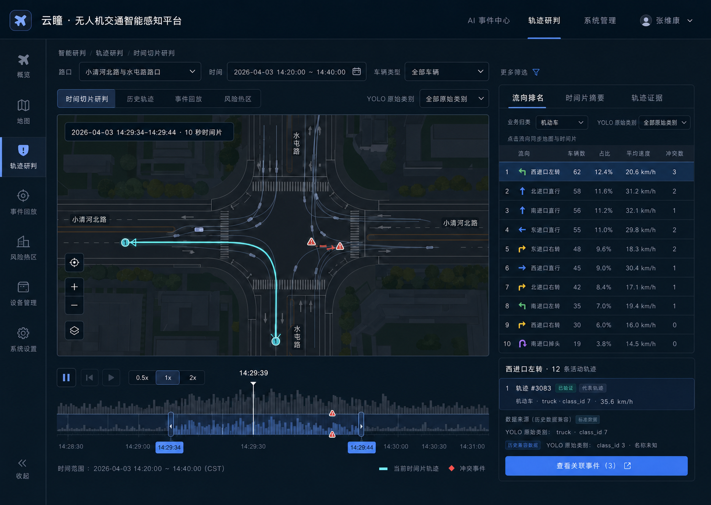

# 轨迹研判升级设计基线

> 日期：2026-07-21  
> 页面：Console2 `/gis` 轨迹研判  
> 状态：产品与交互设计已冻结，可进入实现；业务阈值、权威路网和生产容量仍遵循 S1/S5/S7 的外部门禁  
> 关联：[`S1 路口态势识别分册 PRD`](uav-traffic-ai-prd/S1-intersection-situation-prd.md)、[`API_CONTRACTS.md`](../API_CONTRACTS.md)、[`DATABASE_SCHEMA.md`](../DATABASE_SCHEMA.md)

## 1. 设计结论

历史轨迹不再以“一次铺满最多 500 条彩色折线”为默认视图。页面改为“时间片回放 + 流向排名 + 证据下钻”的研判工作台：

1. 地图默认只投放当前 10 秒时间片内的轨迹，保留真实道路空间关系，降低重叠和视觉眩晕。
2. 右栏默认显示“流向排名”，按车辆数降序排列流向，并同时给出占比、均速和冲突数。
3. 点击流向排名后，地图、时间轴、车型摘要和代表轨迹同步过滤；再次点击或清除筛选恢复全量时间片。
4. “业务车型”和“YOLO 原始类别”并列但不混用。业务车型用于交通研判，原始类别用于算法核查和来源追溯。
5. 任何排名、速度或冲突数字都必须能下钻到代表轨迹；无法证明来源的数据不进入确定性结论。

## 2. 视觉基线



视觉稿沿用 Console2 现有深色指挥系统设计语言：`Inter / PingFang SC`、深蓝面板、细描边、蓝色主操作、青色空间数据、琥珀色风险提示、红色高风险。实现时复用 `console2/src/styles.css` 与 `console2/src/full.css` 的现有令牌、表单、面板、焦点环和响应式断点，不建立第二套主题。

视觉稿用于冻结信息层级和交互关系，不作为数据真实性证据；界面中的示意数字必须在实现时替换为 API 返回值。

## 3. 交通业务研判模型

### 3.1 三层研判路径

| 层级 | 回答的问题 | 默认表达 | 下钻结果 |
| --- | --- | --- | --- |
| 路口态势 | 当前时间片里主要车流怎么走 | 时间片轨迹 + 流向排名 | 某一流向 |
| 流向比较 | 哪个流向量大、慢或冲突多 | 车辆数、占比、均速、冲突数 | 该流向代表轨迹 |
| 单车证据 | 这个结论由哪些真实目标构成 | 轨迹、时间、业务车型、YOLO 原始类别、质量 | 冲突/视频证据深链 |

### 3.2 流向定义

- 流向主键优先使用 `entry_link_id + exit_link_id`；出口不可可靠匹配时，降级为 `entry_link_id + turn_behavior`。
- 展示名称使用 RoadContext 的道路/Link 名称，例如“水屯路南进口 → 小清河北路东出口”。只有本地道路编号时显示“道路 3 → 左转”，不得推测东南西北。
- `unknown`、`unmapped` 独立成组并显示质量标记，不静默并入其他流向。
- 排名默认按 `vehicle_count` 降序；允许切换“均速最低”和“冲突最多”，切换只改变排序，不改变当前筛选集合。
- 车辆数按当前查询总窗口内的唯一完成轨迹去重，不按轨迹点计数。占比的分母为同一筛选条件下可进入流向聚合的轨迹数。
- 均速只聚合有效米制速度；无有效样本显示 `—`，不以 0 代替。冲突数只统计可安全关联到该流向轨迹的真实冲突事件。

### 3.3 时间片语义

- 默认查询最近 30 分钟，回放时间片长度为 10 秒，步长为 5 秒。
- 地图显示与时间片相交的轨迹片段，不显示查询窗口内所有完整轨迹。
- 时间轴柱高表示每个桶内不同活跃轨迹数；同一轨迹在一个桶内只计一次。
- 播放速度提供 `0.5× / 1× / 2× / 4×`，默认 `1×`；播放到末尾后停止，不自动跳回实时。
- 拖动时间轴时先更新刻度与摘要，释放后请求/渲染轨迹，避免连续大请求。
- URL 保存 `intersection_id`、总窗口、当前时间片、筛选和选中流向，刷新和复制链接后可复现同一研判状态。

## 4. 页面信息架构

### 4.1 顶部查询区

第一行保留现有路口、任务、数据源、业务车型、方向筛选，新增“YOLO 原始类别”。第二行放置时间范围、时间片长度、质量状态和清除筛选。

筛选关系：

- 业务车型：`motor / non_motor / pedestrian / unknown` 等业务聚合结果。
- YOLO 原始类别：模型直接输出的 class ID/name，例如 `car`、`bus`、`truck`；只用于核查，不反向覆盖业务车型。
- 两者同时选择时取交集，并在筛选条中并列显示，避免用户误以为它们是同一枚举。
- 数据源、任务和路口改变时，清除不再有效的流向与代表轨迹选择；时间范围保持。

### 4.2 地图主区

- 默认地图占主要宽度，右侧分析栏为固定最小 360 px；桌面宽度不足时右栏移至地图下方。
- 当前选中流向使用高亮蓝色并提高线宽；其他流向降低到 20%—30% 不透明度。
- 轨迹颜色表达流向，不表达单个 Track ID。单车选中后再以白色描边和起终点标记区分。
- 地图只为当前时间片绘制必要轨迹点；完整轨迹在“轨迹证据”中按需加载。
- 冲突点使用独立形状和文字标签，不只依赖红色；点击后进入 `/events` 对应证据详情。
- 地图左下角持续显示坐标语义、RoadContext 版本和数据质量；不存在权威路网时明确显示“本地道路编号”。

### 4.3 时间轴

- 时间轴位于地图下方，包含播放/暂停、前后一个时间片、速度、桶状活跃量和当前时间片范围。
- 缺数据桶留空并显示断点，不跨缺口连线；陈旧或覆盖不足桶使用斜纹/图标，不只靠颜色。
- 当前时间片范围以双边界选区表示，支持键盘左右移动一个步长；`Shift + ←/→` 移动一个完整时间片。

### 4.4 右侧分析栏

三个页签顺序固定：

1. **流向排名（默认）**：流向、车辆数、占比、均速、冲突数；前 5 项直接展示，其余可滚动。
2. **时间片摘要**：当前片活跃车辆、进入/离开数、业务车型和 YOLO 类别分布、速度、质量。
3. **轨迹证据**：当前流向的代表轨迹，默认按“有冲突优先、质量较高、时间较新”排序。

排名行的完整交互：

- 单击：选中流向并联动地图、时间轴摘要、类别分布和代表轨迹。
- 再次单击：取消该流向。
- `Enter/Space`：与单击一致；焦点保留在该行。
- 行内“冲突数”可点击时只进入该流向的冲突证据，不改变排序。
- 表头排序必须有文字/图标状态及 `aria-sort`，不能仅通过颜色表达。

## 5. YOLO 原始分类与业务研判

### 5.1 轨迹级字段

新增并持久化以下字段：

| 字段 | 说明 | 历史兼容 |
| --- | --- | --- |
| `yolo_class_id` | 推理时的原始类别 ID | 可信旧值可保留 |
| `yolo_class_name` | 推理时 `model.names[class_id]` 的原始名称 | 旧记录不得用当前模型猜填 |
| `yolo_model_id` | 权重文件名 + 文件 SHA-256 短摘要 | 旧记录无来源时为空 |
| `vehicle_class` | 业务归一化类别 | 与 YOLO 字段分列 |
| `class_mapping_version` | 原始类别映射为业务类别的规则版本 | 新数据必填 |

严格历史来源规则：

- 已有轨迹只有 ID 时显示 `class_id 2 / 名称未知`。
- 不允许根据当前加载模型的 `names` 为历史记录补名称，因为相同 ID 在不同权重中可能代表不同类别。
- 新产生的完成轨迹必须同时保存 ID、原始名称、模型标识和映射版本；页面详情完整展示。
- YOLO 名称仅参与筛选、统计和追溯，不替代 `vehicle_class`、转向或交通参与者业务口径。

### 5.2 类别摘要

- 默认摘要显示业务车型分布；切换到“YOLO 原始分类”后显示名称、ID、数量、占比和未知来源数。
- 选中某个 YOLO 类别会叠加到当前流向筛选，并更新地图、排名数值和代表轨迹。
- 类别分布使用列表/条形表达，必须同时显示数字，避免仅靠颜色判断。

## 6. 分析 API 设计

新增只读接口：

```http
GET /api/v1/trajectories/{intersection_id}/analysis
```

查询参数：

| 参数 | 必需 | 说明 |
| --- | --- | --- |
| `start_at`, `end_at` | 是 | 总查询窗口，UTC ISO 8601；UI 以 Asia/Shanghai 展示 |
| `slice_start_at`, `slice_end_at` | 是 | 当前回放时间片，必须位于总窗口内 |
| `bucket_sec` | 否 | 时间轴桶宽，默认 10 |
| `mission_id`, `source_profile_id` | 否 | 数据来源范围 |
| `vehicle_class`, `yolo_class_id`, `yolo_class_name` | 否 | 业务类别与原始类别筛选 |
| `turn_behavior`, `quality_status` | 否 | 转向与质量筛选 |
| `movement_key` | 否 | 选中流向的稳定键 |
| `track_limit` | 否 | 当前片最大轨迹数，服务端有硬上限 |

响应骨架：

```json
{
  "query": {
    "intersection_id": "INT_xqh",
    "start_at": "2026-07-21T08:00:00Z",
    "end_at": "2026-07-21T08:30:00Z",
    "slice_start_at": "2026-07-21T08:14:20Z",
    "slice_end_at": "2026-07-21T08:14:30Z",
    "timezone": "UTC"
  },
  "quality": {
    "status": "complete",
    "coverage_ratio": 0.98,
    "total_tracks": 500,
    "replayable_tracks": 492,
    "returned_tracks": 126,
    "truncated": false,
    "reasons": []
  },
  "timeline": [
    {"start_at": "...", "end_at": "...", "active_track_count": 23, "quality_status": "complete"}
  ],
  "movement_ranking": [
    {
      "movement_key": "entry:road_3|exit:road_2",
      "label": "道路 3 → 道路 2",
      "turn_behavior": "left_turn",
      "vehicle_count": 85,
      "share": 0.32,
      "avg_speed_kmh": 35.6,
      "speed_sample_size": 81,
      "conflict_count": 3,
      "quality_status": "degraded"
    }
  ],
  "class_summary": {
    "business": [{"value": "motor", "count": 102, "share": 0.81}],
    "yolo": [{"class_id": 2, "class_name": "car", "model_id": "uav_best.pt@a1b2c3d4", "count": 76, "share": 0.60}],
    "unknown_yolo_name_count": 4
  },
  "slice_tracks": [],
  "conflicts": []
}
```

服务端计算规则：

- 在数据库层按查询范围、来源和类别过滤，不能先取固定 500 条再在浏览器聚合。
- 时间片轨迹与 `[slice_start_at, slice_end_at)` 相交即可进入，点序列裁剪到时间片并保留边界插值/最近点标记。
- 每条轨迹最多返回 60 个确定性抽样点；保留首点、末点、转折点和冲突附近点，并返回抽样标记。
- `movement_ranking` 基于总查询窗口，选中流向后仍返回当前集合的排名并标出 `selected`；不因当前片偶然为空而消失。
- 冲突归因只允许使用 `(mission_id, track_id)`，或缺任务时使用 `(pipeline_id, track_id)` 的安全 lineage；无法唯一关联时进入 `unattributed_conflict_count`，不得猜测归属。
- 返回 `total_tracks/replayable_tracks/returned_tracks/truncated`，让用户区分“没有数据”和“只返回部分数据”。

## 7. 持久化与迁移边界

- `uav_track_events` 增加可空的 `yolo_class_id`、`yolo_class_name`、`yolo_model_id`、`class_mapping_version`、`start_road_id`、`exit_road_id` 类型化列；原始 canonical payload 继续保留。
- 新 migration 只前向演进 `road9`，不恢复旧数据库、旧 Topic 或双写链路。
- 历史回填只复制 payload 中已经存在且可验证的 ID/道路字段；不回填推测的 YOLO 名称、模型标识或方位名称。
- 流向查询至少为 `(intersection_id, ended_at)`、来源 lineage、入口/出口/转向和类别建立适合实际查询计划的索引；最终索引以 `EXPLAIN ANALYZE` 验证。

## 8. 状态与降级设计

| 状态 | 页面行为 |
| --- | --- |
| 加载中 | 保留上次筛选结构，地图和排行显示骨架；不显示旧数字为当前结果 |
| 真空数据 | 显示“该时间范围无完成轨迹”，提供扩大范围/清除筛选操作 |
| 当前片为空 | 排名仍展示总窗口结果，地图提示“当前 10 秒无轨迹”，时间轴可继续移动 |
| 请求失败 | 地图不绘制旧结果，显示错误原因与重试；筛选条件不丢失 |
| 部分截断 | 顶部琥珀提示“返回 126 / 500 条”，提供缩短范围或增加业务筛选 |
| 轨迹不可回放 | 计入总量但不画线，说明缺时间偏移/点序列，并进入质量摘要 |
| 路网缺失 | 使用“道路 N”和 `unmapped`，不显示推测方位 |
| YOLO 名称未知 | 显示 `class_id N / 名称未知`，不调用当前模型字典补齐 |
| 冲突无法归因 | 计入“未归因冲突”，不分摊到流向排名 |
| 覆盖不足/缺口 | 时间轴断开并显示质量原因；跨缺口不连线、不插值统计 |

## 9. 可访问性与操作效率

- 所有筛选、页签、排名行、播放控件和轨迹证据支持键盘操作，并使用现有 `:focus-visible` 焦点环。
- 播放/暂停按钮提供可读名称和当前状态；动态摘要使用 `aria-live="polite"`，避免每帧播报。
- 图例、排名、冲突和质量状态使用图标/文字/数字双编码，不只使用颜色。
- 轨迹动画遵循 `prefers-reduced-motion`；减少动态时采用离散时间片切换。
- 1280 px 以上保持地图 + 右栏；1100 px 以下右栏移至地图下方，筛选区允许换行；本期不承诺手机端研判。

## 10. 开发拆分

1. **检测与消息**：记录 YOLO ID/name/model、映射版本，扩展完成轨迹 canonical payload 和契约测试。
2. **存储**：新增 Alembic migration、类型化列、可信历史回填和查询索引。
3. **分析服务**：实现 `/analysis`、流向/类别/时间桶聚合、轨迹裁剪、冲突安全归因和质量元数据。
4. **Console2**：重构 `/gis` 为时间片状态机、流向排名联动、双分类筛选、代表轨迹与错误/空态。
5. **验收**：使用真实小清河北路与水屯路数据完成 API 对账、浏览器交互、可访问性、性能和视觉对比。

## 11. 验收标准

| 编号 | 验收场景 | 通过条件 |
| --- | --- | --- |
| TA-AC-001 | 默认进入有 500 条历史轨迹的路口 | 地图只显示当前 10 秒片段，不再一次铺满所有轨迹；首屏可辨认主要流向 |
| TA-AC-002 | 点击流向排名第 1 行 | 地图、类别摘要、代表轨迹和冲突证据使用同一 `movement_key`，计数可对账 |
| TA-AC-003 | 切换车辆数/均速/冲突排序 | 只改变顺序，当前查询和选中流向保持；排序状态可被屏幕阅读器识别 |
| TA-AC-004 | 拖动、播放和键盘移动时间片 | 时间范围、地图和摘要同步，缺口不连线，URL 可复现当前状态 |
| TA-AC-005 | 同时选择业务车型与 YOLO 类别 | 使用交集筛选；两种类别名称和数量分列展示，不互相覆盖 |
| TA-AC-006 | 查看只有 `yolo_class_id` 的历史轨迹 | 显示“名称未知”，不出现由当前模型推测的类别名 |
| TA-AC-007 | 当前片无轨迹但总窗口有数据 | 排名保留、地图明确空片状态，用户可继续移动时间轴 |
| TA-AC-008 | 返回截断、覆盖不足、路网缺失、冲突无法归因 | 每种情况有非颜色提示和可执行下一步，不输出伪精确排名 |
| TA-AC-009 | API 与数据库抽样对账 | 流向车辆数、占比、有效均速样本和冲突数一致；重复轨迹不重复计数 |
| TA-AC-010 | 1280×720、1440×900、1920×1080 与 200% 缩放 | 核心地图、时间轴、排名和筛选可用，无遮挡、裁切或横向内容丢失 |
| TA-AC-011 | 键盘与减少动态设置 | 核心流程无需鼠标完成，焦点顺序正确，减少动态时不自动平滑播放 |
| TA-AC-012 | 真实页面与视觉基线对比 | 同视口并排检查信息层级、间距、颜色、边框、字体、空态和交互状态，无明显偏差 |

## 12. 本期不包含

- 不用流向排名替代正式交通工程流量口径冻结；正式窗口和阈值仍由 S1-TBD-002 批准。
- 不把 YOLO 原始类别直接作为违法、风险或主平台事件定性。
- 不对缺失 RoadContext 的道路推测方位，不对缺失模型来源的历史类别补名称。
- 不恢复无前缀 Topic、旧数据库、旧观测链路或长期兼容双写。
- 不在本期增加轨迹编辑、人工改类别或主平台处置状态。
