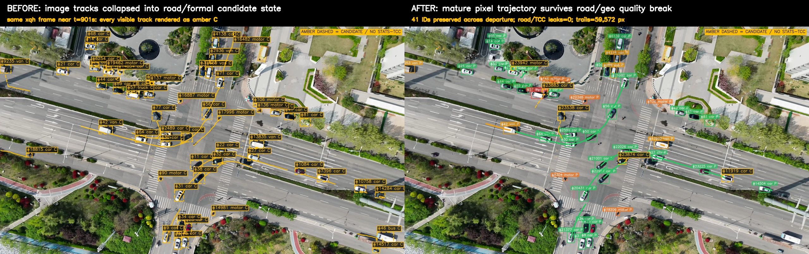

# xqh 轨迹显示回归根因、修复与验收报告

日期：2026-07-28；2026-07-29 ByteTrack 复验  
结论：`local_engineering_acceptance_passed / production_accuracy_not_claimed`

## 1. 结论

用户观察到的“相对 7 月 15 日轨迹识别明显变差”包含两层独立回归。第一层是本报告 7 月 28 日定位的显示与道路资格耦合；第二层是当天稍后加入的固定 `dt=1` Mahalanobis 硬门控与生产 `frame_stride=5` 不相容，导致 4K 小目标关联被拒绝、ID 碎片化。没有发现 YOLO 配置或路网强关联导致检测框消失。

两阶段均采用前向修复：显示只读取图像轨迹资格；生产关联移除硬门控，但保留相同 Mahalanobis 计算作为 shadow 诊断。没有回退图像运动补偿、图像优先 ByteTrack、2 秒真实时间、ID 后世界投影、RoadMapMatching、能力门禁或 TCC 证据链。报告当时保留的 SourceGeoRegistration 运行时设计已于 2026-07-30 被逐帧视频/SRT世界矩阵取代。

## 2. 7 月 15 日基线与排除项

对照提交为 `23252d662b49a9c2c08de24bb98f71d091e41f6c`（2026-07-15 21:29:15 +08:00）。该提交与当前检测主配置相同：

- 权重：`weights/yolo11s-visdrone.pt`
- `confidence=0.05`
- `imgsz=960`
- 默认 `frame_stride=5`

当前完整回放仍使用同一权重标识 `yolo11s-visdrone.pt@9679a16c7c2b`，1142/1142 帧有检测，累计 107603 个合法检测，非法框为 0。因此本轮没有通过换权重、抬低阈值或切回旧 tracker 来制造“改善”。同输入 shadow 仅作工程代理：当前图像运动关联与 legacy 匹配 48310 个框，未匹配当前/legacy 为 6410/4998；没有人工真值，不能把这些数当作 IDF1、HOTA 或正式 ID switch。

## 3. 根因链

1. `PostTrackingWorldProjectionNode` 已输出 `trajectory_association_ids`、`track_id_by_association` 和四级能力状态。
2. `ShowNode` 仍优先按道路资格列表筛选“正式轨迹”，把成熟但无道路资格的像素轨迹当作 `C` 候选。
3. `TrackerInfoUpdateNode` 的候选缓冲与当前关联显示尾迹具有不同生命周期，部分记录没有同长度 `trajectory_display_px`；旧分支因此可能只画框、不画成熟尾迹。
4. 低地理质量帧还可能复用轨迹历史里的旧速度值，造成像素轨迹显示 `km/h`，与地理门禁不一致。
5. 旧验收器把像素 `buffer_tracks` 和通用车辆计数误判为“降级业务泄漏”，并要求质量断点终止轨迹；这与新架构“图像身份不受 H/地图质量拆分”相反，掩盖了真实显示问题。
6. 7 月 28 日提交又在第一轮关联中无条件启用 95% Mahalanobis gate；其 Kalman 时间步固定为 1，而生产每 5 个源帧才处理一次。
7. 10–15px 高的航拍目标一次只允许约 3.36–5.04px 中心位移，正常过路口车辆会被判为不可达；旧 IoU 匹配本来可接受的候选被改写为无穷代价。
8. 轨迹被频繁置为 lost 后重新初始化，难以满足 2 秒/5 点成熟门槛，因此画面上的连续尾迹比单帧检测数量下降更明显。

## 4. 前向修复

- `ShowNode` 使用 `track_id_by_association` 和 `trajectory_output_eligible` 决定成熟像素轨迹；道路资格不再决定像素框和尾迹是否可见。
- 成熟但当前不具备道路业务资格的轨迹以类别色实线和 `P` 标识；真正未成熟预览继续使用琥珀虚线 `C`。
- 显式能力契约下，只有 `geo_analytics_eligible=true` 才显示速度；低质量帧不复用历史速度标签。
- 候选缺少专用显示载荷时，可从同一 `association_id` 的图像轨迹取得显示点，但不进入速度、Lane/Link、统计、TCC 或事件链。
- 验收器升级为 `uav.xqh-hover-departure-acceptance/v2`：图像身份必须跨质量断点保持；道路与 TCC 分别检查零越界；候选只校验自身声明的坐标字段，落地点残差使用 canonical `trajectory_px`。
- ByteTrack 第一轮关联不再应用固定时间步 Mahalanobis 硬过滤；相同门控只在代价副本上统计 `would_reject_eligible_pair_count/would_strand_track_count`，不得改变 ID。
- 新增 `scripts/compare_xqh_bytetrack.py`，每个采样帧只执行一次 YOLO，再把同一检测输入同时交给 7 月 15 日基线和当前 tracker。

## 5. 画面对比

下图使用仓库内同一 xqh 约 901 秒质量断点帧。左侧为修复前证据：所有可见轨迹都被道路/正式资格折叠成琥珀 `C`；右侧为修复后：成熟像素轨迹在地理、道路和 TCC 门禁关闭时仍以类别色实线和 `P` 保留，真正未成熟记录仍为 `C`。

仓库没有发现 7 月 15 日同一 xqh 帧的原始 ShowNode 截图，因此不把其他视频或不同时间帧冒充逐像素 7 月 15 日对照。7 月 15 日只用于 Git 配置/实现基线；上图采用仓库已保存的 7 月 25 日同帧前态证据和 7 月 28 日最终回放，专门证明本次显示根因与修复结果。

## 6. 最终真实回放验收

命令范围：真实 4K MP4 + 原始 SRT，840 秒到自然 EOF，stride 4，原生 arm64 MPS，road9 中已发布的 xqh Runtime Map Bundle。

| 项目 | 结果 |
|---|---:|
| 工程门禁 | 25 / 25 通过 |
| 处理帧 / 检测覆盖 | 1142 / 100% |
| 总检测 / 非法框 | 107603 / 0 |
| 总关联 / 完成轨迹 | 54720 / 438 |
| 跨离场前/后稳定 ID | 41 |
| active / completed / candidate 对齐失败 | 0 / 0 / 0 |
| candidate 落地点残差 P95 / max | 0.0 / 0.0 px |
| road / TCC 能力泄漏 | 0 / 0 |
| 质量断点生产尾迹差异像素 | 59572 |
| YOLO 稳态 p50 / p95 | 67.8 / 185.12 ms |
| 单进程帧 p50 / p95 | 210.579 / 289.052 ms |
| 自然 EOF | 通过 |

自动化回归：

- 聚焦轨迹/显示/验收：`60 passed`
- 根 `test/`：`171 passed`
- `test/test_pipeline_inter_xqh.py`：`56 PASS / 0 FAIL / 0 WARN`
- Platform：`232 passed / 5 skipped / 10 subtests passed`
- Console2：`148 passed`，production build 通过
- ADR-019 local strict：9 项通过，`local_runtime_evidence` 保持外部门禁 blocker；不影响本次轨迹显示工程验收，也不冒充生产就绪

机器报告：`docs/generated/xqh-trajectory-display-acceptance-20260728.json`。最终四张生产 `ShowNode` 代表帧位于 `docs/test-screenshots/xqh-trajectory-display-accepted-20260728/`。

## 7. 精度边界

本次关闭的是工程显示回归与能力隔离门禁，不是生产精度验收。项目没有获批的外部轨迹真值，也不建设人工轨迹标注工作包，因此 IDF1、HOTA、正式 ID switch、位置 RMSE、速度 MAE 和 12m/s 精度继续记为 `not_evaluated`，不能用画面观感、轨迹寿命或 shadow IoU 替代。

## 8. 2026-07-29 ByteTrack 同检测输入与完整回放复验

400–430s、stride=5、原生 MPS 的 canonical 几何回归只执行一次 YOLO，共 180 个处理帧、19696 个检测。
当前中心轨迹密度为同输入 7 月 15 日基线的 95.23%，中心碎片 ID 44（门禁 ≤80），中位观测
寿命 52（门禁 ≥30），3/3 通过。shadow 记录硬门控会拒绝 1080 个原本满足生产代价阈值的候选，
并让 671 条轨迹失去全部候选。绝对 `19.5/帧` 受 canonical 检测框规范化口径影响，改为同一批
检测输入下不低于基线 95%，避免跨口径硬编码。

修复后的完整 840s–自然 EOF、stride=4、原生 MPS 验收再次 25/25 通过：1142 帧检测覆盖 100%，
109899 个合法检测、非法框 0、61831 个关联、448 条完成轨迹、1138 帧可用视觉 warp，road/TCC
泄漏 0，自然 EOF 和四张生产 `ShowNode` 证据完整。报告与截图在本轮保存在
`/private/tmp/TrafficAnalyzer-xqh-hover-departure-bytetrack-fix-20260729.json` 和
`/private/tmp/TrafficAnalyzer-xqh-bytetrack-fix-screenshots-20260729/`；可由仓库脚本重建。
